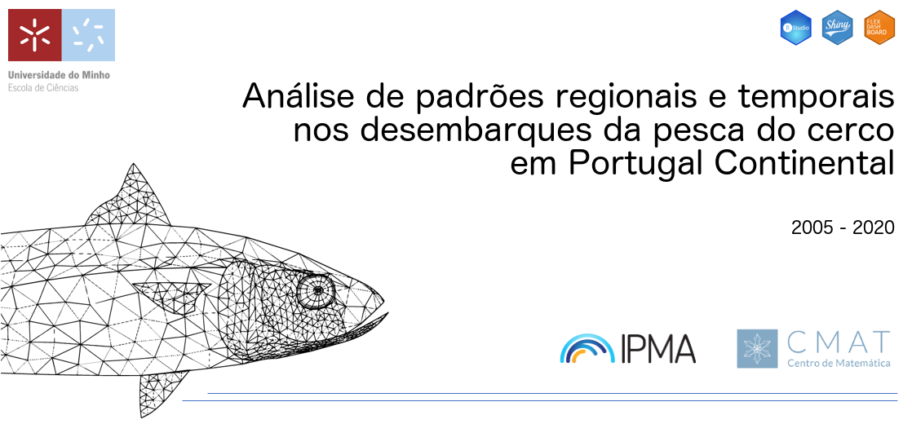
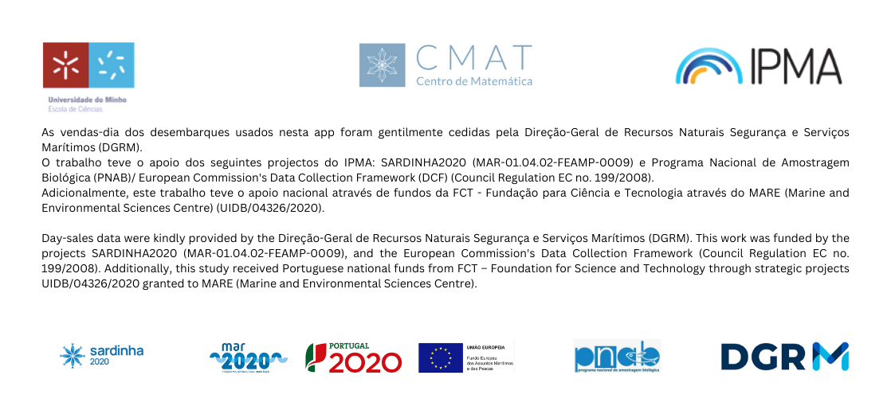

```{r setup, include=FALSE}
#Finished by André Coelho Fiuza Dias
#last update: 13 NOV 2023
library(flexdashboard) #front-end
library(knitr)
library(readr)
library(DT)
library(rpivotTable)
library(ggplot2)
library(plotly)
library(dplyr)
library(openintro)
library(highcharter)
library(ggvis)
library(leaflet) #mapas
library(sp)
library(shiny) #interface c user
library(zoo) #manipular datas
library(dplyr)
library(lubridate)
library(forcats)
library(trend)
```

```{r}
# definir directoria
# load bd's
bd_dash2=read.csv2("ds_compl.csv")

bd_dash_cavala2=bd_dash2[bd_dash2$EESPECIE=="Cavala",]
bd_dash_sardinha2=bd_dash2[bd_dash2$EESPECIE=="Sardinha",]
bd_dash_carapau2=bd_dash2[bd_dash2$EESPECIE=="Carapau-Branco",]
bd_dash_biqueirao2=bd_dash2[bd_dash2$EESPECIE=="Biqueirao",]
bd_dash_outros2=bd_dash2[bd_dash2$EESPECIE=="Outros",]
###################################


# bd maps
bd_dash_porto2 =  aggregate(cbind(QVENDA,VVENDA) ~ year_sale + EESPECIE + PORTO, 
          data=bd_dash2, FUN=sum)
portoss = c("VIANA DO CASTELO","POVOA DO VARZIM","V. CONDE","MATOSINHOS",
            "AFURADA","AVEIRO","FIGUEIRA DA FOZ", "NAZARE","PENICHE",
            "SESIMBRA","COSTA DA CAPARICA","SETUBAL","SINES",
            "LAGOS","SAGRES","PORTIMAO","OLHAO","QUARTEIRA","VRSA",
            "CASCAIS","TAVIRA","AGUDA","TRAFARIA","ESPINHO","FUZETA",
            "SANTA LUZIA")
latitudes = c(41.18349, 40.63262, 40.14706, 38.44073, 38.51988, 37.02403,
              41.68921, 39.58676, 39.35624, 37.95373, 37.10342, 37.00978,
              37.12113, 37.06979, 37.19434, 38.69379, 37.12431, 41.37514,
              41.04944, 38.674818, 41.14409, 38.64346, 41.35035, 40.998391, 
              37.052959, 37.101140)
longitudes = c(-8.697357, -8.73135, -8.863711, -9.113316, -8.897882, -7.83651,
               -8.835347, -9.075641, -9.37091, -8.86554, -8.670568, -8.930174,
               -8.52977, -8.109572, -7.415847, -9.42008, -7.64417,  -8.767912,
               -8.653088, -9.230931, -8.64736, -9.240523, -8.74365, -8650194, 
               -7.743155, 7.658658)
lat_long = data_frame(PORTO=portoss, lat = latitudes, long= longitudes)

merge.PORTOS <- merge(bd_dash_porto2, lat_long,by.x = "PORTO")
bd_dash_porto2=select(merge.PORTOS, year_sale, 
                       EESPECIE, PORTO, QVENDA, VVENDA, lat, long)
names(bd_dash_porto2)=c("ANO", "ESPECIE", "PORTO", 
                         "QVENDA", "VVENDA", "lat", "long")


bd_dash_regiao2 = group_by(bd_dash2,year_sale, 
                           EESPECIE, zona)%>%summarise(VVENDA=sum(VVENDA),QVENDA=sum(QVENDA))

zona = c("Norte","Centro", "Sul")
latit = c(41.13078, 39.43915, 37.10551)
longi = c(-8.638315, -9.141769, -8.105564)

lat_long_regiao = data_frame(zona=zona, lat = latit, long= longi)

merge.REGIAO <- merge(bd_dash_regiao2, lat_long_regiao, by.x = "zona")
bd_dash_regiao2 = select(merge.REGIAO, year_sale, 
                       EESPECIE, zona, QVENDA, VVENDA, lat, long)
names(bd_dash_regiao2)=c("ANO", "ESPECIE", "REGIAO", 
                         "QVENDA", "VVENDA", "lat", "long")

#########################################################
# bd series temporais
bd_dash_ST_dia_QVENDA2=read.csv2("novo_bd_dash_ST_dia_QVENDA2.csv")
bd_dash_ST_dia_PMED2=read.csv2("novo_bd_dash_ST_dia_PMED2.csv")
bd_dash_ST_mes_QVENDA2=read.csv2("novo_bd_dash_ST_mes_QVENDA2.csv")
bd_dash_ST_mes_PMED2=read.csv2("novo_bd_dash_ST_mes_PMED2.csv")

bd_dash_ST_mes_PMED2$DATA <- dmy(bd_dash_ST_mes_PMED2$DATA)
bd_dash_ST_mes_QVENDA2$DATA <- ymd(bd_dash_ST_mes_QVENDA2$DATA)
bd_dash_ST_dia_PMED2$DATA <- ymd(bd_dash_ST_dia_PMED2$DATA)
bd_dash_ST_dia_QVENDA2$DATA <- ymd(bd_dash_ST_dia_QVENDA2$DATA)

            
```

Início {data-icon="fa-home"}
================================
{ width=100% }

Quantidade {data-navmenu="Dados" data-icon="fa-balance-scale"} 
================================

Inputs {.sidebar  data-width=120}
--------------------------------
```{r}

br()
selectInput(inputId="id_portos_", "Porto", 
          choices=c("Todos","VIANA DO CASTELO","MATOSINHOS","AVEIRO",
                    "FIGUEIRA DA FOZ","PENICHE","SESIMBRA",
                    "SETUBAL","SINES","SAGRES","LAGOS",
                    "PORTIMAO","QUARTEIRA","OLHAO"), 
          selected = "Todos")
br()
selectInput(inputId="id_barcos_", "Embarcações", 
          choices=c("Todas", "Todas as Tucas", "Tuca-pequena", "Tuca-grande", "Traineira"), 
          selected = "Todas")
br()
selectInput(inputId="id_especie_", "Espécie", 
          choices=c("Todas", "Cavala", "Sardinha", "Biqueirao", 
                    "Carapau-Branco", "Outros"), 
          selected = "Todas")

```

Row 
--------------------------------
### Portugal Continental 2005-2010
```{r}
valueBox(paste("Pesca do Cerco"),
         color="#4F4F4F") #colocar cinza
```

### (Quilos)
```{r}
valueBox(paste("Quantidade"),
         color="chocolate", icon="fa-balance-scale")
```

### Porto 
```{r}
renderValueBox({
    valueBox(paste(input$id_portos_),
         icon="fa-anchor", color="dimgray")
})
```

### Embarcação
```{r}
renderValueBox({
    valueBox(paste(input$id_barcos_),
         icon="fa-ship", color="gray")
})
```

Row 
--------------------------------
### Nº Entradas 
```{r}
renderValueBox({
  if(input$id_portos_!="Todos" & input$id_barcos_!="Todas"){
    if(input$id_barcos_=="Todas as Tucas"){
      valueBox(nrow(bd_dash2[bd_dash2$PORTO==input$id_portos_ & 
                       bd_dash2$tipo_barco=="tuca",]),
         icon="fa-anchor-circle-check", color="royalblue")
      
    }else{
valueBox(nrow(bd_dash2[bd_dash2$PORTO==input$id_portos_ & 
                       bd_dash2$tipos_barcos3==input$id_barcos_,]),
         icon="fa-anchor-circle-check", color="royalblue")}
  } else if (input$id_portos_!="Todos" & input$id_barcos_=="Todas"){
valueBox(nrow(bd_dash2[bd_dash2$PORTO==input$id_portos_,]),
         icon="fa-anchor-circle-check", color="royalblue")
    
  } else if (input$id_portos_=="Todos" & input$id_barcos_!="Todas"){
    if(input$id_barcos_=="Todas as Tucas"){
      valueBox(nrow(bd_dash2[bd_dash2$tipo_barco=="tuca",]),
         icon="fa-anchor-circle-check", color="royalblue")
      
    }else{
valueBox(nrow(bd_dash2[bd_dash2$tipos_barcos3==input$id_barcos_,]),
         icon="fa-anchor-circle-check", color="royalblue")}
  }else {
    valueBox(nrow(bd_dash2),
         icon="fa-anchor-circle-check", color="royalblue")
  }
})

```

### Cavala
```{r}
renderValueBox({
  if(input$id_especie_!="Cavala"){
    if(input$id_portos_!="Todos" & input$id_barcos_!="Todas"){
      if(input$id_barcos_=="Todas as Tucas"){
      valueBox(nrow(bd_dash_cavala2[bd_dash_cavala2$PORTO==input$id_portos_&
                       bd_dash_cavala2$tipo_barco=="tuca",]),
         icon="fa-fish", color="cornflowerblue")
      }else{
        valueBox(nrow(bd_dash_cavala2[bd_dash_cavala2$PORTO==input$id_portos_&
                       bd_dash_cavala2$tipos_barcos3==input$id_barcos_,]),
         icon="fa-fish", color="cornflowerblue")
      }

    }else if (input$id_portos_!="Todos" & input$id_barcos_=="Todas"){
      valueBox(nrow(bd_dash_cavala2[bd_dash_cavala2$PORTO==input$id_portos_,]),
         icon="fa-fish", color="cornflowerblue")
    }else if (input$id_portos_=="Todos" & input$id_barcos_!="Todas"){
      if(input$id_barcos_=="Todas as Tucas"){
      valueBox(nrow(bd_dash_cavala2[bd_dash_cavala2$tipo_barco=="tuca",]),
         icon="fa-fish", color="cornflowerblue")
      }else{
        valueBox(nrow(bd_dash_cavala2[
          bd_dash_cavala2$tipos_barcos3==input$id_barcos_,]),
         icon="fa-fish", color="cornflowerblue")
      }
    }else{
      valueBox(nrow(bd_dash_cavala2),
         icon="fa-fish", color="cornflowerblue")
    }
  } else{
    if(input$id_portos_!="Todos" & input$id_barcos_!="Todas"){
      if(input$id_barcos_=="Todas as Tucas"){
      valueBox(nrow(bd_dash_cavala2[bd_dash_cavala2$PORTO==input$id_portos_&
                       bd_dash_cavala2$tipo_barco=="tuca",]),
         icon="fa-fish", color="indigo")
      }else{
        valueBox(nrow(bd_dash_cavala2[bd_dash_cavala2$PORTO==input$id_portos_&
                       bd_dash_cavala2$tipos_barcos3==input$id_barcos_,]),
         icon="fa-fish", color="indigo")
      }
    }else if (input$id_portos_!="Todos" & input$id_barcos_=="Todas"){
      valueBox(nrow(bd_dash_cavala2[bd_dash_cavala2$PORTO==input$id_portos_,]),
         icon="fa-fish", color="indigo")
    }else if (input$id_portos_=="Todos" & input$id_barcos_!="Todas"){
      if(input$id_barcos_=="Todas as Tucas"){
        valueBox(nrow(bd_dash_cavala2
                      [bd_dash_cavala2$tipo_barco=="tuca",]),
         icon="fa-fish", color="indigo")
      }else{
      valueBox(nrow(bd_dash_cavala2[bd_dash_cavala2$tipos_barcos3==input$id_barcos_,]),
         icon="fa-fish", color="indigo")}
    }else{
      valueBox(nrow(bd_dash_cavala2),
         icon="fa-fish", color="indigo")
    }
    }
})

```

### Sardinha
```{r}
renderValueBox({
  if(input$id_especie_!="Sardinha"){
    if(input$id_portos_!="Todos" & input$id_barcos_!="Todas"){
      if(input$id_barcos_=="Todas as Tucas"){
        valueBox(nrow(bd_dash_sardinha2[bd_dash_sardinha2$PORTO==input$id_portos_&
                       bd_dash_sardinha2$tipo_barco=="tuca",]),
         icon="fa-fish", color="cornflowerblue")
      }
      else{
        valueBox(nrow(bd_dash_sardinha2[bd_dash_sardinha2$PORTO==input$id_portos_&
                       bd_dash_sardinha2$tipos_barcos3==input$id_barcos_,]),
         icon="fa-fish", color="cornflowerblue")
      }
    
    }else if (input$id_portos_!="Todos" & input$id_barcos_=="Todas"){
      valueBox(nrow(bd_dash_sardinha2[bd_dash_sardinha2$PORTO==input$id_portos_,]),
         icon="fa-fish", color="cornflowerblue")
    }else if (input$id_portos_=="Todos" & input$id_barcos_!="Todas"){
      if(input$id_barcos_=="Todas as Tucas"){
        valueBox(nrow(bd_dash_sardinha2[bd_dash_sardinha2$tipo_barco=="tuca",]),
         icon="fa-fish", color="cornflowerblue")
      }
      else{
         valueBox(nrow(bd_dash_sardinha2
                       [bd_dash_sardinha2$tipos_barcos3==input$id_barcos_,]),
         icon="fa-fish", color="cornflowerblue")
      }
    }else{
      valueBox(nrow(bd_dash_sardinha2),
         icon="fa-fish", color="cornflowerblue")
    }
  } else{
    if(input$id_portos_!="Todos" & input$id_barcos_!="Todas"){
      if(input$id_barcos_=="Todas as Tucas"){
        valueBox(nrow(bd_dash_sardinha2[bd_dash_sardinha2$PORTO==input$id_portos_&
                       bd_dash_sardinha2$tipo_barco=="tuca",]),
         icon="fa-fish", color="indigo")
      }
      else{
    valueBox(nrow(bd_dash_sardinha2[bd_dash_sardinha2$PORTO==input$id_portos_&
                       bd_dash_sardinha2$tipos_barcos3==input$id_barcos_,]),
         icon="fa-fish", color="indigo")}
      
    }else if (input$id_portos_!="Todos" & input$id_barcos_=="Todas"){
      valueBox(nrow(bd_dash_sardinha2[bd_dash_sardinha2$PORTO==input$id_portos_,]),
         icon="fa-fish", color="indigo")
    }else if (input$id_portos_=="Todos" & input$id_barcos_!="Todas"){
      if(input$id_barcos_=="Todas as Tucas"){
        valueBox(nrow(bd_dash_sardinha2[bd_dash_sardinha2$tipo_barco=="tuca",]),
         icon="fa-fish", color="indigo")
      }
      else{
      valueBox(nrow(bd_dash_sardinha2[bd_dash_sardinha2$tipos_barcos3==input$id_barcos_,]),
         icon="fa-fish", color="indigo")}
    }else{
      valueBox(nrow(bd_dash_sardinha2),
         icon="fa-fish", color="indigo")
    }
    }
})

```

### Biqueirão
```{r}
renderValueBox({
  if(input$id_especie_!="Biqueirao"){
    if(input$id_portos_!="Todos" & input$id_barcos_!="Todas"){
      if(input$id_barcos_=="Todas as Tucas"){
        valueBox(nrow(bd_dash_biqueirao2[bd_dash_biqueirao2$PORTO==input$id_portos_&
                       bd_dash_biqueirao2$tipo_barco=="tuca",]),
         icon="fa-fish", color="cornflowerblue")
      }else{ 
    valueBox(nrow(bd_dash_biqueirao2[bd_dash_biqueirao2$PORTO==input$id_portos_&
                       bd_dash_biqueirao2$tipos_barcos3==input$id_barcos_,]),
         icon="fa-fish", color="cornflowerblue")}
    }else if (input$id_portos_!="Todos" & input$id_barcos_=="Todas"){
      valueBox(nrow(bd_dash_biqueirao2[bd_dash_biqueirao2$PORTO==input$id_portos_,]),
         icon="fa-fish", color="cornflowerblue")
    }else if (input$id_portos_=="Todos" & input$id_barcos_!="Todas"){
      if(input$id_barcos_=="Todas as Tucas"){
        valueBox(nrow(bd_dash_biqueirao2[bd_dash_biqueirao2$tipo_barco=="tuca",]),
         icon="fa-fish", color="cornflowerblue")}
      else{
      valueBox(nrow(bd_dash_biqueirao2[bd_dash_biqueirao2$tipos_barcos3==input$id_barcos_,]),
         icon="fa-fish", color="cornflowerblue")}
    }else{
      valueBox(nrow(bd_dash_biqueirao2),
         icon="fa-fish", color="cornflowerblue")
    }
  } else{
    if(input$id_portos_!="Todos" & input$id_barcos_!="Todas"){
      if(input$id_barcos_=="Todas as Tucas"){
        valueBox(nrow(bd_dash_biqueirao2[bd_dash_biqueirao2$PORTO==input$id_portos_&
                       bd_dash_biqueirao2$tipo_barco=="tuca",]),
         icon="fa-fish", color="indigo")}
      else{  
    valueBox(nrow(bd_dash_biqueirao2[bd_dash_biqueirao2$PORTO==input$id_portos_&
                       bd_dash_biqueirao2$tipos_barcos3==input$id_barcos_,]),
         icon="fa-fish", color="indigo")}
    }else if (input$id_portos_!="Todos" & input$id_barcos_=="Todas"){
      valueBox(nrow(bd_dash_biqueirao2[bd_dash_biqueirao2$PORTO==input$id_portos_,]),
         icon="fa-fish", color="indigo")
    }else if (input$id_portos_=="Todos" & input$id_barcos_!="Todas"){
      if(input$id_barcos_=="Todas as Tucas"){
        valueBox(nrow(bd_dash_biqueirao2[bd_dash_biqueirao2$tipo_barco=="tuca",]),
         icon="fa-fish", color="indigo")}
      else{
      valueBox(nrow(bd_dash_biqueirao2[bd_dash_biqueirao2$tipos_barcos3==input$id_barcos_,]),
         icon="fa-fish", color="indigo")}
    }else{
      valueBox(nrow(bd_dash_biqueirao2),
         icon="fa-fish", color="indigo")
    }
    }
})

```

### Carapau-Branco
```{r}

renderValueBox({
  if(input$id_especie_!="Carapau-Branco"){
    if(input$id_portos_!="Todos" & input$id_barcos_!="Todas"){
      if(input$id_barcos_=="Todas as Tucas"){
        valueBox(nrow(bd_dash_carapau2[bd_dash_carapau2$PORTO==input$id_portos_&
                       bd_dash_carapau2$tipo_barco=="tuca",]),
         icon="fa-fish", color="cornflowerblue")}
      else{
    valueBox(nrow(bd_dash_carapau2[bd_dash_carapau2$PORTO==input$id_portos_&
                       bd_dash_carapau2$tipos_barcos3==input$id_barcos_,]),
         icon="fa-fish", color="cornflowerblue")}
    }else if (input$id_portos_!="Todos" & input$id_barcos_=="Todas"){
      valueBox(nrow(bd_dash_carapau2[bd_dash_carapau2$PORTO==input$id_portos_,]),
         icon="fa-fish", color="cornflowerblue")
    }else if (input$id_portos_=="Todos" & input$id_barcos_!="Todas"){
      if(input$id_barcos_=="Todas as Tucas"){
        valueBox(nrow(bd_dash_carapau2[bd_dash_carapau2$tipo_barco=="tuca",]),
         icon="fa-fish", color="cornflowerblue")}
      else{
      valueBox(nrow(bd_dash_carapau2[bd_dash_carapau2$tipos_barcos3==input$id_barcos_,]),
         icon="fa-fish", color="cornflowerblue")}
    }else{
      valueBox(nrow(bd_dash_carapau2),
         icon="fa-fish", color="cornflowerblue")
    }
  } else{
    if(input$id_portos_!="Todos" & input$id_barcos_!="Todas"){
      if(input$id_barcos_=="Todas as Tucas"){
        valueBox(nrow(bd_dash_carapau2[bd_dash_carapau2$PORTO==input$id_portos_&
                       bd_dash_carapau2$tipo_barco=="tuca",]),
         icon="fa-fish", color="indigo")}
      else{
    valueBox(nrow(bd_dash_carapau2[bd_dash_carapau2$PORTO==input$id_portos_&
                       bd_dash_carapau2$tipos_barcos3==input$id_barcos_,]),
         icon="fa-fish", color="indigo")}
    }else if (input$id_portos_!="Todos" & input$id_barcos_=="Todas"){
      valueBox(nrow(bd_dash_carapau2[bd_dash_carapau2$PORTO==input$id_portos_,]),
         icon="fa-fish", color="indigo")
    }else if (input$id_portos_=="Todos" & input$id_barcos_!="Todas"){
      if(input$id_barcos_=="Todas as Tucas"){
        valueBox(nrow(bd_dash_carapau2[bd_dash_carapau2$tipo_barco=="tuca",]),
         icon="fa-fish", color="indigo")}
      else{
      valueBox(nrow(bd_dash_carapau2[bd_dash_carapau2$tipos_barcos3==input$id_barcos_,]),
         icon="fa-fish", color="indigo")}
    }else{
      valueBox(nrow(bd_dash_carapau2),
         icon="fa-fish", color="indigo")
    }
    }
})

```

### Outros
```{r}
renderValueBox({
  if(input$id_especie_!="Outros"){
    if(input$id_portos_!="Todos" & input$id_barcos_!="Todas"){
      if(input$id_barcos_=="Todas as Tucas"){
        valueBox(nrow(bd_dash_outros2[bd_dash_outros2$PORTO==input$id_portos_&                       bd_dash_outros2$tipo_barco=="tuca",]),
         icon="fa-fish", color="cornflowerblue")}
      else{valueBox(nrow(bd_dash_outros2[bd_dash_outros2$PORTO==input$id_portos_&                       bd_dash_outros2$tipos_barcos3==input$id_barcos_,]),
         icon="fa-fish", color="cornflowerblue")}
    }else if (input$id_portos_!="Todos" & input$id_barcos_=="Todas"){
      valueBox(nrow(bd_dash_outros2[bd_dash_outros2$PORTO==input$id_portos_,]),
         icon="fa-fish", color="cornflowerblue")
    }else if (input$id_portos_=="Todos" & input$id_barcos_!="Todas"){
      if(input$id_barcos_=="Todas as Tucas"){
      valueBox(nrow(bd_dash_outros2[bd_dash_outros2$tipo_barco=="tuca",]),
         icon="fa-fish", color="cornflowerblue")}
      else{
      valueBox(nrow(bd_dash_outros2[bd_dash_outros2$tipos_barcos3==input$id_barcos_,]),
         icon="fa-fish", color="cornflowerblue")}
    }else{
      valueBox(nrow(bd_dash_outros2),
         icon="fa-fish", color="cornflowerblue")
    }
  } else{
    if(input$id_portos_!="Todos" & input$id_barcos_!="Todas"){
      if(input$id_barcos_=="Todas as Tucas"){
    valueBox(nrow(bd_dash_outros2[bd_dash_outros2$PORTO==input$id_portos_&
                       bd_dash_outros2$tipo_barco=="tuca",]),
         icon="fa-fish", color="indigo")}
      else{
    valueBox(nrow(bd_dash_outros2[bd_dash_outros2$PORTO==input$id_portos_&
                       bd_dash_outros2$tipos_barcos3==input$id_barcos_,]),
         icon="fa-fish", color="indigo")}
    }else if (input$id_portos_!="Todos" & input$id_barcos_=="Todas"){
      valueBox(nrow(bd_dash_outros2[bd_dash_outros2$PORTO==input$id_portos_,]),
         icon="fa-fish", color="indigo")
    }else if (input$id_portos_=="Todos" & input$id_barcos_!="Todas"){
      if(input$id_barcos_=="Todas as Tucas"){
      valueBox(nrow(bd_dash_outros2[bd_dash_outros2$tipo_barco=="tuca",]),
         icon="fa-fish", color="indigo")}
      else{
      valueBox(nrow(bd_dash_outros2[bd_dash_outros2$tipos_barcos3==input$id_barcos_,]),
         icon="fa-fish", color="indigo")}
    }else{
      valueBox(nrow(bd_dash_outros2),
         icon="fa-fish", color="indigo")
    }
    }
})
```

Row 
--------------------------------
### Dia da Semana
```{r}
renderPlotly({
  if(input$id_portos_!="Todos" & input$id_barcos_!="Todas" & input$id_especie_!="Todas"){
    if(input$id_barcos_=="Todas as Tucas"){
    df_select=bd_dash2[bd_dash2$PORTO==input$id_portos_ & bd_dash2$tipo_barco=="tuca" & bd_dash2$EESPECIE==input$id_especie_,]}
    else{
    df_select=bd_dash2[bd_dash2$PORTO==input$id_portos_ & bd_dash2$tipos_barcos3==input$id_barcos_ & bd_dash2$EESPECIE==input$id_especie_,]}
  
    }else if(input$id_portos_!="Todos" & input$id_barcos_!="Todas" & input$id_especie_=="Todas"){
      if(input$id_barcos_!="Todas as Tucas"){
    df_select=bd_dash2[bd_dash2$PORTO==input$id_portos_ & bd_dash2$tipos_barcos3==input$id_barcos_,]}
      else{
    df_select=bd_dash2[bd_dash2$PORTO==input$id_portos_ & 
                         bd_dash2$tipo_barco=="tuca",]}
  
    }else if(input$id_portos_!="Todos" & input$id_barcos_=="Todas" & input$id_especie_!="Todas"){
    df_select=bd_dash2[bd_dash2$PORTO==input$id_portos_ & bd_dash2$EESPECIE==input$id_especie_,]
  
    }else if(input$id_portos_=="Todos" & input$id_barcos_!="Todas" & input$id_especie_!="Todas"){
      if(input$id_barcos_!="Todas as Tucas"){
    df_select=bd_dash2[bd_dash2$tipos_barcos3==input$id_barcos_ & bd_dash2$EESPECIE==input$id_especie_,]}
      else{
    df_select=bd_dash2[bd_dash2$tipo_barco=="tuca" & bd_dash2$EESPECIE==input$id_especie_,]}
  
    }else if(input$id_portos_=="Todos" & input$id_barcos_=="Todas" & input$id_especie_!="Todas"){
    df_select=bd_dash2[bd_dash2$EESPECIE==input$id_especie_,]

    }else if(input$id_portos_=="Todos" & input$id_barcos_!="Todas" & input$id_especie_=="Todas"){
      if(input$id_barcos_!="Todas as Tucas"){
    df_select=bd_dash2[bd_dash2$tipos_barcos3==input$id_barcos_,]}
      else{
    df_select=bd_dash2[bd_dash2$tipo_barco=="tuca",]}
    
    }else if(input$id_portos_!="Todos" & input$id_barcos_=="Todas" & input$id_especie_=="Todas"){
    df_select=bd_dash2[bd_dash2$PORTO==input$id_portos_,]
    
    }else{
    df_select=bd_dash2
  }
  # Como deixamos apenas as traineiras, o df_select será o bd_dash2 inteiro
  #df_select=bd_dash2
  if(nrow(df_select)==0){
      plot_ly()%>% 
        layout(xaxis = list(title = '',
                      zeroline = TRUE),
        yaxis = list(title = '',
                      zeroline = TRUE))%>% 
        add_annotations(x=1, y=1, xref = "x", yref = "y",
          text = "Não existe registro\npara esta combinação de escolha",
          xanchor = 'Left',font = list(color = 'chocolate', size = 15),
          showarrow = F)
  }else{
  bd_1=aggregate(QVENDA~DiaSemana, data=df_select, FUN=sum)
  bd_1$DiaSemana=lvls_reorder(bd_1$DiaSemana, c(2,5,6,4,1,3))
  levels(bd_1$DiaSemana)=c("Dom", "Seg", "Ter", "Qua", "Qui", "Sex", "Sáb") 
  
plot_ly(data=bd_1, x=~DiaSemana, y=~QVENDA, type="bar", 
           text = ~paste(round(QVENDA/sum(df_select$QVENDA)*100, 1), "%"), textposition = "auto",
           marker=list(color="chocolate")) %>%
  layout(xaxis=list(title="Dias da Semana"), 
         yaxis=list(title="Quilos"))
}
})
```

### Região
```{r}
renderPlotly({
  if(input$id_portos_!="Todos" & input$id_barcos_!="Todas" & input$id_especie_!="Todas"){
    if(input$id_barcos_!="Todas as Tucas"){
    df_select=bd_dash2[bd_dash2$PORTO==input$id_portos_ & bd_dash2$tipos_barcos3==input$id_barcos_ & bd_dash2$EESPECIE==input$id_especie_,]}
    else{
      df_select=bd_dash2[bd_dash2$PORTO==input$id_portos_ & bd_dash2$EESPECIE==input$id_especie_ & bd_dash2$tipos_barcos3!="Traineira",]
    }
  
    
    }else if(input$id_portos_!="Todos" & input$id_barcos_!="Todas" & input$id_especie_=="Todas"){
      if(input$id_barcos_!="Todas as Tucas"){
    df_select=bd_dash2[bd_dash2$PORTO==input$id_portos_ & bd_dash2$tipos_barcos3==input$id_barcos_,]}
      else{df_select=bd_dash2[bd_dash2$PORTO==input$id_portos_ & bd_dash2$tipos_barcos3!="Traineira",]
      }
  
      
    }else if(input$id_portos_!="Todos" & input$id_barcos_=="Todas" & input$id_especie_!="Todas"){
    df_select=bd_dash2[bd_dash2$PORTO==input$id_portos_ & bd_dash2$EESPECIE==input$id_especie_,]
  
    
    }else if(input$id_portos_=="Todos" & input$id_barcos_!="Todas" & input$id_especie_!="Todas"){
      if(input$id_barcos_!="Todas as Tucas"){
    df_select=bd_dash2[bd_dash2$tipos_barcos3==input$id_barcos_ & bd_dash2$EESPECIE==input$id_especie_,]}
      else{df_select=bd_dash2[bd_dash2$tipos_barcos3!="Traineira" & bd_dash2$EESPECIE==input$id_especie_,]
      }
  
    }else if(input$id_portos_=="Todos" & input$id_barcos_=="Todas" & input$id_especie_!="Todas"){
    df_select=bd_dash2[bd_dash2$EESPECIE==input$id_especie_,]
    
    }else if(input$id_portos_=="Todos" & input$id_barcos_!="Todas" & input$id_especie_=="Todas"){
      if(input$id_barcos_!="Todas as Tucas"){
    df_select=bd_dash2[bd_dash2$tipos_barcos3==input$id_barcos_,]}
      else{
    df_select=bd_dash2[bd_dash2$tipos_barcos3!="Traineira",]}
    
    }else if(input$id_portos_!="Todos" & input$id_barcos_=="Todas" & input$id_especie_=="Todas"){
    df_select=bd_dash2[bd_dash2$PORTO==input$id_portos_,]
    
    }else{
    df_select=bd_dash2
    }
if(nrow(df_select)==0){
      plot_ly()%>% 
        layout(xaxis = list(title = '',
                      zeroline = TRUE),
        yaxis = list(title = '',
                      zeroline = TRUE))%>% 
        add_annotations(x=1, y=1, xref = "x", yref = "y",
          text = "Não existe registro\npara esta combinação de escolha",
          xanchor = 'Left',font = list(color = 'chocolate', size = 15),
          showarrow = F)
  }else{

bd_2=aggregate(QVENDA~zona, data=df_select, FUN=sum)
pal_2=c("royalblue","orange","firebrick")

p2=bd_2 %>%
  plot_ly(labels=~zona,
          values=~QVENDA,
          marker=list(colors=pal_2))%>%
  add_pie(hole=0.2)
p2
}
})
```

### Tipo de Embarcação 
```{r}
renderPlotly({
  if(input$id_portos_!="Todos" & input$id_especie_!="Todas"){
    df_select=bd_dash2[bd_dash2$PORTO==input$id_portos_  & bd_dash2$EESPECIE==input$id_especie_,]
  
    }else if(input$id_portos_!="Todos" & input$id_especie_=="Todas"){
    df_select=bd_dash2[bd_dash2$PORTO==input$id_portos_,]
  
    }else if(input$id_portos_=="Todos" & input$id_especie_!="Todas"){
    df_select=bd_dash2[bd_dash2$EESPECIE==input$id_especie_,]
    
    }else{
    df_select=bd_dash2
  }
if(nrow(df_select)==0){
      plot_ly()%>% 
        layout(xaxis = list(title = '',
                      zeroline = TRUE),
        yaxis = list(title = '',
                      zeroline = TRUE))%>% 
        add_annotations(x=1, y=1, xref = "x", yref = "y",
          text = "Não existe registro\npara esta combinação de escolha",
          xanchor = 'Left',font = list(color = 'chocolate', size = 15),
          showarrow = F)
  }else{

bd_3=aggregate(QVENDA~tipos_barcos3, data=df_select, FUN=sum)
pal_3=c("darkblue","steelblue","lightblue")

p3=plot_ly(data=bd_3, x=~tipos_barcos3, y=~QVENDA, type="bar",
           text = ~paste(round(QVENDA/sum(bd_3$QVENDA)*100, 1), "%"), textposition = "auto",
           marker=list(color=pal_3)) %>%
  layout(xaxis=list(title="Embarcações"), 
         yaxis=list(title="Quilos"))
p3
}
})
```

### Espécie 
```{r}
renderPlotly({
  if(input$id_portos_!="Todos" & input$id_barcos_!="Todas"){
    if(input$id_barcos_!="Todas as Tucas"){
    df_select=bd_dash2[bd_dash2$PORTO==input$id_portos_ & bd_dash2$tipos_barcos3==input$id_barcos_,]}
    else{
      df_select=bd_dash2[bd_dash2$PORTO==input$id_portos_ & bd_dash2$tipos_barcos3!="Traineira",]
    }
  
    }else if(input$id_portos_!="Todos" & input$id_barcos_=="Todas"){
    df_select=bd_dash2[bd_dash2$PORTO==input$id_portos_,]
  
    }else if(input$id_portos_=="Todos" & input$id_barcos_!="Todas"){
      if(input$id_barcos_!="Todas as Tucas"){
    df_select=bd_dash2[bd_dash2$tipos_barcos3==input$id_barcos_,]}
      else{
    df_select=bd_dash2[bd_dash2$tipos_barcos3!="Traineira",]}
    
    }else{
    df_select=bd_dash2
  }
  
  if(nrow(df_select)==0){
      plot_ly()%>% 
        layout(xaxis = list(title = '',
                      zeroline = TRUE),
        yaxis = list(title = '',
                      zeroline = TRUE))%>% 
        add_annotations(x=1, y=1, xref = "x", yref = "y",
          text = "Não existe registro\npara esta combinação de escolha",
          xanchor = 'Left',font = list(color = 'chocolate', size = 15),
          showarrow = F)
  }else{

bd_4=aggregate(QVENDA~EESPECIE, data=df_select, FUN=sum)
pal_4=c("yellowgreen","DodgerBlue","seagreen", "Olive", "lime")

p4=bd_4 %>%
  plot_ly(labels=~EESPECIE,
          values=~QVENDA,
          marker=list(colors=pal_4))%>%
  add_pie(hole=0.2)
p4
}
})
```

Row 
--------------------------------
### Tamanho
```{r}
renderPlotly({
  if(input$id_portos_!="Todos" & input$id_barcos_!="Todas" & input$id_especie_!="Todas"){
    if(input$id_barcos_=="Todas as Tucas"){
    df_select=bd_dash2[bd_dash2$PORTO==input$id_portos_ & bd_dash2$tipo_barco=="tuca" & bd_dash2$EESPECIE==input$id_especie_,]}
    else{
    df_select=bd_dash2[bd_dash2$PORTO==input$id_portos_ & bd_dash2$tipos_barcos3==input$id_barcos_ & bd_dash2$EESPECIE==input$id_especie_,]}
  
    }else if(input$id_portos_!="Todos" & input$id_barcos_!="Todas" & input$id_especie_=="Todas"){
      if(input$id_barcos_!="Todas as Tucas"){
    df_select=bd_dash2[bd_dash2$PORTO==input$id_portos_ & bd_dash2$tipos_barcos3==input$id_barcos_,]}
      else{
    df_select=bd_dash2[bd_dash2$PORTO==input$id_portos_ & 
                         bd_dash2$tipo_barco=="tuca",]}
  
    }else if(input$id_portos_!="Todos" & input$id_barcos_=="Todas" & input$id_especie_!="Todas"){
    df_select=bd_dash2[bd_dash2$PORTO==input$id_portos_ & bd_dash2$EESPECIE==input$id_especie_,]
  
    }else if(input$id_portos_=="Todos" & input$id_barcos_!="Todas" & input$id_especie_!="Todas"){
      if(input$id_barcos_!="Todas as Tucas"){
    df_select=bd_dash2[bd_dash2$tipos_barcos3==input$id_barcos_ & bd_dash2$EESPECIE==input$id_especie_,]}
      else{
    df_select=bd_dash2[bd_dash2$tipo_barco=="tuca" & bd_dash2$EESPECIE==input$id_especie_,]}
  
    }else if(input$id_portos_=="Todos" & input$id_barcos_=="Todas" & input$id_especie_!="Todas"){
    df_select=bd_dash2[bd_dash2$EESPECIE==input$id_especie_,]

    }else if(input$id_portos_=="Todos" & input$id_barcos_!="Todas" & input$id_especie_=="Todas"){
      if(input$id_barcos_!="Todas as Tucas"){
    df_select=bd_dash2[bd_dash2$tipos_barcos3==input$id_barcos_,]}
      else{
    df_select=bd_dash2[bd_dash2$tipo_barco=="tuca",]}
    
    }else if(input$id_portos_!="Todos" & input$id_barcos_=="Todas" & input$id_especie_=="Todas"){
    df_select=bd_dash2[bd_dash2$PORTO==input$id_portos_,]
    
    }else{
    df_select=bd_dash2
  }
  
  if(nrow(df_select)==0){
      plot_ly()%>% 
        layout(xaxis = list(title = '',
                      zeroline = TRUE),
        yaxis = list(title = '',
                      zeroline = TRUE))%>% 
        add_annotations(x=1, y=1, xref = "x", yref = "y",
          text = "Não existe registro\npara esta combinação de escolha",
          xanchor = 'Left',font = list(color = 'chocolate', size = 15),
          showarrow = F)
  }else{

a=df_select[!df_select$ETAMANHO=="SemTam",]
ret=aggregate(QVENDA~ETAMANHO, data=a, FUN=sum)

plot_ly(data=ret, x=~ETAMANHO, y=~QVENDA, type="bar", 
           text = ~paste(round(QVENDA/sum(ret$QVENDA)*100, 1), "%"), textposition = "auto",
           marker=list(color="chocolate")) %>%
  layout(xaxis=list(title="Tamanho"), 
         yaxis=list(title="Quilos"))
}
})
```

### Mês
```{r}
renderPlotly({
  if(input$id_portos_!="Todos" & input$id_barcos_!="Todas" & input$id_especie_!="Todas"){
    if(input$id_barcos_=="Todas as Tucas"){
    df_select=bd_dash2[bd_dash2$PORTO==input$id_portos_ & bd_dash2$tipo_barco=="tuca" & bd_dash2$EESPECIE==input$id_especie_,]}
    else{
    df_select=bd_dash2[bd_dash2$PORTO==input$id_portos_ & bd_dash2$tipos_barcos3==input$id_barcos_ & bd_dash2$EESPECIE==input$id_especie_,]}
  
    }else if(input$id_portos_!="Todos" & input$id_barcos_!="Todas" & input$id_especie_=="Todas"){
      if(input$id_barcos_!="Todas as Tucas"){
    df_select=bd_dash2[bd_dash2$PORTO==input$id_portos_ & bd_dash2$tipos_barcos3==input$id_barcos_,]}
      else{
    df_select=bd_dash2[bd_dash2$PORTO==input$id_portos_ & 
                         bd_dash2$tipo_barco=="tuca",]}
  
    }else if(input$id_portos_!="Todos" & input$id_barcos_=="Todas" & input$id_especie_!="Todas"){
    df_select=bd_dash2[bd_dash2$PORTO==input$id_portos_ & bd_dash2$EESPECIE==input$id_especie_,]
  
    }else if(input$id_portos_=="Todos" & input$id_barcos_!="Todas" & input$id_especie_!="Todas"){
      if(input$id_barcos_!="Todas as Tucas"){
    df_select=bd_dash2[bd_dash2$tipos_barcos3==input$id_barcos_ & bd_dash2$EESPECIE==input$id_especie_,]}
      else{
    df_select=bd_dash2[bd_dash2$tipo_barco=="tuca" & bd_dash2$EESPECIE==input$id_especie_,]}
  
    }else if(input$id_portos_=="Todos" & input$id_barcos_=="Todas" & input$id_especie_!="Todas"){
    df_select=bd_dash2[bd_dash2$EESPECIE==input$id_especie_,]

    }else if(input$id_portos_=="Todos" & input$id_barcos_!="Todas" & input$id_especie_=="Todas"){
      if(input$id_barcos_!="Todas as Tucas"){
    df_select=bd_dash2[bd_dash2$tipos_barcos3==input$id_barcos_,]}
      else{
    df_select=bd_dash2[bd_dash2$tipo_barco=="tuca",]}
    
    }else if(input$id_portos_!="Todos" & input$id_barcos_=="Todas" & input$id_especie_=="Todas"){
    df_select=bd_dash2[bd_dash2$PORTO==input$id_portos_,]
    
    }else{
    df_select=bd_dash2
  }
  
  if(nrow(df_select)==0){
      plot_ly()%>% 
        layout(xaxis = list(title = '',
                      zeroline = TRUE),
        yaxis = list(title = '',
                      zeroline = TRUE))%>% 
        add_annotations(x=1, y=1, xref = "x", yref = "y",
          text = "Não existe registro\npara esta combinação de escolha",
          xanchor = 'Left',font = list(color = 'chocolate', size = 15),
          showarrow = F)
  }else{
bd_6=aggregate(QVENDA~month_sale, data=df_select, FUN=sum)
levels(bd_6$month_sale)=c("Jan","Fev","Mar","Abr","Mai","Jun","Jul","Ago","Set","Out","Nov","Dez")

p6=plot_ly(data=bd_6, x=~month_sale, y=~QVENDA, type="bar",
           text = ~paste(round(QVENDA/sum(bd_6$QVENDA)*100, 1), "%"), textposition = "auto",
           marker=list(color="chocolate")) %>%
  layout(xaxis=list(title="Meses"), 
         yaxis=list(title="Quilos"))
p6
}
})
```

### Ano
```{r}
renderPlotly({
  if(input$id_portos_!="Todos" & input$id_barcos_!="Todas" & input$id_especie_!="Todas"){
    if(input$id_barcos_=="Todas as Tucas"){
    df_select=bd_dash2[bd_dash2$PORTO==input$id_portos_ & bd_dash2$tipo_barco=="tuca" & bd_dash2$EESPECIE==input$id_especie_,]}
    else{
    df_select=bd_dash2[bd_dash2$PORTO==input$id_portos_ & bd_dash2$tipos_barcos3==input$id_barcos_ & bd_dash2$EESPECIE==input$id_especie_,]}
  
    }else if(input$id_portos_!="Todos" & input$id_barcos_!="Todas" & input$id_especie_=="Todas"){
      if(input$id_barcos_!="Todas as Tucas"){
    df_select=bd_dash2[bd_dash2$PORTO==input$id_portos_ & bd_dash2$tipos_barcos3==input$id_barcos_,]}
      else{
    df_select=bd_dash2[bd_dash2$PORTO==input$id_portos_ & 
                         bd_dash2$tipo_barco=="tuca",]}
  
    }else if(input$id_portos_!="Todos" & input$id_barcos_=="Todas" & input$id_especie_!="Todas"){
    df_select=bd_dash2[bd_dash2$PORTO==input$id_portos_ & bd_dash2$EESPECIE==input$id_especie_,]
  
    }else if(input$id_portos_=="Todos" & input$id_barcos_!="Todas" & input$id_especie_!="Todas"){
      if(input$id_barcos_!="Todas as Tucas"){
    df_select=bd_dash2[bd_dash2$tipos_barcos3==input$id_barcos_ & bd_dash2$EESPECIE==input$id_especie_,]}
      else{
    df_select=bd_dash2[bd_dash2$tipo_barco=="tuca" & bd_dash2$EESPECIE==input$id_especie_,]}
  
    }else if(input$id_portos_=="Todos" & input$id_barcos_=="Todas" & input$id_especie_!="Todas"){
    df_select=bd_dash2[bd_dash2$EESPECIE==input$id_especie_,]

    }else if(input$id_portos_=="Todos" & input$id_barcos_!="Todas" & input$id_especie_=="Todas"){
      if(input$id_barcos_!="Todas as Tucas"){
    df_select=bd_dash2[bd_dash2$tipos_barcos3==input$id_barcos_,]}
      else{
    df_select=bd_dash2[bd_dash2$tipo_barco=="tuca",]}
    
    }else if(input$id_portos_!="Todos" & input$id_barcos_=="Todas" & input$id_especie_=="Todas"){
    df_select=bd_dash2[bd_dash2$PORTO==input$id_portos_,]
    
    }else{
    df_select=bd_dash2
  }
  
  if(nrow(df_select)==0){
      plot_ly()%>% 
        layout(xaxis = list(title = '',
                      zeroline = TRUE),
        yaxis = list(title = '',
                      zeroline = TRUE))%>% 
        add_annotations(x=1, y=1, xref = "x", yref = "y",
          text = "Não existe registro\npara esta combinação de escolha",
          xanchor = 'Left',font = list(color = 'chocolate', size = 15),
          showarrow = F)
  }else{
bd_5=aggregate(QVENDA~year_sale, data=df_select, FUN=sum)

p5=plot_ly(data=bd_5, x=~year_sale, y=~QVENDA, type="bar",
           text = ~paste(round(QVENDA/sum(bd_5$QVENDA)*100, 1), "%"), textposition = "auto",
           marker=list(color="chocolate")) %>%
  layout(xaxis=list(title="Anos"), 
         yaxis=list(title="Quilos"))
p5
}
})
```

### Distribuição 
```{r}
renderPlotly({
  if(input$id_portos_!="Todos" & input$id_barcos_!="Todas"){
    if(input$id_barcos_!="Todas as Tucas"){
    df_select=bd_dash2[bd_dash2$PORTO==input$id_portos_ & bd_dash2$tipos_barcos3==input$id_barcos_,]}
    else{ 
    df_select=bd_dash2[bd_dash2$PORTO==input$id_portos_ & bd_dash2$tipos_barcos3!="Traineira",]}
  
    }else if(input$id_portos_!="Todos" & input$id_barcos_=="Todas"){
    df_select=bd_dash2[bd_dash2$PORTO==input$id_portos_,]
  
    }else if(input$id_portos_=="Todos" & input$id_barcos_!="Todas"){
      if(input$id_barcos_!="Todas as Tucas"){
    df_select=bd_dash2[bd_dash2$tipos_barcos3==input$id_barcos_,]}
      else{
    df_select=bd_dash2[bd_dash2$tipos_barcos3!="Traineira",]}
  
    }else{
    df_select=bd_dash2
  }
  
  if(nrow(df_select)==0){
      plot_ly()%>% 
        layout(xaxis = list(title = '',
                      zeroline = TRUE),
        yaxis = list(title = '',
                      zeroline = TRUE))%>% 
        add_annotations(x=1, y=1, xref = "x", yref = "y",
          text = "Não existe registro\npara esta combinação de escolha",
          xanchor = 'Left',font = list(color = 'chocolate', size = 15),
          showarrow = F)
  }else{
anos = seq(2005,2010)
bd_7=aggregate(QVENDA~EESPECIE+year_sale, data=df_select, FUN=sum)

bi=rep("Biqueirao",6)
biano=data.frame(biq = bi, anos=anos)
#biano$anos=factor(biano$anos)
bd_biq = bd_7[bd_7$EESPECIE=="Biqueirao",]
bd_biq = right_join(bd_biq, biano, 
                        by = c("year_sale"="anos"))
bd_biq$QVENDA[is.na(bd_biq$QVENDA)] = 0
bd_biq$EESPECIE = NULL
bd_biq= arrange(bd_biq,year_sale)

car=rep("Carapau-Branco",6)
carano=data.frame(car = car, anos=anos)
#carano$anos=factor(carano$anos)
bd_car = bd_7[bd_7$EESPECIE=="Carapau-Branco",]
bd_car = right_join(bd_car, carano, 
                        by = c("year_sale"="anos"))
bd_car$QVENDA[is.na(bd_car$QVENDA)] = 0
bd_car$EESPECIE = NULL
bd_car= arrange(bd_car,year_sale)

cav=rep("Cavala",6)
cavano=data.frame(cav = cav, anos=anos)
#cavano$anos=factor(cavano$anos)
bd_cav = bd_7[bd_7$EESPECIE=="Cavala",]
bd_cav = right_join(bd_cav, cavano, 
                        by = c("year_sale"="anos"))
bd_cav$QVENDA[is.na(bd_cav$QVENDA)] = 0
bd_cav$EESPECIE = NULL
bd_cav= arrange(bd_cav,year_sale)

sar=rep("Sardinha",6)
sarano=data.frame(sar = sar, anos=anos)
#sarano$anos=factor(sarano$anos)
bd_sar = bd_7[bd_7$EESPECIE=="Sardinha",]
bd_sar = right_join(bd_sar, sarano, 
                        by = c("year_sale"="anos"))
bd_sar$QVENDA[is.na(bd_sar$QVENDA)] = 0
bd_sar$EESPECIE = NULL
bd_sar= arrange(bd_sar,year_sale)

out=rep("Outros",6)
outano=data.frame(out = out, anos=anos)
#outano$anos=factor(outano$anos)
bd_out = bd_7[bd_7$EESPECIE=="Outros",]
bd_out = right_join(bd_out, outano, 
                        by = c("year_sale"="anos"))
bd_out$QVENDA[is.na(bd_out$QVENDA)] = 0
bd_out$EESPECIE = NULL
bd_out= arrange(bd_out,year_sale)


novodf = data.frame(biq = bd_biq$QVENDA, car=bd_car$QVENDA, 
                    cav=bd_cav$QVENDA, sar=bd_sar$QVENDA, 
                    out= bd_out$QVENDA)
novodf <- novodf%>%
  mutate(sum_of_rows = rowSums(.))

biq100=round((novodf[,1]*100)/novodf$sum_of_rows,2)
car100=round((novodf[,2]*100)/novodf$sum_of_rows,2)
cav100=round((novodf[,3]*100)/novodf$sum_of_rows,2)
sar100=round((novodf[,4]*100)/novodf$sum_of_rows,2)
out100=round((novodf[,5]*100)/novodf$sum_of_rows,2)


novodf100 = data.frame(ano = anos , biq = biq100, car=car100, cav=cav100, sar=sar100, out= out100)

nomes_especie = c("Biqueirão","Carapau-Branco","Cavala", "Sardinha", 
                           "Outros")
#"seagreen"cv,"DodgerBlue"cp,"yellowgreen"b, "lime"s, "Olive"o
plot_ly(novodf100, y = ~biq, x = ~ano, type = 'bar', name = "Biqueirao", 
         orientation = 'v', marker = list(color = "yellowgreen"))  %>% 
   add_trace(y = ~car,name = "Carapau", marker = list(color = "DodgerBlue")) %>% 
   add_trace(y = ~cav, name = "Cavala",marker = list(color = "seagreen")) %>% 
   add_trace(y = ~sar, name = "Sardinha",marker = list(color = "lime")) %>% 
   add_trace(y = ~out, name = "Outros",marker = list(color = "Olive"))  %>%
 layout(barmode = 'stack', yaxis=list(title = "%"), 
        xaxis=list(title = "Anos")) 
} 
})
```

Valor {data-navmenu="Dados" data-icon="fa-coins"}
================================

Inputs {.sidebar  data-width=120}
--------------------------------
```{r}

br()
selectInput(inputId="id_portos_v", "Porto", 
          choices=c("Todos","VIANA DO CASTELO","MATOSINHOS","AVEIRO",
                    "FIGUEIRA DA FOZ","PENICHE","SESIMBRA",
                    "SETUBAL","SINES","SAGRES","LAGOS",
                    "PORTIMAO","QUARTEIRA","OLHAO"), 
          selected = "Todos")
br()
selectInput(inputId="id_barcos_v", "Embarcações", 
          choices=c("Todas", "Todas as Tucas", "Tuca-pequena", "Tuca-grande", "Traineira"), 
          selected = "Todas")
br()
selectInput(inputId="id_especie_v", "Espécie", 
          choices=c("Todas", "Cavala", "Sardinha", "Biqueirao", 
                    "Carapau-Branco", "Outros"), 
          selected = "Todas")

```

Row 
--------------------------------
### Portugal Continental 2005-2010
```{r}
valueBox(paste("Pesca do Cerco"),
         color="#4F4F4F") #colocar cinza
```

### (Euros)
```{r}
valueBox(paste("Valor"),
         color="mediumseagreen", icon="fa-coins")
```

### Porto 
```{r}
renderValueBox({
  if(input$id_portos_v!="Todos"){
valueBox(input$id_portos_v,
         icon="fa-anchor", color="dimgray")
  } else{
    valueBox("Todos",
         icon="fa-anchor", color="dimgray")
  }
})
```

### Embarcação
```{r}
renderValueBox({
  if(input$id_barcos_v!="Todas"){
valueBox(input$id_barcos_v,
         icon="fa-ship", color="gray")
  } else{
    valueBox("Todos",
         icon="fa-ship", color="gray")
  }
})
```

Row 
--------------------------------
### Nº Entradas 
```{r}
renderValueBox({
  if(input$id_portos_v!="Todos" & input$id_barcos_v!="Todas"){
    if(input$id_barcos_v=="Todas as Tucas"){
      valueBox(nrow(bd_dash2[bd_dash2$PORTO==input$id_portos_v & 
                       bd_dash2$tipo_barco=="tuca",]),
         icon="fa-anchor-circle-check", color="royalblue")
      
    }else{
valueBox(nrow(bd_dash2[bd_dash2$PORTO==input$id_portos_v & 
                       bd_dash2$tipos_barcos3==input$id_barcos_v,]),
         icon="fa-anchor-circle-check", color="royalblue")}
  } else if (input$id_portos_v!="Todos" & input$id_barcos_v=="Todas"){
valueBox(nrow(bd_dash2[bd_dash2$PORTO==input$id_portos_v,]),
         icon="fa-anchor-circle-check", color="royalblue")
    
  } else if (input$id_portos_v=="Todos" & input$id_barcos_v!="Todas"){
    if(input$id_barcos_v=="Todas as Tucas"){
      valueBox(nrow(bd_dash2[bd_dash2$tipo_barco=="tuca",]),
         icon="fa-anchor-circle-check", color="royalblue")
      
    }else{
valueBox(nrow(bd_dash2[bd_dash2$tipos_barcos3==input$id_barcos_v,]),
         icon="fa-anchor-circle-check", color="royalblue")}
  }else {
    valueBox(nrow(bd_dash2),
         icon="fa-anchor-circle-check", color="royalblue")
  }
})

```

### Cavala
```{r}
renderValueBox({
  if(input$id_especie_v!="Cavala"){
    if(input$id_portos_v!="Todos" & input$id_barcos_v!="Todas"){
      if(input$id_barcos_v=="Todas as Tucas"){
      valueBox(nrow(bd_dash_cavala2[bd_dash_cavala2$PORTO==input$id_portos_v&
                       bd_dash_cavala2$tipo_barco=="tuca",]),
         icon="fa-fish", color="cornflowerblue")
      }else{
        valueBox(nrow(bd_dash_cavala2[bd_dash_cavala2$PORTO==input$id_portos_v&
                       bd_dash_cavala2$tipos_barcos3==input$id_barcos_v,]),
         icon="fa-fish", color="cornflowerblue")
      }

    }else if (input$id_portos_v!="Todos" & input$id_barcos_v=="Todas"){
      valueBox(nrow(bd_dash_cavala2[bd_dash_cavala2$PORTO==input$id_portos_v,]),
         icon="fa-fish", color="cornflowerblue")
    }else if (input$id_portos_v=="Todos" & input$id_barcos_v!="Todas"){
      if(input$id_barcos_v=="Todas as Tucas"){
      valueBox(nrow(bd_dash_cavala2[bd_dash_cavala2$tipo_barco=="tuca",]),
         icon="fa-fish", color="cornflowerblue")
      }else{
        valueBox(nrow(bd_dash_cavala2[
          bd_dash_cavala2$tipos_barcos3==input$id_barcos_v,]),
         icon="fa-fish", color="cornflowerblue")
      }
    }else{
      valueBox(nrow(bd_dash_cavala2),
         icon="fa-fish", color="cornflowerblue")
    }
  } else{
    if(input$id_portos_v!="Todos" & input$id_barcos_v!="Todas"){
      if(input$id_barcos_v=="Todas as Tucas"){
      valueBox(nrow(bd_dash_cavala2[bd_dash_cavala2$PORTO==input$id_portos_v&
                       bd_dash_cavala2$tipo_barco=="tuca",]),
         icon="fa-fish", color="indigo")
      }else{
        valueBox(nrow(bd_dash_cavala2[bd_dash_cavala2$PORTO==input$id_portos_v&
                       bd_dash_cavala2$tipos_barcos3==input$id_barcos_v,]),
         icon="fa-fish", color="indigo")
      }
    }else if (input$id_portos_v!="Todos" & input$id_barcos_v=="Todas"){
      valueBox(nrow(bd_dash_cavala2[bd_dash_cavala2$PORTO==input$id_portos_v,]),
         icon="fa-fish", color="indigo")
    }else if (input$id_portos_v=="Todos" & input$id_barcos_v!="Todas"){
      if(input$id_barcos_v=="Todas as Tucas"){
        valueBox(nrow(bd_dash_cavala2
                      [bd_dash_cavala2$tipo_barco=="tuca",]),
         icon="fa-fish", color="indigo")
      }else{
      valueBox(nrow(bd_dash_cavala2[bd_dash_cavala2$tipos_barcos3==input$id_barcos_v,]),
         icon="fa-fish", color="indigo")}
    }else{
      valueBox(nrow(bd_dash_cavala2),
         icon="fa-fish", color="indigo")
    }
    }
})

```

### Sardinha
```{r}
renderValueBox({
  if(input$id_especie_v!="Sardinha"){
    if(input$id_portos_v!="Todos" & input$id_barcos_v!="Todas"){
      if(input$id_barcos_v=="Todas as Tucas"){
        valueBox(nrow(bd_dash_sardinha2[bd_dash_sardinha2$PORTO==input$id_portos_v&
                       bd_dash_sardinha2$tipo_barco=="tuca",]),
         icon="fa-fish", color="cornflowerblue")
      }
      else{
        valueBox(nrow(bd_dash_sardinha2[bd_dash_sardinha2$PORTO==input$id_portos_v&
                       bd_dash_sardinha2$tipos_barcos3==input$id_barcos_v,]),
         icon="fa-fish", color="cornflowerblue")
      }
    
    }else if (input$id_portos_v!="Todos" & input$id_barcos_v=="Todas"){
      valueBox(nrow(bd_dash_sardinha2[bd_dash_sardinha2$PORTO==input$id_portos_v,]),
         icon="fa-fish", color="cornflowerblue")
    }else if (input$id_portos_v=="Todos" & input$id_barcos_v!="Todas"){
      if(input$id_barcos_v=="Todas as Tucas"){
        valueBox(nrow(bd_dash_sardinha2[bd_dash_sardinha2$tipo_barco=="tuca",]),
         icon="fa-fish", color="cornflowerblue")
      }
      else{
         valueBox(nrow(bd_dash_sardinha2
                       [bd_dash_sardinha2$tipos_barcos3==input$id_barcos_v,]),
         icon="fa-fish", color="cornflowerblue")
      }
    }else{
      valueBox(nrow(bd_dash_sardinha2),
         icon="fa-fish", color="cornflowerblue")
    }
  } else{
    if(input$id_portos_v!="Todos" & input$id_barcos_v!="Todas"){
      if(input$id_barcos_v=="Todas as Tucas"){
        valueBox(nrow(bd_dash_sardinha2[bd_dash_sardinha2$PORTO==input$id_portos_v&
                       bd_dash_sardinha2$tipo_barco=="tuca",]),
         icon="fa-fish", color="indigo")
      }
      else{
    valueBox(nrow(bd_dash_sardinha2[bd_dash_sardinha2$PORTO==input$id_portos_v&
                       bd_dash_sardinha2$tipos_barcos3==input$id_barcos_v,]),
         icon="fa-fish", color="indigo")}
      
    }else if (input$id_portos_v!="Todos" & input$id_barcos_v=="Todas"){
      valueBox(nrow(bd_dash_sardinha2[bd_dash_sardinha2$PORTO==input$id_portos_v,]),
         icon="fa-fish", color="indigo")
    }else if (input$id_portos_v=="Todos" & input$id_barcos_v!="Todas"){
      if(input$id_barcos_v=="Todas as Tucas"){
        valueBox(nrow(bd_dash_sardinha2[bd_dash_sardinha2$tipo_barco=="tuca",]),
         icon="fa-fish", color="indigo")
      }
      else{
      valueBox(nrow(bd_dash_sardinha2[bd_dash_sardinha2$tipos_barcos3==input$id_barcos_v,]),
         icon="fa-fish", color="indigo")}
    }else{
      valueBox(nrow(bd_dash_sardinha2),
         icon="fa-fish", color="indigo")
    }
    }
})

```

### Biqueirão
```{r}
renderValueBox({
  if(input$id_especie_v!="Biqueirao"){
    if(input$id_portos_v!="Todos" & input$id_barcos_v!="Todas"){
      if(input$id_barcos_v=="Todas as Tucas"){
        valueBox(nrow(bd_dash_biqueirao2[bd_dash_biqueirao2$PORTO==input$id_portos_v&
                       bd_dash_biqueirao2$tipo_barco=="tuca",]),
         icon="fa-fish", color="cornflowerblue")
      }else{ 
    valueBox(nrow(bd_dash_biqueirao2[bd_dash_biqueirao2$PORTO==input$id_portos_v&
                       bd_dash_biqueirao2$tipos_barcos3==input$id_barcos_v,]),
         icon="fa-fish", color="cornflowerblue")}
    }else if (input$id_portos_v!="Todos" & input$id_barcos_v=="Todas"){
      valueBox(nrow(bd_dash_biqueirao2[bd_dash_biqueirao2$PORTO==input$id_portos_v,]),
         icon="fa-fish", color="cornflowerblue")
    }else if (input$id_portos_v=="Todos" & input$id_barcos_v!="Todas"){
      if(input$id_barcos_v=="Todas as Tucas"){
        valueBox(nrow(bd_dash_biqueirao2[bd_dash_biqueirao2$tipo_barco=="tuca",]),
         icon="fa-fish", color="cornflowerblue")}
      else{
      valueBox(nrow(bd_dash_biqueirao2[bd_dash_biqueirao2$tipos_barcos3==input$id_barcos_v,]),
         icon="fa-fish", color="cornflowerblue")}
    }else{
      valueBox(nrow(bd_dash_biqueirao2),
         icon="fa-fish", color="cornflowerblue")
    }
  } else{
    if(input$id_portos_v!="Todos" & input$id_barcos_v!="Todas"){
      if(input$id_barcos_v=="Todas as Tucas"){
        valueBox(nrow(bd_dash_biqueirao2[bd_dash_biqueirao2$PORTO==input$id_portos_v&
                       bd_dash_biqueirao2$tipo_barco=="tuca",]),
         icon="fa-fish", color="indigo")}
      else{  
    valueBox(nrow(bd_dash_biqueirao2[bd_dash_biqueirao2$PORTO==input$id_portos_v&
                       bd_dash_biqueirao2$tipos_barcos3==input$id_barcos_v,]),
         icon="fa-fish", color="indigo")}
    }else if (input$id_portos_v!="Todos" & input$id_barcos_v=="Todas"){
      valueBox(nrow(bd_dash_biqueirao2[bd_dash_biqueirao2$PORTO==input$id_portos_v,]),
         icon="fa-fish", color="indigo")
    }else if (input$id_portos_v=="Todos" & input$id_barcos_v!="Todas"){
      if(input$id_barcos_v=="Todas as Tucas"){
        valueBox(nrow(bd_dash_biqueirao2[bd_dash_biqueirao2$tipo_barco=="tuca",]),
         icon="fa-fish", color="indigo")}
      else{
      valueBox(nrow(bd_dash_biqueirao2[bd_dash_biqueirao2$tipos_barcos3==input$id_barcos_v,]),
         icon="fa-fish", color="indigo")}
    }else{
      valueBox(nrow(bd_dash_biqueirao2),
         icon="fa-fish", color="indigo")
    }
    }
})

```

### Carapau-Branco
```{r}

renderValueBox({
  if(input$id_especie_v!="Carapau-Branco"){
    if(input$id_portos_v!="Todos" & input$id_barcos_v!="Todas"){
      if(input$id_barcos_v=="Todas as Tucas"){
        valueBox(nrow(bd_dash_carapau2[bd_dash_carapau2$PORTO==input$id_portos_v&
                       bd_dash_carapau2$tipo_barco=="tuca",]),
         icon="fa-fish", color="cornflowerblue")}
      else{
    valueBox(nrow(bd_dash_carapau2[bd_dash_carapau2$PORTO==input$id_portos_v&
                       bd_dash_carapau2$tipos_barcos3==input$id_barcos_v,]),
         icon="fa-fish", color="cornflowerblue")}
    }else if (input$id_portos_v!="Todos" & input$id_barcos_v=="Todas"){
      valueBox(nrow(bd_dash_carapau2[bd_dash_carapau2$PORTO==input$id_portos_v,]),
         icon="fa-fish", color="cornflowerblue")
    }else if (input$id_portos_v=="Todos" & input$id_barcos_v!="Todas"){
      if(input$id_barcos_v=="Todas as Tucas"){
        valueBox(nrow(bd_dash_carapau2[bd_dash_carapau2$tipo_barco=="tuca",]),
         icon="fa-fish", color="cornflowerblue")}
      else{
      valueBox(nrow(bd_dash_carapau2[bd_dash_carapau2$tipos_barcos3==input$id_barcos_v,]),
         icon="fa-fish", color="cornflowerblue")}
    }else{
      valueBox(nrow(bd_dash_carapau2),
         icon="fa-fish", color="cornflowerblue")
    }
  } else{
    if(input$id_portos_v!="Todos" & input$id_barcos_v!="Todas"){
      if(input$id_barcos_v=="Todas as Tucas"){
        valueBox(nrow(bd_dash_carapau2[bd_dash_carapau2$PORTO==input$id_portos_v&
                       bd_dash_carapau2$tipo_barco=="tuca",]),
         icon="fa-fish", color="indigo")}
      else{
    valueBox(nrow(bd_dash_carapau2[bd_dash_carapau2$PORTO==input$id_portos_v&
                       bd_dash_carapau2$tipos_barcos3==input$id_barcos_v,]),
         icon="fa-fish", color="indigo")}
    }else if (input$id_portos_v!="Todos" & input$id_barcos_v=="Todas"){
      valueBox(nrow(bd_dash_carapau2[bd_dash_carapau2$PORTO==input$id_portos_v,]),
         icon="fa-fish", color="indigo")
    }else if (input$id_portos_v=="Todos" & input$id_barcos_v!="Todas"){
      if(input$id_barcos_v=="Todas as Tucas"){
        valueBox(nrow(bd_dash_carapau2[bd_dash_carapau2$tipo_barco=="tuca",]),
         icon="fa-fish", color="indigo")}
      else{
      valueBox(nrow(bd_dash_carapau2[bd_dash_carapau2$tipos_barcos3==input$id_barcos_v,]),
         icon="fa-fish", color="indigo")}
    }else{
      valueBox(nrow(bd_dash_carapau2),
         icon="fa-fish", color="indigo")
    }
    }
})

```

### Outros
```{r}
renderValueBox({
  if(input$id_especie_v!="Outros"){
    if(input$id_portos_v!="Todos" & input$id_barcos_v!="Todas"){
      if(input$id_barcos_v=="Todas as Tucas"){
        valueBox(nrow(bd_dash_outros2[bd_dash_outros2$PORTO==input$id_portos_v&                       bd_dash_outros2$tipo_barco=="tuca",]),
         icon="fa-fish", color="cornflowerblue")}
      else{valueBox(nrow(bd_dash_outros2[bd_dash_outros2$PORTO==input$id_portos_v&                       bd_dash_outros2$tipos_barcos3==input$id_barcos_v,]),
         icon="fa-fish", color="cornflowerblue")}
    }else if (input$id_portos_v!="Todos" & input$id_barcos_v=="Todas"){
      valueBox(nrow(bd_dash_outros2[bd_dash_outros2$PORTO==input$id_portos_v,]),
         icon="fa-fish", color="cornflowerblue")
    }else if (input$id_portos_v=="Todos" & input$id_barcos_v!="Todas"){
      if(input$id_barcos_v=="Todas as Tucas"){
      valueBox(nrow(bd_dash_outros2[bd_dash_outros2$tipo_barco=="tuca",]),
         icon="fa-fish", color="cornflowerblue")}
      else{
      valueBox(nrow(bd_dash_outros2[bd_dash_outros2$tipos_barcos3==input$id_barcos_v,]),
         icon="fa-fish", color="cornflowerblue")}
    }else{
      valueBox(nrow(bd_dash_outros2),
         icon="fa-fish", color="cornflowerblue")
    }
  } else{
    if(input$id_portos_v!="Todos" & input$id_barcos_v!="Todas"){
      if(input$id_barcos_v=="Todas as Tucas"){
    valueBox(nrow(bd_dash_outros2[bd_dash_outros2$PORTO==input$id_portos_v&
                       bd_dash_outros2$tipo_barco=="tuca",]),
         icon="fa-fish", color="indigo")}
      else{
    valueBox(nrow(bd_dash_outros2[bd_dash_outros2$PORTO==input$id_portos_v&
                       bd_dash_outros2$tipos_barcos3==input$id_barcos_v,]),
         icon="fa-fish", color="indigo")}
    }else if (input$id_portos_v!="Todos" & input$id_barcos_v=="Todas"){
      valueBox(nrow(bd_dash_outros2[bd_dash_outros2$PORTO==input$id_portos_v,]),
         icon="fa-fish", color="indigo")
    }else if (input$id_portos_v=="Todos" & input$id_barcos_v!="Todas"){
      if(input$id_barcos_v=="Todas as Tucas"){
      valueBox(nrow(bd_dash_outros2[bd_dash_outros2$tipo_barco=="tuca",]),
         icon="fa-fish", color="indigo")}
      else{
      valueBox(nrow(bd_dash_outros2[bd_dash_outros2$tipos_barcos3==input$id_barcos_v,]),
         icon="fa-fish", color="indigo")}
    }else{
      valueBox(nrow(bd_dash_outros2),
         icon="fa-fish", color="indigo")
    }
    }
})
```

Row 
--------------------------------
### Dia da Semana 
```{r}
renderPlotly({
  if(input$id_portos_v!="Todos" & input$id_barcos_v!="Todas" & input$id_especie_v!="Todas"){
    if(input$id_barcos_v=="Todas as Tucas"){
    df_select=bd_dash2[bd_dash2$PORTO==input$id_portos_v & bd_dash2$tipo_barco=="tuca" & bd_dash2$EESPECIE==input$id_especie_v,]}
    else{
    df_select=bd_dash2[bd_dash2$PORTO==input$id_portos_v & bd_dash2$tipos_barcos3==input$id_barcos_v & bd_dash2$EESPECIE==input$id_especie_v,]}
  
    }else if(input$id_portos_v!="Todos" & input$id_barcos_v!="Todas" & input$id_especie_v=="Todas"){
      if(input$id_barcos_v!="Todas as Tucas"){
    df_select=bd_dash2[bd_dash2$PORTO==input$id_portos_v & bd_dash2$tipos_barcos3==input$id_barcos_v,]}
      else{
    df_select=bd_dash2[bd_dash2$PORTO==input$id_portos_v & 
                         bd_dash2$tipo_barco=="tuca",]}
  
    }else if(input$id_portos_v!="Todos" & input$id_barcos_v=="Todas" & input$id_especie_v!="Todas"){
    df_select=bd_dash2[bd_dash2$PORTO==input$id_portos_v & bd_dash2$EESPECIE==input$id_especie_v,]
  
    }else if(input$id_portos_v=="Todos" & input$id_barcos_v!="Todas" & input$id_especie_v!="Todas"){
      if(input$id_barcos_v!="Todas as Tucas"){
    df_select=bd_dash2[bd_dash2$tipos_barcos3==input$id_barcos_v & bd_dash2$EESPECIE==input$id_especie_v,]}
      else{
    df_select=bd_dash2[bd_dash2$tipo_barco=="tuca" & bd_dash2$EESPECIE==input$id_especie_v,]}
  
    }else if(input$id_portos_v=="Todos" & input$id_barcos_v=="Todas" & input$id_especie_v!="Todas"){
    df_select=bd_dash2[bd_dash2$EESPECIE==input$id_especie_v,]

    }else if(input$id_portos_v=="Todos" & input$id_barcos_v!="Todas" & input$id_especie_v=="Todas"){
      if(input$id_barcos_v!="Todas as Tucas"){
    df_select=bd_dash2[bd_dash2$tipos_barcos3==input$id_barcos_v,]}
      else{
    df_select=bd_dash2[bd_dash2$tipo_barco=="tuca",]}
    
    }else if(input$id_portos_v!="Todos" & input$id_barcos_v=="Todas" & input$id_especie_v=="Todas"){
    df_select=bd_dash2[bd_dash2$PORTO==input$id_portos_v,]
    
    }else{
    df_select=bd_dash2
  }
  
  if(nrow(df_select)==0){
      plot_ly()%>% 
        layout(xaxis = list(title = '',
                      zeroline = TRUE),
        yaxis = list(title = '',
                      zeroline = TRUE))%>% 
        add_annotations(x=1, y=1, xref = "x", yref = "y",
          text = "Não existe registro\npara esta combinação de escolha",
          xanchor = 'Left',font = list(color = 'mediumseagreen', size = 15),
          showarrow = F)
  }else{
  bd_1=aggregate(VVENDA~DiaSemana, data=df_select, FUN=sum)
  bd_1$DiaSemana=lvls_reorder(bd_1$DiaSemana, c(2,5,6,4,1,3))
  levels(bd_1$DiaSemana)=c("Dom", "Seg", "Ter", "Qua", "Qui", "Sex", "Sáb")  

  
plot_ly(data=bd_1, x=~DiaSemana, y=~VVENDA, type="bar", 
           text = ~paste(round(VVENDA/sum(df_select$VVENDA)*100, 1), "%"), textposition = "auto",
           marker=list(color="mediumseagreen")) %>%
  layout(xaxis=list(title="Dias da Semana"), 
         yaxis=list(title="Euros"))
}
})
```

### Região
```{r}
renderPlotly({
  if(input$id_portos_v!="Todos" & input$id_barcos_v!="Todas" & input$id_especie_v!="Todas"){
    if(input$id_barcos_v!="Todas as Tucas"){
    df_select=bd_dash2[bd_dash2$PORTO==input$id_portos_v & bd_dash2$tipos_barcos3==input$id_barcos_v & bd_dash2$EESPECIE==input$id_especie_v,]}
    else{
      df_select=bd_dash2[bd_dash2$PORTO==input$id_portos_v & bd_dash2$EESPECIE==input$id_especie_v & bd_dash2$tipos_barcos3!="Traineira",]
    }
  
    
    }else if(input$id_portos_v!="Todos" & input$id_barcos_v!="Todas" & input$id_especie_v=="Todas"){
      if(input$id_barcos_v!="Todas as Tucas"){
    df_select=bd_dash2[bd_dash2$PORTO==input$id_portos_v & bd_dash2$tipos_barcos3==input$id_barcos_v,]}
      else{df_select=bd_dash2[bd_dash2$PORTO==input$id_portos_v & bd_dash2$tipos_barcos3!="Traineira",]
      }
  
      
    }else if(input$id_portos_v!="Todos" & input$id_barcos_v=="Todas" & input$id_especie_v!="Todas"){
    df_select=bd_dash2[bd_dash2$PORTO==input$id_portos_v & bd_dash2$EESPECIE==input$id_especie_v,]
  
    
    }else if(input$id_portos_v=="Todos" & input$id_barcos_v!="Todas" & input$id_especie_v!="Todas"){
      if(input$id_barcos_v!="Todas as Tucas"){
    df_select=bd_dash2[bd_dash2$tipos_barcos3==input$id_barcos_v & bd_dash2$EESPECIE==input$id_especie_v,]}
      else{df_select=bd_dash2[bd_dash2$tipos_barcos3!="Traineira" & bd_dash2$EESPECIE==input$id_especie_v,]
      }
  
    }else if(input$id_portos_v=="Todos" & input$id_barcos_v=="Todas" & input$id_especie_v!="Todas"){
    df_select=bd_dash2[bd_dash2$EESPECIE==input$id_especie_v,]
    
    }else if(input$id_portos_v=="Todos" & input$id_barcos_v!="Todas" & input$id_especie_v=="Todas"){
      if(input$id_barcos_v!="Todas as Tucas"){
    df_select=bd_dash2[bd_dash2$tipos_barcos3==input$id_barcos_v,]}
      else{
    df_select=bd_dash2[bd_dash2$tipos_barcos3!="Traineira",]}
    
    }else if(input$id_portos_v!="Todos" & input$id_barcos_v=="Todas" & input$id_especie_v=="Todas"){
    df_select=bd_dash2[bd_dash2$PORTO==input$id_portos_v,]
    
    }else{
    df_select=bd_dash2
    }
if(nrow(df_select)==0){
      plot_ly()%>% 
        layout(xaxis = list(title = '',
                      zeroline = TRUE),
        yaxis = list(title = '',
                      zeroline = TRUE))%>% 
        add_annotations(x=1, y=1, xref = "x", yref = "y",
          text = "Não existe registro\npara esta combinação de escolha",
          xanchor = 'Left',font = list(color = 'mediumseagreen', size = 15),
          showarrow = F)
  }else{

bd_2=aggregate(VVENDA~zona, data=df_select, FUN=sum)
pal_2=c("royalblue","orange","firebrick")

p2=bd_2 %>%
  plot_ly(labels=~zona,
          values=~VVENDA,
          marker=list(colors=pal_2))%>%
  add_pie(hole=0.2)
p2
}
})
```

### Tipo de Embarcação
```{r}
renderPlotly({
  if(input$id_portos_v!="Todos" & input$id_especie_v!="Todas"){
    df_select=bd_dash2[bd_dash2$PORTO==input$id_portos_v  & bd_dash2$EESPECIE==input$id_especie_v,]
  
    }else if(input$id_portos_v!="Todos" & input$id_especie_v=="Todas"){
    df_select=bd_dash2[bd_dash2$PORTO==input$id_portos_v,]
  
    }else if(input$id_portos_v=="Todos" & input$id_especie_v!="Todas"){
    df_select=bd_dash2[bd_dash2$EESPECIE==input$id_especie_v,]
    
    }else{
    df_select=bd_dash2
  }
if(nrow(df_select)==0){
      plot_ly()%>% 
        layout(xaxis = list(title = '',
                      zeroline = TRUE),
        yaxis = list(title = '',
                      zeroline = TRUE))%>% 
        add_annotations(x=1, y=1, xref = "x", yref = "y",
          text = "Não existe registro\npara esta combinação de escolha",
          xanchor = 'Left',font = list(color = 'mediumseagreen', size = 15),
          showarrow = F)
  }else{

bd_3=aggregate(VVENDA~tipos_barcos3, data=df_select, FUN=sum)
pal_3=c("darkblue","steelblue","lightblue")

p3=plot_ly(data=bd_3, x=~tipos_barcos3, y=~VVENDA, type="bar",
           text = ~paste(round(VVENDA/sum(bd_3$VVENDA)*100, 1), "%"), textposition = "auto",
           marker=list(color=pal_3)) %>%
  layout(xaxis=list(title="Embarcações"), 
         yaxis=list(title="Euros"))
p3
}
})
```

### Espécie 
```{r}
renderPlotly({
  if(input$id_portos_v!="Todos" & input$id_barcos_v!="Todas"){
    if(input$id_barcos_v!="Todas as Tucas"){
    df_select=bd_dash2[bd_dash2$PORTO==input$id_portos_v & bd_dash2$tipos_barcos3==input$id_barcos_v,]}
    else{
      df_select=bd_dash2[bd_dash2$PORTO==input$id_portos_v & bd_dash2$tipos_barcos3!="Traineira",]
    }
  
    }else if(input$id_portos_v!="Todos" & input$id_barcos_v=="Todas"){
    df_select=bd_dash2[bd_dash2$PORTO==input$id_portos_v,]
  
    }else if(input$id_portos_v=="Todos" & input$id_barcos_v!="Todas"){
      if(input$id_barcos_v!="Todas as Tucas"){
    df_select=bd_dash2[bd_dash2$tipos_barcos3==input$id_barcos_v,]}
      else{
    df_select=bd_dash2[bd_dash2$tipos_barcos3!="Traineira",]}
    
    }else{
    df_select=bd_dash2
  }
  
  if(nrow(df_select)==0){
      plot_ly()%>% 
        layout(xaxis = list(title = '',
                      zeroline = TRUE),
        yaxis = list(title = '',
                      zeroline = TRUE))%>% 
        add_annotations(x=1, y=1, xref = "x", yref = "y",
          text = "Não existe registro\npara esta combinação de escolha",
          xanchor = 'Left',font = list(color = 'mediumseagreen', size = 15),
          showarrow = F)
  }else{

bd_4=aggregate(VVENDA~EESPECIE, data=df_select, FUN=sum)
pal_4=c("yellowgreen","DodgerBlue","seagreen", "Olive", "lime")

p4=bd_4 %>%
  plot_ly(labels=~EESPECIE,
          values=~VVENDA,
          marker=list(colors=pal_4))%>%
  add_pie(hole=0.2)
p4
}
})
```

Row 
--------------------------------
### Tamanho 
```{r}
renderPlotly({
  if(input$id_portos_v!="Todos" & input$id_barcos_v!="Todas" & input$id_especie_v!="Todas"){
    if(input$id_barcos_v=="Todas as Tucas"){
    df_select=bd_dash2[bd_dash2$PORTO==input$id_portos_v & bd_dash2$tipo_barco=="tuca" & bd_dash2$EESPECIE==input$id_especie_v,]}
    else{
    df_select=bd_dash2[bd_dash2$PORTO==input$id_portos_v & bd_dash2$tipos_barcos3==input$id_barcos_v & bd_dash2$EESPECIE==input$id_especie_v,]}
  
    }else if(input$id_portos_v!="Todos" & input$id_barcos_v!="Todas" & input$id_especie_v=="Todas"){
      if(input$id_barcos_v!="Todas as Tucas"){
    df_select=bd_dash2[bd_dash2$PORTO==input$id_portos_v & bd_dash2$tipos_barcos3==input$id_barcos_v,]}
      else{
    df_select=bd_dash2[bd_dash2$PORTO==input$id_portos_v & 
                         bd_dash2$tipo_barco=="tuca",]}
  
    }else if(input$id_portos_v!="Todos" & input$id_barcos_v=="Todas" & input$id_especie_v!="Todas"){
    df_select=bd_dash2[bd_dash2$PORTO==input$id_portos_v & bd_dash2$EESPECIE==input$id_especie_v,]
  
    }else if(input$id_portos_v=="Todos" & input$id_barcos_v!="Todas" & input$id_especie_v!="Todas"){
      if(input$id_barcos_v!="Todas as Tucas"){
    df_select=bd_dash2[bd_dash2$tipos_barcos3==input$id_barcos_v & bd_dash2$EESPECIE==input$id_especie_v,]}
      else{
    df_select=bd_dash2[bd_dash2$tipo_barco=="tuca" & bd_dash2$EESPECIE==input$id_especie_v,]}
  
    }else if(input$id_portos_v=="Todos" & input$id_barcos_v=="Todas" & input$id_especie_v!="Todas"){
    df_select=bd_dash2[bd_dash2$EESPECIE==input$id_especie_v,]

    }else if(input$id_portos_v=="Todos" & input$id_barcos_v!="Todas" & input$id_especie_v=="Todas"){
      if(input$id_barcos_v!="Todas as Tucas"){
    df_select=bd_dash2[bd_dash2$tipos_barcos3==input$id_barcos_v,]}
      else{
    df_select=bd_dash2[bd_dash2$tipo_barco=="tuca",]}
    
    }else if(input$id_portos_v!="Todos" & input$id_barcos_v=="Todas" & input$id_especie_v=="Todas"){
    df_select=bd_dash2[bd_dash2$PORTO==input$id_portos_v,]
    
    }else{
    df_select=bd_dash2
  }
  
  if(nrow(df_select)==0){
      plot_ly()%>% 
        layout(xaxis = list(title = '',
                      zeroline = TRUE),
        yaxis = list(title = '',
                      zeroline = TRUE))%>% 
        add_annotations(x=1, y=1, xref = "x", yref = "y",
          text = "Não existe registro\npara esta combinação de escolha",
          xanchor = 'Left',font = list(color = 'mediumseagreen', size = 15),
          showarrow = F)
  }else{

a=df_select[!df_select$ETAMANHO=="SemTam",]
ret=aggregate(VVENDA~ETAMANHO, data=a, FUN=sum)

plot_ly(data=ret, x=~ETAMANHO, y=~VVENDA, type="bar", 
           text = ~paste(round(VVENDA/sum(ret$VVENDA)*100, 1), "%"), textposition = "auto",
           marker=list(color="mediumseagreen")) %>%
  layout(xaxis=list(title="Tamanho"), 
         yaxis=list(title="Euros"))
}
})
```

### Mês
```{r}
renderPlotly({
  if(input$id_portos_v!="Todos" & input$id_barcos_v!="Todas" & input$id_especie_v!="Todas"){
    if(input$id_barcos_v=="Todas as Tucas"){
    df_select=bd_dash2[bd_dash2$PORTO==input$id_portos_v & bd_dash2$tipo_barco=="tuca" & bd_dash2$EESPECIE==input$id_especie_v,]}
    else{
    df_select=bd_dash2[bd_dash2$PORTO==input$id_portos_v & bd_dash2$tipos_barcos3==input$id_barcos_v & bd_dash2$EESPECIE==input$id_especie_v,]}
  
    }else if(input$id_portos_v!="Todos" & input$id_barcos_v!="Todas" & input$id_especie_v=="Todas"){
      if(input$id_barcos_v!="Todas as Tucas"){
    df_select=bd_dash2[bd_dash2$PORTO==input$id_portos_v & bd_dash2$tipos_barcos3==input$id_barcos_v,]}
      else{
    df_select=bd_dash2[bd_dash2$PORTO==input$id_portos_v & 
                         bd_dash2$tipo_barco=="tuca",]}
  
    }else if(input$id_portos_v!="Todos" & input$id_barcos_v=="Todas" & input$id_especie_v!="Todas"){
    df_select=bd_dash2[bd_dash2$PORTO==input$id_portos_v & bd_dash2$EESPECIE==input$id_especie_v,]
  
    }else if(input$id_portos_v=="Todos" & input$id_barcos_v!="Todas" & input$id_especie_v!="Todas"){
      if(input$id_barcos_v!="Todas as Tucas"){
    df_select=bd_dash2[bd_dash2$tipos_barcos3==input$id_barcos_v & bd_dash2$EESPECIE==input$id_especie_v,]}
      else{
    df_select=bd_dash2[bd_dash2$tipo_barco=="tuca" & bd_dash2$EESPECIE==input$id_especie_v,]}
  
    }else if(input$id_portos_v=="Todos" & input$id_barcos_v=="Todas" & input$id_especie_v!="Todas"){
    df_select=bd_dash2[bd_dash2$EESPECIE==input$id_especie_v,]

    }else if(input$id_portos_v=="Todos" & input$id_barcos_v!="Todas" & input$id_especie_v=="Todas"){
      if(input$id_barcos_v!="Todas as Tucas"){
    df_select=bd_dash2[bd_dash2$tipos_barcos3==input$id_barcos_v,]}
      else{
    df_select=bd_dash2[bd_dash2$tipo_barco=="tuca",]}
    
    }else if(input$id_portos_v!="Todos" & input$id_barcos_v=="Todas" & input$id_especie_v=="Todas"){
    df_select=bd_dash2[bd_dash2$PORTO==input$id_portos_v,]
    
    }else{
    df_select=bd_dash2
  }
  
  if(nrow(df_select)==0){
      plot_ly()%>% 
        layout(xaxis = list(title = '',
                      zeroline = TRUE),
        yaxis = list(title = '',
                      zeroline = TRUE))%>% 
        add_annotations(x=1, y=1, xref = "x", yref = "y",
          text = "Não existe registro\npara esta combinação de escolha",
          xanchor = 'Left',font = list(color = 'mediumseagreen', size = 15),
          showarrow = F)
  }else{
bd_6=aggregate(VVENDA~month_sale, data=df_select, FUN=sum)
levels(bd_6$month_sale)=c("Jan","Fev","Mar","Abr","Mai","Jun","Jul","Ago","Set","Out","Nov","Dez")

p6=plot_ly(data=bd_6, x=~month_sale, y=~VVENDA, type="bar",
           text = ~paste(round(VVENDA/sum(bd_6$VVENDA)*100, 1), "%"), textposition = "auto",
           marker=list(color="mediumseagreen")) %>%
  layout(xaxis=list(title="Meses"), 
         yaxis=list(title="Euros"))
p6
}
})
```

### Ano
```{r}
renderPlotly({
  if(input$id_portos_v!="Todos" & input$id_barcos_v!="Todas" & input$id_especie_v!="Todas"){
    if(input$id_barcos_v=="Todas as Tucas"){
    df_select=bd_dash2[bd_dash2$PORTO==input$id_portos_v & bd_dash2$tipo_barco=="tuca" & bd_dash2$EESPECIE==input$id_especie_v,]}
    else{
    df_select=bd_dash2[bd_dash2$PORTO==input$id_portos_v & bd_dash2$tipos_barcos3==input$id_barcos_v & bd_dash2$EESPECIE==input$id_especie_v,]}
  
    }else if(input$id_portos_v!="Todos" & input$id_barcos_v!="Todas" & input$id_especie_v=="Todas"){
      if(input$id_barcos_v!="Todas as Tucas"){
    df_select=bd_dash2[bd_dash2$PORTO==input$id_portos_v & bd_dash2$tipos_barcos3==input$id_barcos_v,]}
      else{
    df_select=bd_dash2[bd_dash2$PORTO==input$id_portos_v & 
                         bd_dash2$tipo_barco=="tuca",]}
  
    }else if(input$id_portos_v!="Todos" & input$id_barcos_v=="Todas" & input$id_especie_v!="Todas"){
    df_select=bd_dash2[bd_dash2$PORTO==input$id_portos_v & bd_dash2$EESPECIE==input$id_especie_v,]
  
    }else if(input$id_portos_v=="Todos" & input$id_barcos_v!="Todas" & input$id_especie_v!="Todas"){
      if(input$id_barcos_v!="Todas as Tucas"){
    df_select=bd_dash2[bd_dash2$tipos_barcos3==input$id_barcos_v & bd_dash2$EESPECIE==input$id_especie_v,]}
      else{
    df_select=bd_dash2[bd_dash2$tipo_barco=="tuca" & bd_dash2$EESPECIE==input$id_especie_v,]}
  
    }else if(input$id_portos_v=="Todos" & input$id_barcos_v=="Todas" & input$id_especie_v!="Todas"){
    df_select=bd_dash2[bd_dash2$EESPECIE==input$id_especie_v,]

    }else if(input$id_portos_v=="Todos" & input$id_barcos_v!="Todas" & input$id_especie_v=="Todas"){
      if(input$id_barcos_v!="Todas as Tucas"){
    df_select=bd_dash2[bd_dash2$tipos_barcos3==input$id_barcos_v,]}
      else{
    df_select=bd_dash2[bd_dash2$tipo_barco=="tuca",]}
    
    }else if(input$id_portos_v!="Todos" & input$id_barcos_v=="Todas" & input$id_especie_v=="Todas"){
    df_select=bd_dash2[bd_dash2$PORTO==input$id_portos_v,]
    
    }else{
    df_select=bd_dash2
  }
  
  if(nrow(df_select)==0){
      plot_ly()%>% 
        layout(xaxis = list(title = '',
                      zeroline = TRUE),
        yaxis = list(title = '',
                      zeroline = TRUE))%>% 
        add_annotations(x=1, y=1, xref = "x", yref = "y",
          text = "Não existe registro\npara esta combinação de escolha",
          xanchor = 'Left',font = list(color = 'mediumseagreen', size = 15),
          showarrow = F)
  }else{
bd_5=aggregate(VVENDA~year_sale, data=df_select, FUN=sum)

p5=plot_ly(data=bd_5, x=~year_sale, y=~VVENDA, type="bar",
           text = ~paste(round(VVENDA/sum(bd_5$VVENDA)*100, 1), "%"), textposition = "auto",
           marker=list(color="mediumseagreen")) %>%
  layout(xaxis=list(title="Anos"), 
         yaxis=list(title="Euros"))
p5
}
})
```

### Distribuição 
```{r}
renderPlotly({
  if(input$id_portos_v!="Todos" & input$id_barcos_v!="Todas"){
    if(input$id_barcos_v!="Todas as Tucas"){
    df_select=bd_dash2[bd_dash2$PORTO==input$id_portos_v & bd_dash2$tipos_barcos3==input$id_barcos_v,]}
    else{
    df_select=bd_dash2[bd_dash2$PORTO==input$id_portos_v & bd_dash2$tipos_barcos3!="Traineira",]}
  
    }else if(input$id_portos_v!="Todos" & input$id_barcos_v=="Todas"){
    df_select=bd_dash2[bd_dash2$PORTO==input$id_portos_v,]
  
    }else if(input$id_portos_v=="Todos" & input$id_barcos_v!="Todas"){
      if(input$id_barcos_v!="Todas as Tucas"){
    df_select=bd_dash2[bd_dash2$tipos_barcos3==input$id_barcos_v,]}
      else{
    df_select=bd_dash2[bd_dash2$tipos_barcos3!="Traineira",]}
  
    }else{
    df_select=bd_dash2
  }
  
  if(nrow(df_select)==0){
      plot_ly()%>% 
        layout(xaxis = list(title = '',
                      zeroline = TRUE),
        yaxis = list(title = '',
                      zeroline = TRUE))%>% 
        add_annotations(x=1, y=1, xref = "x", yref = "y",
          text = "Não existe registro\npara esta combinação de escolha",
          xanchor = 'Left',font = list(color = 'mediumseagreen', size = 15),
          showarrow = F)
  }else{
anos = seq(2005,2020)

bd_7=aggregate(VVENDA~EESPECIE+year_sale, data=df_select, FUN=sum)

bi=rep("Biqueirao",16)
biano=data.frame(biq = bi, anos=anos)
#biano$anos=factor(biano$anos)
bd_biq = bd_7[bd_7$EESPECIE=="Biqueirao",]
bd_biq = right_join(bd_biq, biano, 
                        by = c("year_sale"="anos"))
bd_biq$VVENDA[is.na(bd_biq$VVENDA)] = 0
bd_biq$EESPECIE = NULL
bd_biq= arrange(bd_biq,year_sale)

car=rep("Carapau-Branco",16)
carano=data.frame(car = car, anos=anos)
#carano$anos=factor(carano$anos)
bd_car = bd_7[bd_7$EESPECIE=="Carapau-Branco",]
bd_car = right_join(bd_car, carano, 
                        by = c("year_sale"="anos"))
bd_car$VVENDA[is.na(bd_car$VVENDA)] = 0
bd_car$EESPECIE = NULL
bd_car= arrange(bd_car,year_sale)

cav=rep("Cavala",16)
cavano=data.frame(cav = cav, anos=anos)
#cavano$anos=factor(cavano$anos)
bd_cav = bd_7[bd_7$EESPECIE=="Cavala",]
bd_cav = right_join(bd_cav, cavano, 
                        by = c("year_sale"="anos"))
bd_cav$VVENDA[is.na(bd_cav$VVENDA)] = 0
bd_cav$EESPECIE = NULL
bd_cav= arrange(bd_cav,year_sale)

sar=rep("Sardinha",16)
sarano=data.frame(sar = sar, anos=anos)
#sarano$anos=factor(sarano$anos)
bd_sar = bd_7[bd_7$EESPECIE=="Sardinha",]
bd_sar = right_join(bd_sar, sarano, 
                        by = c("year_sale"="anos"))
bd_sar$VVENDA[is.na(bd_sar$VVENDA)] = 0
bd_sar$EESPECIE = NULL
bd_sar= arrange(bd_sar,year_sale)

out=rep("Outros",16)
outano=data.frame(out = out, anos=anos)
#outano$anos=factor(outano$anos)
bd_out = bd_7[bd_7$EESPECIE=="Outros",]
bd_out = right_join(bd_out, outano, 
                        by = c("year_sale"="anos"))
bd_out$VVENDA[is.na(bd_out$VVENDA)] = 0
bd_out$EESPECIE = NULL
bd_out= arrange(bd_out,year_sale)


novodf = data.frame(biq = bd_biq$VVENDA, car=bd_car$VVENDA, 
                    cav=bd_cav$VVENDA, sar=bd_sar$VVENDA, 
                    out= bd_out$VVENDA)
novodf <- novodf%>%
  mutate(sum_of_rows = rowSums(.))

biq100=round((novodf[,1]*100)/novodf$sum_of_rows,2)
car100=round((novodf[,2]*100)/novodf$sum_of_rows,2)
cav100=round((novodf[,3]*100)/novodf$sum_of_rows,2)
sar100=round((novodf[,4]*100)/novodf$sum_of_rows,2)
out100=round((novodf[,5]*100)/novodf$sum_of_rows,2)


novodf100 = data.frame(ano = anos , biq = biq100, car=car100, cav=cav100, sar=sar100, out= out100)

#"seagreen"cv,"DodgerBlue"cp,"yellowgreen"b, "lime"s, "Olive"o

plot_ly(novodf100, y = ~biq, x = ~ano, type = 'bar', name = "Biqueirao", 
         orientation = 'v', marker = list(color = "yellowgreen"))  %>% 
   add_trace(y = ~car,name = "Carapau", marker = list(color = "DodgerBlue")) %>% 
   add_trace(y = ~cav, name = "Cavala",marker = list(color = "seagreen")) %>% 
   add_trace(y = ~sar, name = "Sardinha",marker = list(color = "lime")) %>% 
   add_trace(y = ~out, name = "Outros",marker = list(color = "Olive"))  %>%
 layout(barmode = 'stack', yaxis=list(title = "%"), 
        xaxis=list(title = "Anos")) 
}
})
```


Preço Médio {data-navmenu="Dados" data-icon="fa-hand-holding-dollar"}
================================

Inputs {.sidebar  data-width=120}
--------------------------------
```{r}

br()
selectInput(inputId="id_portos_pm", "Porto", 
          choices=c("Todos","VIANA DO CASTELO","MATOSINHOS","AVEIRO",
                    "FIGUEIRA DA FOZ","PENICHE","SESIMBRA",
                    "SETUBAL","SINES","SAGRES","LAGOS",
                    "PORTIMAO","QUARTEIRA","OLHAO"), 
          selected = "Todos")
br()
selectInput(inputId="id_barcos_pm", "Embarcações", 
          choices=c("Todas", "Todas as Tucas", "Tuca-pequena", "Tuca-grande", "Traineira"), 
          selected = "Todas")
br()
selectInput(inputId="id_especie_pm", "Espécie", 
          choices=c("Todas", "Cavala", "Sardinha", "Biqueirao", 
                    "Carapau-Branco", "Outros"), 
          selected = "Todas")

```

Row 
--------------------------------
### Portugal Continental 2005-2010
```{r}
valueBox(paste("Pesca do Cerco"),
         color="#4F4F4F") #colocar cinza
```

### (Euros / Kg)
```{r}
valueBox(paste("Preço Médio / Kg"),
         color="orchid", icon="fa-hand-holding-dollar")
```

### Porto 
```{r}
renderValueBox({
  if(input$id_portos_pm!="Todos"){
valueBox(input$id_portos_pm,
         icon="fa-anchor", color="dimgray")
  } else{
    valueBox("Todos",
         icon="fa-anchor", color="dimgray")
  }
})
```

### Embarcação
```{r}
renderValueBox({
  if(input$id_barcos_pm!="Todas"){
valueBox(input$id_barcos_pm,
         icon="fa-ship", color="gray")
  } else{
    valueBox("Todos",
         icon="fa-ship", color="gray")
  }
})
```

Row 
--------------------------------
### Nº Entradas 
```{r}
renderValueBox({
  if(input$id_portos_pm!="Todos" & input$id_barcos_pm!="Todas"){
    if(input$id_barcos_pm=="Todas as Tucas"){
      valueBox(nrow(bd_dash2[bd_dash2$PORTO==input$id_portos_pm & 
                       bd_dash2$tipo_barco=="tuca",]),
         icon="fa-anchor-circle-check", color="royalblue")
      
    }else{
valueBox(nrow(bd_dash2[bd_dash2$PORTO==input$id_portos_pm & 
                       bd_dash2$tipos_barcos3==input$id_barcos_pm,]),
         icon="fa-anchor-circle-check", color="royalblue")}
  } else if (input$id_portos_pm!="Todos" & input$id_barcos_pm=="Todas"){
valueBox(nrow(bd_dash2[bd_dash2$PORTO==input$id_portos_pm,]),
         icon="fa-anchor-circle-check", color="royalblue")
    
  } else if (input$id_portos_pm=="Todos" & input$id_barcos_pm!="Todas"){
    if(input$id_barcos_pm=="Todas as Tucas"){
      valueBox(nrow(bd_dash2[bd_dash2$tipo_barco=="tuca",]),
         icon="fa-anchor-circle-check", color="royalblue")
      
    }else{
valueBox(nrow(bd_dash2[bd_dash2$tipos_barcos3==input$id_barcos_pm,]),
         icon="fa-anchor-circle-check", color="royalblue")}
  }else {
    valueBox(nrow(bd_dash2),
         icon="fa-anchor-circle-check", color="royalblue")
  }
})

```

### Cavala
```{r}
renderValueBox({
  if(input$id_especie_pm!="Cavala"){
    if(input$id_portos_pm!="Todos" & input$id_barcos_pm!="Todas"){
      if(input$id_barcos_pm=="Todas as Tucas"){
      valueBox(nrow(bd_dash_cavala2[bd_dash_cavala2$PORTO==input$id_portos_pm &
                       bd_dash_cavala2$tipo_barco=="tuca",]),
         icon="fa-fish", color="cornflowerblue")
      }else{
        valueBox(nrow(bd_dash_cavala2[bd_dash_cavala2$PORTO==input$id_portos_pm &
                       bd_dash_cavala2$tipos_barcos3==input$id_barcos_pm,]),
         icon="fa-fish", color="cornflowerblue")
      }

    }else if (input$id_portos_pm!="Todos" & input$id_barcos_pm=="Todas"){
      valueBox(nrow(bd_dash_cavala2[bd_dash_cavala2$PORTO==input$id_portos_pm,]),
         icon="fa-fish", color="cornflowerblue")
    }else if (input$id_portos_pm=="Todos" & input$id_barcos_pm!="Todas"){
      if(input$id_barcos_pm=="Todas as Tucas"){
      valueBox(nrow(bd_dash_cavala2[bd_dash_cavala2$tipo_barco=="tuca",]),
         icon="fa-fish", color="cornflowerblue")
      }else{
        valueBox(nrow(bd_dash_cavala2[
          bd_dash_cavala2$tipos_barcos3==input$id_barcos_pm,]),
         icon="fa-fish", color="cornflowerblue")
      }
    }else{
      valueBox(nrow(bd_dash_cavala2),
         icon="fa-fish", color="cornflowerblue")
    }
  } else{
    if(input$id_portos_pm!="Todos" & input$id_barcos_pm!="Todas"){
      if(input$id_barcos_pm=="Todas as Tucas"){
      valueBox(nrow(bd_dash_cavala2[bd_dash_cavala2$PORTO==input$id_portos_pm&
                       bd_dash_cavala2$tipo_barco=="tuca",]),
         icon="fa-fish", color="indigo")
      }else{
        valueBox(nrow(bd_dash_cavala2[bd_dash_cavala2$PORTO==input$id_portos_pm&
                       bd_dash_cavala2$tipos_barcos3==input$id_barcos_pm,]),
         icon="fa-fish", color="indigo")
      }
    }else if (input$id_portos_pm!="Todos" & input$id_barcos_pm=="Todas"){
      valueBox(nrow(bd_dash_cavala2[bd_dash_cavala2$PORTO==input$id_portos_pm,]),
         icon="fa-fish", color="indigo")
    }else if (input$id_portos_pm=="Todos" & input$id_barcos_pm!="Todas"){
      if(input$id_barcos_pm=="Todas as Tucas"){
        valueBox(nrow(bd_dash_cavala2
                      [bd_dash_cavala2$tipo_barco=="tuca",]),
         icon="fa-fish", color="indigo")
      }else{
      valueBox(nrow(bd_dash_cavala2[bd_dash_cavala2$tipos_barcos3==input$id_barcos_pm,]),
         icon="fa-fish", color="indigo")}
    }else{
      valueBox(nrow(bd_dash_cavala2),
         icon="fa-fish", color="indigo")
    }
    }
})

```

### Sardinha
```{r}
renderValueBox({
  if(input$id_especie_pm!="Sardinha"){
    if(input$id_portos_pm!="Todos" & input$id_barcos_pm!="Todas"){
      if(input$id_barcos_pm=="Todas as Tucas"){
        valueBox(nrow(bd_dash_sardinha2[bd_dash_sardinha2$PORTO==input$id_portos_pm&
                       bd_dash_sardinha2$tipo_barco=="tuca",]),
         icon="fa-fish", color="cornflowerblue")
      }
      else{
        valueBox(nrow(bd_dash_sardinha2[bd_dash_sardinha2$PORTO==input$id_portos_pm&
                       bd_dash_sardinha2$tipos_barcos3==input$id_barcos_pm,]),
         icon="fa-fish", color="cornflowerblue")
      }
    
    }else if (input$id_portos_pm!="Todos" & input$id_barcos_pm=="Todas"){
      valueBox(nrow(bd_dash_sardinha2[bd_dash_sardinha2$PORTO==input$id_portos_pm,]),
         icon="fa-fish", color="cornflowerblue")
    }else if (input$id_portos_pm=="Todos" & input$id_barcos_pm!="Todas"){
      if(input$id_barcos_pm=="Todas as Tucas"){
        valueBox(nrow(bd_dash_sardinha2[bd_dash_sardinha2$tipo_barco=="tuca",]),
         icon="fa-fish", color="cornflowerblue")
      }
      else{
         valueBox(nrow(bd_dash_sardinha2
                       [bd_dash_sardinha2$tipos_barcos3==input$id_barcos_pm,]),
         icon="fa-fish", color="cornflowerblue")
      }
    }else{
      valueBox(nrow(bd_dash_sardinha2),
         icon="fa-fish", color="cornflowerblue")
    }
  } else{
    if(input$id_portos_pm!="Todos" & input$id_barcos_pm!="Todas"){
      if(input$id_barcos_pm=="Todas as Tucas"){
        valueBox(nrow(bd_dash_sardinha2[bd_dash_sardinha2$PORTO==input$id_portos_pm&
                       bd_dash_sardinha2$tipo_barco=="tuca",]),
         icon="fa-fish", color="indigo")
      }
      else{
    valueBox(nrow(bd_dash_sardinha2[bd_dash_sardinha2$PORTO==input$id_portos_pm&
                       bd_dash_sardinha2$tipos_barcos3==input$id_barcos_pm,]),
         icon="fa-fish", color="indigo")}
      
    }else if (input$id_portos_pm!="Todos" & input$id_barcos_pm=="Todas"){
      valueBox(nrow(bd_dash_sardinha2[bd_dash_sardinha2$PORTO==input$id_portos_pm,]),
         icon="fa-fish", color="indigo")
    }else if (input$id_portos_pm=="Todos" & input$id_barcos_pm!="Todas"){
      if(input$id_barcos_pm=="Todas as Tucas"){
        valueBox(nrow(bd_dash_sardinha2[bd_dash_sardinha2$tipo_barco=="tuca",]),
         icon="fa-fish", color="indigo")
      }
      else{
      valueBox(nrow(bd_dash_sardinha2[bd_dash_sardinha2$tipos_barcos3==input$id_barcos_pm,]),
         icon="fa-fish", color="indigo")}
    }else{
      valueBox(nrow(bd_dash_sardinha2),
         icon="fa-fish", color="indigo")
    }
    }
})

```

### Biqueirão
```{r}
renderValueBox({
  if(input$id_especie_pm!="Biqueirao"){
    if(input$id_portos_pm!="Todos" & input$id_barcos_pm!="Todas"){
      if(input$id_barcos_pm=="Todas as Tucas"){
        valueBox(nrow(bd_dash_biqueirao2[bd_dash_biqueirao2$PORTO==input$id_portos_pm&
                       bd_dash_biqueirao2$tipo_barco=="tuca",]),
         icon="fa-fish", color="cornflowerblue")
      }else{ 
    valueBox(nrow(bd_dash_biqueirao2[bd_dash_biqueirao2$PORTO==input$id_portos_pm&
                       bd_dash_biqueirao2$tipos_barcos3==input$id_barcos_pm,]),
         icon="fa-fish", color="cornflowerblue")}
    }else if (input$id_portos_pm!="Todos" & input$id_barcos_pm=="Todas"){
      valueBox(nrow(bd_dash_biqueirao2[bd_dash_biqueirao2$PORTO==input$id_portos_pm,]),
         icon="fa-fish", color="cornflowerblue")
    }else if (input$id_portos_pm=="Todos" & input$id_barcos_pm!="Todas"){
      if(input$id_barcos_pm=="Todas as Tucas"){
        valueBox(nrow(bd_dash_biqueirao2[bd_dash_biqueirao2$tipo_barco=="tuca",]),
         icon="fa-fish", color="cornflowerblue")}
      else{
      valueBox(nrow(bd_dash_biqueirao2[bd_dash_biqueirao2$tipos_barcos3==input$id_barcos_pm,]),
         icon="fa-fish", color="cornflowerblue")}
    }else{
      valueBox(nrow(bd_dash_biqueirao2),
         icon="fa-fish", color="cornflowerblue")
    }
  } else{
    if(input$id_portos_pm!="Todos" & input$id_barcos_pm!="Todas"){
      if(input$id_barcos_pm=="Todas as Tucas"){
        valueBox(nrow(bd_dash_biqueirao2[bd_dash_biqueirao2$PORTO==input$id_portos_pm&
                       bd_dash_biqueirao2$tipo_barco=="tuca",]),
         icon="fa-fish", color="indigo")}
      else{  
    valueBox(nrow(bd_dash_biqueirao2[bd_dash_biqueirao2$PORTO==input$id_portos_pm&
                       bd_dash_biqueirao2$tipos_barcos3==input$id_barcos_pm,]),
         icon="fa-fish", color="indigo")}
    }else if (input$id_portos_pm!="Todos" & input$id_barcos_pm=="Todas"){
      valueBox(nrow(bd_dash_biqueirao2[bd_dash_biqueirao2$PORTO==input$id_portos_pm,]),
         icon="fa-fish", color="indigo")
    }else if (input$id_portos_pm=="Todos" & input$id_barcos_pm!="Todas"){
      if(input$id_barcos_pm=="Todas as Tucas"){
        valueBox(nrow(bd_dash_biqueirao2[bd_dash_biqueirao2$tipo_barco=="tuca",]),
         icon="fa-fish", color="indigo")}
      else{
      valueBox(nrow(bd_dash_biqueirao2[bd_dash_biqueirao2$tipos_barcos3==input$id_barcos_pm,]),
         icon="fa-fish", color="indigo")}
    }else{
      valueBox(nrow(bd_dash_biqueirao2),
         icon="fa-fish", color="indigo")
    }
    }
})

```

### Carapau-Branco
```{r}

renderValueBox({
  if(input$id_especie_pm!="Carapau-Branco"){
    if(input$id_portos_pm!="Todos" & input$id_barcos_pm!="Todas"){
      if(input$id_barcos_pm=="Todas as Tucas"){
        valueBox(nrow(bd_dash_carapau2[bd_dash_carapau2$PORTO==input$id_portos_pm&
                       bd_dash_carapau2$tipo_barco=="tuca",]),
         icon="fa-fish", color="cornflowerblue")}
      else{
    valueBox(nrow(bd_dash_carapau2[bd_dash_carapau2$PORTO==input$id_portos_pm&
                       bd_dash_carapau2$tipos_barcos3==input$id_barcos_pm,]),
         icon="fa-fish", color="cornflowerblue")}
    }else if (input$id_portos_pm!="Todos" & input$id_barcos_pm=="Todas"){
      valueBox(nrow(bd_dash_carapau2[bd_dash_carapau2$PORTO==input$id_portos_pm,]),
         icon="fa-fish", color="cornflowerblue")
    }else if (input$id_portos_pm=="Todos" & input$id_barcos_pm!="Todas"){
      if(input$id_barcos_pm=="Todas as Tucas"){
        valueBox(nrow(bd_dash_carapau2[bd_dash_carapau2$tipo_barco=="tuca",]),
         icon="fa-fish", color="cornflowerblue")}
      else{
      valueBox(nrow(bd_dash_carapau2[bd_dash_carapau2$tipos_barcos3==input$id_barcos_pm,]),
         icon="fa-fish", color="cornflowerblue")}
    }else{
      valueBox(nrow(bd_dash_carapau2),
         icon="fa-fish", color="cornflowerblue")
    }
  } else{
    if(input$id_portos_pm!="Todos" & input$id_barcos_pm!="Todas"){
      if(input$id_barcos_pm=="Todas as Tucas"){
        valueBox(nrow(bd_dash_carapau2[bd_dash_carapau2$PORTO==input$id_portos_pm&
                       bd_dash_carapau2$tipo_barco=="tuca",]),
         icon="fa-fish", color="indigo")}
      else{
    valueBox(nrow(bd_dash_carapau2[bd_dash_carapau2$PORTO==input$id_portos_pm&
                       bd_dash_carapau2$tipos_barcos3==input$id_barcos_pm,]),
         icon="fa-fish", color="indigo")}
    }else if (input$id_portos_pm!="Todos" & input$id_barcos_pm=="Todas"){
      valueBox(nrow(bd_dash_carapau2[bd_dash_carapau2$PORTO==input$id_portos_pm,]),
         icon="fa-fish", color="indigo")
    }else if (input$id_portos_pm=="Todos" & input$id_barcos_pm!="Todas"){
      if(input$id_barcos_pm=="Todas as Tucas"){
        valueBox(nrow(bd_dash_carapau2[bd_dash_carapau2$tipo_barco=="tuca",]),
         icon="fa-fish", color="indigo")}
      else{
      valueBox(nrow(bd_dash_carapau2[bd_dash_carapau2$tipos_barcos3==input$id_barcos_pm,]),
         icon="fa-fish", color="indigo")}
    }else{
      valueBox(nrow(bd_dash_carapau2),
         icon="fa-fish", color="indigo")
    }
    }
})

```

### Outros
```{r}
renderValueBox({
  if(input$id_especie_pm!="Outros"){
    if(input$id_portos_pm!="Todos" & input$id_barcos_pm!="Todas"){
      if(input$id_barcos_pm=="Todas as Tucas"){
        valueBox(nrow(bd_dash_outros2[bd_dash_outros2$PORTO==input$id_portos_pm&                       bd_dash_outros2$tipo_barco=="tuca",]),
         icon="fa-fish", color="cornflowerblue")}
      else{valueBox(nrow(bd_dash_outros2[bd_dash_outros2$PORTO==input$id_portos_pm&                       bd_dash_outros2$tipos_barcos3==input$id_barcos_pm,]),
         icon="fa-fish", color="cornflowerblue")}
    }else if (input$id_portos_pm!="Todos" & input$id_barcos_pm=="Todas"){
      valueBox(nrow(bd_dash_outros2[bd_dash_outros2$PORTO==input$id_portos_pm,]),
         icon="fa-fish", color="cornflowerblue")
    }else if (input$id_portos_pm=="Todos" & input$id_barcos_pm!="Todas"){
      if(input$id_barcos_pm=="Todas as Tucas"){
      valueBox(nrow(bd_dash_outros2[bd_dash_outros2$tipo_barco=="tuca",]),
         icon="fa-fish", color="cornflowerblue")}
      else{
      valueBox(nrow(bd_dash_outros2[bd_dash_outros2$tipos_barcos3==input$id_barcos_pm,]),
         icon="fa-fish", color="cornflowerblue")}
    }else{
      valueBox(nrow(bd_dash_outros2),
         icon="fa-fish", color="cornflowerblue")
    }
  } else{
    if(input$id_portos_pm!="Todos" & input$id_barcos_pm!="Todas"){
      if(input$id_barcos_pm=="Todas as Tucas"){
    valueBox(nrow(bd_dash_outros2[bd_dash_outros2$PORTO==input$id_portos_pm&
                       bd_dash_outros2$tipo_barco=="tuca",]),
         icon="fa-fish", color="indigo")}
      else{
    valueBox(nrow(bd_dash_outros2[bd_dash_outros2$PORTO==input$id_portos_pm&
                       bd_dash_outros2$tipos_barcos3==input$id_barcos_pm,]),
         icon="fa-fish", color="indigo")}
    }else if (input$id_portos_pm!="Todos" & input$id_barcos_pm=="Todas"){
      valueBox(nrow(bd_dash_outros2[bd_dash_outros2$PORTO==input$id_portos_pm,]),
         icon="fa-fish", color="indigo")
    }else if (input$id_portos_pm=="Todos" & input$id_barcos_pm!="Todas"){
      if(input$id_barcos_pm=="Todas as Tucas"){
      valueBox(nrow(bd_dash_outros2[bd_dash_outros2$tipo_barco=="tuca",]),
         icon="fa-fish", color="indigo")}
      else{
      valueBox(nrow(bd_dash_outros2[bd_dash_outros2$tipos_barcos3==input$id_barcos_pm,]),
         icon="fa-fish", color="indigo")}
    }else{
      valueBox(nrow(bd_dash_outros2),
         icon="fa-fish", color="indigo")
    }
    }
})
```

Row 
--------------------------------
### Dia da Semana 
```{r}

renderPlotly({
  if(input$id_portos_pm!="Todos" & input$id_barcos_pm!="Todas" & input$id_especie_pm!="Todas" ){
      if(input$id_barcos_pm=="Todas as Tucas"){
    df_select=bd_dash2[bd_dash2$PORTO==input$id_portos_pm&
                      bd_dash2$tipo_barco=="tuca"&
                        bd_dash2$EESPECIE==input$id_especie_pm,]}
      else{
    df_select=bd_dash2[bd_dash2$PORTO==input$id_portos_pm&
                       bd_dash2$tipos_barcos3==input$id_barcos_pm&
                        bd_dash2$EESPECIE==input$id_especie_pm,]}
  
    }else if(input$id_portos_pm!="Todos" & input$id_barcos_pm!="Todas" & input$id_especie_pm=="Todas"){
      if(input$id_barcos_pm!="Todas as Tucas"){
    df_select=bd_dash2[bd_dash2$PORTO==input$id_portos_pm & bd_dash2$tipos_barcos3==input$id_barcos_pm,]}
      else{
    df_select=bd_dash2[bd_dash2$PORTO==input$id_portos_pm & 
                         bd_dash2$tipo_barco=="tuca",]}
  
    }else if(input$id_portos_pm!="Todos" & input$id_barcos_pm=="Todas" & input$id_especie_pm!="Todas"){
    df_select=bd_dash2[bd_dash2$PORTO==input$id_portos_pm & bd_dash2$EESPECIE==input$id_especie_pm,]
  
    }else if(input$id_portos_pm=="Todos" & input$id_barcos_pm!="Todas" & input$id_especie_pm!="Todas"){
      if(input$id_barcos_pm!="Todas as Tucas"){
    df_select=bd_dash2[bd_dash2$tipos_barcos3==input$id_barcos_pm & bd_dash2$EESPECIE==input$id_especie_pm,]}
      else{
    df_select=bd_dash2[bd_dash2$tipo_barco=="tuca" & bd_dash2$EESPECIE==input$id_especie_pm,]}
  
    }else if(input$id_portos_pm=="Todos" & input$id_barcos_pm=="Todas" & input$id_especie_pm!="Todas"){
    df_select=bd_dash2[bd_dash2$EESPECIE==input$id_especie_pm,]

    }else if(input$id_portos_pm=="Todos" & input$id_barcos_pm!="Todas" & input$id_especie_pm=="Todas"){
      if(input$id_barcos_pm!="Todas as Tucas"){
    df_select=bd_dash2[bd_dash2$tipos_barcos3==input$id_barcos_pm,]}
      else{
    df_select=bd_dash2[bd_dash2$tipo_barco=="tuca",]}
    
    }else if(input$id_portos_pm!="Todos" & input$id_barcos_pm=="Todas" & input$id_especie_pm=="Todas"){
    df_select=bd_dash2[bd_dash2$PORTO==input$id_portos_pm,]
    
    }else{
    df_select=bd_dash2
  }
  
  if(nrow(df_select)==0){
      plot_ly()%>% 
        layout(xaxis = list(title = '',
                      zeroline = TRUE),
        yaxis = list(title = '',
                      zeroline = TRUE))%>% 
        add_annotations(x=1, y=1, xref = "x", yref = "y",
          text = "Não existe registro\npara esta combinação de escolha",
          xanchor = 'Left',font = list(color = 'mediumseagreen', size = 15),
          showarrow = F)
  }else{
  bd_1=aggregate(PMED~DiaSemana, data=df_select, FUN=mean)
bd_1$PMED = round(bd_1$PMED,2)
bd_1$DiaSemana=lvls_reorder(bd_1$DiaSemana, c(2,5,6,4,1,3))
levels(bd_1$DiaSemana)=c("Dom", "Seg", "Ter", "Qua", "Qui", "Sex", "Sáb")  

plot_ly(data=bd_1, x=~DiaSemana, y=~PMED, type="bar",
           text = ~paste(bd_1$PMED, "€"), textposition = "auto",
           marker=list(color="orchid")) %>%
  layout(xaxis=list(title="Dias da Semana"), 
         yaxis=list(title="Preço médio por Kg (€)"))

}
})
```

### Região
```{r}
renderPlotly({
  if(input$id_portos_pm!="Todos" & input$id_barcos_pm!="Todas" & input$id_especie_pm!="Todas"){
    if(input$id_barcos_pm!="Todas as Tucas"){
    df_select=bd_dash2[bd_dash2$PORTO==input$id_portos_pm & bd_dash2$tipos_barcos3==input$id_barcos_pm & bd_dash2$EESPECIE==input$id_especie_pm,]}
    else{
      df_select=bd_dash2[bd_dash2$PORTO==input$id_portos_pm & bd_dash2$EESPECIE==input$id_especie_pm & bd_dash2$tipos_barcos3!="Traineira",]
    }
  
    
    }else if(input$id_portos_pm!="Todos" & input$id_barcos_pm!="Todas" & input$id_especie_pm=="Todas"){
      if(input$id_barcos_pm!="Todas as Tucas"){
    df_select=bd_dash2[bd_dash2$PORTO==input$id_portos_pm & bd_dash2$tipos_barcos3==input$id_barcos_pm,]}
      else{df_select=bd_dash2[bd_dash2$PORTO==input$id_portos_pm & bd_dash2$tipos_barcos3!="Traineira",]
      }
  
      
    }else if(input$id_portos_pm!="Todos" & input$id_barcos_pm=="Todas" & input$id_especie_pm!="Todas"){
    df_select=bd_dash2[bd_dash2$PORTO==input$id_portos_pm & bd_dash2$EESPECIE==input$id_especie_pm,]
  
    
    }else if(input$id_portos_pm=="Todos" & input$id_barcos_pm!="Todas" & input$id_especie_pm!="Todas"){
      if(input$id_barcos_pm!="Todas as Tucas"){
    df_select=bd_dash2[bd_dash2$tipos_barcos3==input$id_barcos_pm & bd_dash2$EESPECIE==input$id_especie_pm,]}
      else{df_select=bd_dash2[bd_dash2$tipos_barcos3!="Traineira" & bd_dash2$EESPECIE==input$id_especie_pm,]
      }
  
    }else if(input$id_portos_pm=="Todos" & input$id_barcos_pm=="Todas" & input$id_especie_pm!="Todas"){
    df_select=bd_dash2[bd_dash2$EESPECIE==input$id_especie_pm,]
    
    }else if(input$id_portos_pm=="Todos" & input$id_barcos_pm!="Todas" & input$id_especie_pm=="Todas"){
      if(input$id_barcos_pm!="Todas as Tucas"){
    df_select=bd_dash2[bd_dash2$tipos_barcos3==input$id_barcos_pm,]}
      else{
    df_select=bd_dash2[bd_dash2$tipos_barcos3!="Traineira",]}
    
    }else if(input$id_portos_pm!="Todos" & input$id_barcos_pm=="Todas" & input$id_especie_pm=="Todas"){
    df_select=bd_dash2[bd_dash2$PORTO==input$id_portos_pm,]
    
    }else{
    df_select=bd_dash2
    }
  
  
if(nrow(df_select)==0){
      plot_ly()%>% 
        layout(xaxis = list(title = '',
                      zeroline = TRUE),
        yaxis = list(title = '',
                      zeroline = TRUE))%>% 
        add_annotations(x=1, y=1, xref = "x", yref = "y",
          text = "Não existe registro\npara esta combinação de escolha",
          xanchor = 'Left',font = list(color = 'mediumseagreen', size = 15),
          showarrow = F)
  }else{

bd_2=aggregate(PMED~zona, df_select, FUN=mean)
bd_2$PMED = round(bd_2$PMED,2)

plot_ly(type = 'barpolar',name=bd_2$zona) %>%
       add_trace(r = bd_2$PMED, theta = bd_2$zona, hoverinfo="r",
                 opacity=0.7,width=1, 
               marker=list(color=c("royalblue","orange","firebrick"),
               line=list(color="black", width=0.1))  
                           )  %>% 
       layout(polar = list( radialaxis = list( visible = T, dtick= 0.5,
                                               range=c(0,max(bd_2$PMED))),
                             angularaxis=list(visible = T, period=12,
                                            rotation=15,
                                            linecolor="lightgrey"),
                       sector=c(0,90)), showlegend = F)%>%
        layout(annotations = list(text=paste(bd_2$PMED[1], "€"), 
                                  x = 0.42,y = 0.03, opacity=0.8,
                                  font = list(color = 'black',
                                              size = 11), 
                                  showarrow = F))%>%
        layout(annotations = list(text=paste(bd_2$PMED[2], "€"), 
                                   x = 0.43,y = 0.38, opacity=0.8,
                                   font = list(color = 'black',
                                               size = 11),
                                  showarrow = F))%>%
        layout(annotations = list(text=paste(bd_2$PMED[3], "€"), 
                                   x = 0.27,y = 0.85, opacity=0.8, 
                                   font = list(color = 'black', 
                                               size = 11),
                                  showarrow = F))
}
})
```

### Tipo de Embarcação
```{r}
renderPlotly({
  if(input$id_portos_pm!="Todos" & input$id_especie_pm!="Todas"){
    df_select=bd_dash2[bd_dash2$PORTO==input$id_portos_pm  & bd_dash2$EESPECIE==input$id_especie_pm,]
  
    }else if(input$id_portos_pm!="Todos" & input$id_especie_pm=="Todas"){
    df_select=bd_dash2[bd_dash2$PORTO==input$id_portos_pm,]
  
    }else if(input$id_portos_pm=="Todos" & input$id_especie_pm!="Todas"){
    df_select=bd_dash2[bd_dash2$EESPECIE==input$id_especie_pm,]
    
    }else{
    df_select=bd_dash2
  }
if(nrow(df_select)==0){
      plot_ly()%>% 
        layout(xaxis = list(title = '',
                      zeroline = TRUE),
        yaxis = list(title = '',
                      zeroline = TRUE))%>% 
        add_annotations(x=1, y=1, xref = "x", yref = "y",
          text = "Não existe registro\npara esta combinação de escolha",
          xanchor = 'Left',font = list(color = 'mediumseagreen', size = 15),
          showarrow = F)
  }else{

bd_3=aggregate(PMED~tipos_barcos3, data=df_select, FUN=mean)
bd_3$PMED = round(bd_3$PMED,2)
pal_3=c("darkblue","steelblue","lightblue")

p3=plot_ly(data=bd_3, x=~tipos_barcos3, y=~PMED, type="bar",
           text = ~paste(bd_3$PMED, "€"), textposition = "auto",
           marker=list(color=pal_3)) %>%
  layout(xaxis=list(title="Embarcações"), 
         yaxis=list(title="Preço médio por Kg (€)"))
p3
}
})
```

### Espécies 
```{r}
renderPlotly({
  if(input$id_portos_pm!="Todos" & input$id_barcos_pm!="Todas"){
    if(input$id_barcos_pm!="Todas as Tucas"){
    df_select=bd_dash2[bd_dash2$PORTO==input$id_portos_pm & bd_dash2$tipos_barcos3==input$id_barcos_pm,]}
    else{
      df_select=bd_dash2[bd_dash2$PORTO==input$id_portos_pm & bd_dash2$tipos_barcos3!="Traineira",]
    }
  
    }else if(input$id_portos_pm!="Todos" & input$id_barcos_pm=="Todas"){
    df_select=bd_dash2[bd_dash2$PORTO==input$id_portos_pm,]
  
    }else if(input$id_portos_pm=="Todos" & input$id_barcos_pm!="Todas"){
      if(input$id_barcos_pm!="Todas as Tucas"){
    df_select=bd_dash2[bd_dash2$tipos_barcos3==input$id_barcos_pm,]}
      else{
    df_select=bd_dash2[bd_dash2$tipos_barcos3!="Traineira",]}
    
    }else{
    df_select=bd_dash2
  }
  
  if(nrow(df_select)==0){
      plot_ly()%>% 
        layout(xaxis = list(title = '',
                      zeroline = TRUE),
        yaxis = list(title = '',
                      zeroline = TRUE))%>% 
        add_annotations(x=1, y=1, xref = "x", yref = "y",
          text = "Não existe registro\npara esta combinação de escolha",
          xanchor = 'Left',font = list(color = 'mediumseagreen', size = 15),
          showarrow = F)
  }else{
#"seagreen"cv,"DodgerBlue"cp,"yellowgreen"b, "lime"s, "Olive"o
bd_4=aggregate(PMED~EESPECIE, data=df_select, FUN=mean)
pal_4=c("yellowgreen","DodgerBlue","seagreen", "Olive", "lime")
bd_4$PMED = round(bd_4$PMED,2)
bd_4$EESPECIE=lvls_reorder(bd_4$EESPECIE, c(4,2,1,5,3))
plot_ly(type = 'bar', orientation = 'h',x = bd_4$PMED, y = bd_4$EESPECIE, 
         text = paste(bd_4$PMED, "€"),textposition = 'auto', 
         marker = list(color=pal_4)
)
}
})
```

Row 
--------------------------------
### Tamanho 
```{r}
renderPlotly({
  if(input$id_portos_pm!="Todos" & input$id_barcos_pm!="Todas" & input$id_especie_pm!="Todas"){
    if(input$id_barcos_pm=="Todas as Tucas"){
    df_select=bd_dash2[bd_dash2$PORTO==input$id_portos_pm & bd_dash2$tipo_barco=="tuca" & bd_dash2$EESPECIE==input$id_especie_pm,]}
    else{
    df_select=bd_dash2[bd_dash2$PORTO==input$id_portos_pm & bd_dash2$tipos_barcos3==input$id_barcos_pm & bd_dash2$EESPECIE==input$id_especie_pm,]}
  
    }else if(input$id_portos_pm!="Todos" & input$id_barcos_pm!="Todas" & input$id_especie_pm=="Todas"){
      if(input$id_barcos_pm!="Todas as Tucas"){
    df_select=bd_dash2[bd_dash2$PORTO==input$id_portos_pm & bd_dash2$tipos_barcos3==input$id_barcos_pm,]}
      else{
    df_select=bd_dash2[bd_dash2$PORTO==input$id_portos_pm & 
                         bd_dash2$tipo_barco=="tuca",]}
  
    }else if(input$id_portos_pm!="Todos" & input$id_barcos_pm=="Todas" & input$id_especie_pm!="Todas"){
    df_select=bd_dash2[bd_dash2$PORTO==input$id_portos_pm & bd_dash2$EESPECIE==input$id_especie_pm,]
  
    }else if(input$id_portos_pm=="Todos" & input$id_barcos_pm!="Todas" & input$id_especie_pm!="Todas"){
      if(input$id_barcos_pm!="Todas as Tucas"){
    df_select=bd_dash2[bd_dash2$tipos_barcos3==input$id_barcos_pm & bd_dash2$EESPECIE==input$id_especie_pm,]}
      else{
    df_select=bd_dash2[bd_dash2$tipo_barco=="tuca" & bd_dash2$EESPECIE==input$id_especie_pm,]}
  
    }else if(input$id_portos_pm=="Todos" & input$id_barcos_pm=="Todas" & input$id_especie_pm!="Todas"){
    df_select=bd_dash2[bd_dash2$EESPECIE==input$id_especie_pm,]

    }else if(input$id_portos_pm=="Todos" & input$id_barcos_pm!="Todas" & input$id_especie_pm=="Todas"){
      if(input$id_barcos_pm!="Todas as Tucas"){
    df_select=bd_dash2[bd_dash2$tipos_barcos3==input$id_barcos_pm,]}
      else{
    df_select=bd_dash2[bd_dash2$tipo_barco=="tuca",]}
    
    }else if(input$id_portos_pm!="Todos" & input$id_barcos_pm=="Todas" & input$id_especie_pm=="Todas"){
    df_select=bd_dash2[bd_dash2$PORTO==input$id_portos_pm,]
    
    }else{
    df_select=bd_dash2
  }
  
  if(nrow(df_select)==0){
      plot_ly()%>% 
        layout(xaxis = list(title = '',
                      zeroline = TRUE),
        yaxis = list(title = '',
                      zeroline = TRUE))%>% 
        add_annotations(x=1, y=1, xref = "x", yref = "y",
          text = "Não existe registro\npara esta combinação de escolha",
          xanchor = 'Left',font = list(color = 'mediumseagreen', size = 15),
          showarrow = F)
  }else{

a=df_select[!df_select$ETAMANHO=="SemTam",]
ret=aggregate(PMED~ETAMANHO, data=a, FUN=mean)
ret$PMED = round(ret$PMED,2)
plot_ly(data=ret, x=~ETAMANHO, y=~PMED, type="bar", 
           text = paste(ret$PMED, "€"), textposition = "auto",
           marker=list(color="orchid")) %>%
  layout(xaxis=list(title="Tamanho"), 
         yaxis=list(title="Preço médio por Kg (€)"))
}
})
```

### Mês
```{r}
renderPlotly({
  if(input$id_portos_v!="Todos" & input$id_barcos_v!="Todas" & input$id_especie_v!="Todas"){
    if(input$id_barcos_v=="Todas as Tucas"){
    df_select=bd_dash2[bd_dash2$PORTO==input$id_portos_v & bd_dash2$tipo_barco=="tuca" & bd_dash2$EESPECIE==input$id_especie_v,]}
    else{
    df_select=bd_dash2[bd_dash2$PORTO==input$id_portos_v & bd_dash2$tipos_barcos3==input$id_barcos_v & bd_dash2$EESPECIE==input$id_especie_v,]}
  
    }else if(input$id_portos_v!="Todos" & input$id_barcos_v!="Todas" & input$id_especie_v=="Todas"){
      if(input$id_barcos_v!="Todas as Tucas"){
    df_select=bd_dash2[bd_dash2$PORTO==input$id_portos_v & bd_dash2$tipos_barcos3==input$id_barcos_v,]}
      else{
    df_select=bd_dash2[bd_dash2$PORTO==input$id_portos_v & 
                         bd_dash2$tipo_barco=="tuca",]}
  
    }else if(input$id_portos_v!="Todos" & input$id_barcos_v=="Todas" & input$id_especie_v!="Todas"){
    df_select=bd_dash2[bd_dash2$PORTO==input$id_portos_v & bd_dash2$EESPECIE==input$id_especie_v,]
  
    }else if(input$id_portos_v=="Todos" & input$id_barcos_v!="Todas" & input$id_especie_v!="Todas"){
      if(input$id_barcos_v!="Todas as Tucas"){
    df_select=bd_dash2[bd_dash2$tipos_barcos3==input$id_barcos_v & bd_dash2$EESPECIE==input$id_especie_v,]}
      else{
    df_select=bd_dash2[bd_dash2$tipo_barco=="tuca" & bd_dash2$EESPECIE==input$id_especie_v,]}
  
    }else if(input$id_portos_v=="Todos" & input$id_barcos_v=="Todas" & input$id_especie_v!="Todas"){
    df_select=bd_dash2[bd_dash2$EESPECIE==input$id_especie_v,]

    }else if(input$id_portos_v=="Todos" & input$id_barcos_v!="Todas" & input$id_especie_v=="Todas"){
      if(input$id_barcos_v!="Todas as Tucas"){
    df_select=bd_dash2[bd_dash2$tipos_barcos3==input$id_barcos_v,]}
      else{
    df_select=bd_dash2[bd_dash2$tipo_barco=="tuca",]}
    
    }else if(input$id_portos_v!="Todos" & input$id_barcos_v=="Todas" & input$id_especie_v=="Todas"){
    df_select=bd_dash2[bd_dash2$PORTO==input$id_portos_v,]
    
    }else{
    df_select=bd_dash2
  }
  
  if(nrow(df_select)==0){
      plot_ly()%>% 
        layout(xaxis = list(title = '',
                      zeroline = TRUE),
        yaxis = list(title = '',
                      zeroline = TRUE))%>% 
        add_annotations(x=1, y=1, xref = "x", yref = "y",
          text = "Não existe registro\npara esta combinação de escolha",
          xanchor = 'Left',font = list(color = 'mediumseagreen', size = 15),
          showarrow = F)
  }else{
bd_6=aggregate(PMED~month_sale, data=df_select, FUN=mean)
levels(bd_6$month_sale)=c("Jan","Fev","Mar","Abr","Mai","Jun","Jul","Ago","Set","Out","Nov","Dez")
bd_6$PMED = round(bd_6$PMED,2)
p6=plot_ly(data=bd_6, x=~month_sale, y=~PMED, type="bar",
           text = ~paste(bd_6$PMED, "€"), textposition = "auto",
           marker=list(color="orchid")) %>%
  layout(xaxis=list(title="Meses"), 
         yaxis=list(title="Preço médio por Kg (€)"))
p6
}
})
```

### Ano
```{r}
renderPlotly({
  if(input$id_portos_v!="Todos" & input$id_barcos_v!="Todas" & input$id_especie_v!="Todas"){
    if(input$id_barcos_v=="Todas as Tucas"){
    df_select=bd_dash2[bd_dash2$PORTO==input$id_portos_v & bd_dash2$tipo_barco=="tuca" & bd_dash2$EESPECIE==input$id_especie_v,]}
    else{
    df_select=bd_dash2[bd_dash2$PORTO==input$id_portos_v & bd_dash2$tipos_barcos3==input$id_barcos_v & bd_dash2$EESPECIE==input$id_especie_v,]}
  
    }else if(input$id_portos_v!="Todos" & input$id_barcos_v!="Todas" & input$id_especie_v=="Todas"){
      if(input$id_barcos_v!="Todas as Tucas"){
    df_select=bd_dash2[bd_dash2$PORTO==input$id_portos_v & bd_dash2$tipos_barcos3==input$id_barcos_v,]}
      else{
    df_select=bd_dash2[bd_dash2$PORTO==input$id_portos_v & 
                         bd_dash2$tipo_barco=="tuca",]}
  
    }else if(input$id_portos_v!="Todos" & input$id_barcos_v=="Todas" & input$id_especie_v!="Todas"){
    df_select=bd_dash2[bd_dash2$PORTO==input$id_portos_v & bd_dash2$EESPECIE==input$id_especie_v,]
  
    }else if(input$id_portos_v=="Todos" & input$id_barcos_v!="Todas" & input$id_especie_v!="Todas"){
      if(input$id_barcos_v!="Todas as Tucas"){
    df_select=bd_dash2[bd_dash2$tipos_barcos3==input$id_barcos_v & bd_dash2$EESPECIE==input$id_especie_v,]}
      else{
    df_select=bd_dash2[bd_dash2$tipo_barco=="tuca" & bd_dash2$EESPECIE==input$id_especie_v,]}
  
    }else if(input$id_portos_v=="Todos" & input$id_barcos_v=="Todas" & input$id_especie_v!="Todas"){
    df_select=bd_dash2[bd_dash2$EESPECIE==input$id_especie_v,]

    }else if(input$id_portos_v=="Todos" & input$id_barcos_v!="Todas" & input$id_especie_v=="Todas"){
      if(input$id_barcos_v!="Todas as Tucas"){
    df_select=bd_dash2[bd_dash2$tipos_barcos3==input$id_barcos_v,]}
      else{
    df_select=bd_dash2[bd_dash2$tipo_barco=="tuca",]}
    
    }else if(input$id_portos_v!="Todos" & input$id_barcos_v=="Todas" & input$id_especie_v=="Todas"){
    df_select=bd_dash2[bd_dash2$PORTO==input$id_portos_v,]
    
    }else{
    df_select=bd_dash2
  }
  
  if(nrow(df_select)==0){
      plot_ly()%>% 
        layout(xaxis = list(title = '',
                      zeroline = TRUE),
        yaxis = list(title = '',
                      zeroline = TRUE))%>% 
        add_annotations(x=1, y=1, xref = "x", yref = "y",
          text = "Não existe registro\npara esta combinação de escolha",
          xanchor = 'Left',font = list(color = 'mediumseagreen', size = 15),
          showarrow = F)
  }else{
bd_5=aggregate(PMED~year_sale, data=df_select, FUN=mean)
bd_5$PMED = round(bd_5$PMED,2)
p5=plot_ly(data=bd_5, x=~year_sale, y=~PMED, type="bar",
           text = ~paste(bd_5$PMED, "€"), textposition = "auto",
           marker=list(color="orchid")) %>%
  layout(xaxis=list(title="Anos"), 
         yaxis=list(title="Preço médio por Kg (€)"))
p5
}
})
```

### Distribuição das Espécies
```{r}
renderPlotly({
  if(input$id_portos_pm!="Todos" & input$id_barcos_pm!="Todas"){
    if(input$id_barcos_pm!="Todas as Tucas"){
    df_select=bd_dash2[bd_dash2$PORTO==input$id_portos_pm & bd_dash2$tipos_barcos3==input$id_barcos_pm,]}
    else{
    df_select=bd_dash2[bd_dash2$PORTO==input$id_portos_pm & bd_dash2$tipos_barcos3!="Traineira",]}
  
    }else if(input$id_portos_pm!="Todos" & input$id_barcos_pm=="Todas"){
    df_select=bd_dash2[bd_dash2$PORTO==input$id_portos_pm,]
  
    }else if(input$id_portos_pm=="Todos" & input$id_barcos_pm!="Todas"){
      if(input$id_barcos_pm!="Todas as Tucas"){
    df_select=bd_dash2[bd_dash2$tipos_barcos3==input$id_barcos_pm,]}
      else{
    df_select=bd_dash2[bd_dash2$tipos_barcos3!="Traineira",]}
  
    }else{
    df_select=bd_dash2
  }
  
  if(nrow(df_select)==0){
      plot_ly()%>% 
        layout(xaxis = list(title = '',
                      zeroline = TRUE),
        yaxis = list(title = '',
                      zeroline = TRUE))%>% 
        add_annotations(x=1, y=1, xref = "x", yref = "y",
          text = "Não existe registro\npara esta combinação de escolha",
          xanchor = 'Left',font = list(color = 'mediumseagreen', size = 15),
          showarrow = F)
  }else{
anos = seq(2005,2020)

bd_7=aggregate(PMED~EESPECIE+year_sale, data=df_select, FUN=mean)

bi=rep("Biqueirao",16)
biano=data.frame(biq = bi, anos=anos)
#biano$anos=factor(biano$anos)
bd_biq = bd_7[bd_7$EESPECIE=="Biqueirao",]
bd_biq = right_join(bd_biq, biano, 
                        by = c("year_sale"="anos"))
bd_biq$PMED[is.na(bd_biq$PMED)] = 0
bd_biq$EESPECIE = NULL
bd_biq= arrange(bd_biq,year_sale)

car=rep("Carapau-Branco",16)
carano=data.frame(car = car, anos=anos)
#carano$anos=factor(carano$anos)
bd_car = bd_7[bd_7$EESPECIE=="Carapau-Branco",]
bd_car = right_join(bd_car, carano, 
                        by = c("year_sale"="anos"))
bd_car$PMED[is.na(bd_car$PMED)] = 0
bd_car$EESPECIE = NULL
bd_car= arrange(bd_car,year_sale)

cav=rep("Cavala",16)
cavano=data.frame(cav = cav, anos=anos)
#cavano$anos=factor(cavano$anos)
bd_cav = bd_7[bd_7$EESPECIE=="Cavala",]
bd_cav = right_join(bd_cav, cavano, 
                        by = c("year_sale"="anos"))
bd_cav$PMED[is.na(bd_cav$PMED)] = 0
bd_cav$EESPECIE = NULL
bd_cav= arrange(bd_cav,year_sale)

sar=rep("Sardinha",16)
sarano=data.frame(sar = sar, anos=anos)
#sarano$anos=factor(sarano$anos)
bd_sar = bd_7[bd_7$EESPECIE=="Sardinha",]
bd_sar = right_join(bd_sar, sarano, 
                        by = c("year_sale"="anos"))
bd_sar$PMED[is.na(bd_sar$PMED)] = 0
bd_sar$EESPECIE = NULL
bd_sar= arrange(bd_sar,year_sale)

out=rep("Outros",16)
outano=data.frame(out = out, anos=anos)
#outano$anos=factor(outano$anos)
bd_out = bd_7[bd_7$EESPECIE=="Outros",]
bd_out = right_join(bd_out, outano, 
                        by = c("year_sale"="anos"))
bd_out$PMED[is.na(bd_out$PMED)] = 0
bd_out$EESPECIE = NULL
bd_out= arrange(bd_out,year_sale)


novodf = data.frame(biq = bd_biq$PMED, car=bd_car$PMED, 
                    cav=bd_cav$PMED, sar=bd_sar$PMED, 
                    out= bd_out$PMED, ano = anos)
novodf=round(novodf,2)

#"seagreen"cv,"DodgerBlue"cp,"yellowgreen"b, "lime"s, "Olive"o

plot_ly(novodf, y = ~biq, x = ~ano, type = 'scatter', name = "Biqueirao", mode = 'lines', line = list(color = "yellowgreen"))  %>% 
   add_trace(y = ~car,name = "Carapau", mode = 'lines', line = list(color = "DodgerBlue")) %>% 
   add_trace(y = ~cav, name = "Cavala", mode = 'lines', line = list(color = "seagreen")) %>% 
   add_trace(y = ~sar, name = "Sardinha", mode = 'lines', line = list(color = "lime")) %>% 
   add_trace(y = ~out, name = "Outros", mode = 'lines', line = list(color = "Olive"))  %>% 
 layout(yaxis=list(title = "Preço médio por Kg (€)"), 
       xaxis=list(title = "Anos")) 
}
})
```

Tamanho {data-navmenu="Dados" data-icon="fa-ruler"}
================================

Column {.sidebar  data-width=120}
--------------------------------
```{r}
br()
selectInput(inputId="portas", "Porto", 
          choices=c("Todos","VIANA DO CASTELO","MATOSINHOS","AVEIRO",
                    "FIGUEIRA DA FOZ","PENICHE","SESIMBRA",
                    "SETUBAL","SINES","SAGRES","LAGOS",
                    "PORTIMAO","QUARTEIRA","OLHAO"), 
          selected = "MATOSINHOS")
br()
selectInput(inputId="barcas", "Embarcações", 
          choices=c("Todas", "Todas as Tucas", "Tuca-pequena", "Tuca-grande", "Traineira"), 
          selected = "Todas")
br()
selectInput(inputId="peixas", "Espécie", 
          choices=c("Todas","Cavala", "Sardinha", "Biqueirao", "Carapau-Branco", 
                    "Outros"), selected = "Cavala")

```

Row
--------------------------------
### Quantidade por Porto {data-height=600}
```{r}
  renderPlotly({
    if(input$portas!="Todos" & input$barcas!="Todas" & input$peixas!="Todas" ){
      if(input$barcas=="Todas as Tucas"){
    df_select=bd_dash2[bd_dash2$PORTO==input$portas&
                      bd_dash2$tipo_barco=="tuca"&
                        bd_dash2$EESPECIE==input$peixas,]}
      else{
    df_select=bd_dash2[bd_dash2$PORTO==input$portas&
                       bd_dash2$tipos_barcos3==input$barcas&
                        bd_dash2$EESPECIE==input$peixas,]}
  
    }else if(input$portas!="Todos" & input$barcas!="Todas" & input$peixas=="Todas"){
      if(input$barcas!="Todas as Tucas"){
    df_select=bd_dash2[bd_dash2$PORTO==input$portas & bd_dash2$tipos_barcos3==input$barcas,]}
      else{
    df_select=bd_dash2[bd_dash2$PORTO==input$portas & 
                         bd_dash2$tipo_barco=="tuca",]}
  
    }else if(input$portas!="Todos" & input$barcas=="Todas" & input$peixas!="Todas"){
    df_select=bd_dash2[bd_dash2$PORTO==input$portas & bd_dash2$EESPECIE==input$peixas,]
  
    }else if(input$portas=="Todos" & input$barcas!="Todas" & input$peixas!="Todas"){
      if(input$barcas!="Todas as Tucas"){
    df_select=bd_dash2[bd_dash2$tipos_barcos3==input$barcas & bd_dash2$EESPECIE==input$peixas,]}
      else{
    df_select=bd_dash2[bd_dash2$tipo_barco=="tuca" & bd_dash2$EESPECIE==input$peixas,]}
  
    }else if(input$portas=="Todos" & input$barcas=="Todas" & input$peixas!="Todas"){
    df_select=bd_dash2[bd_dash2$EESPECIE==input$peixas,]

    }else if(input$portas=="Todos" & input$barcas!="Todas" & input$peixas=="Todas"){
      if(input$barcas!="Todas as Tucas"){
    df_select=bd_dash2[bd_dash2$tipos_barcos3==input$barcas,]}
      else{
    df_select=bd_dash2[bd_dash2$tipo_barco=="tuca",]}
    
    }else if(input$portas!="Todos" & input$barcas=="Todas" & input$peixas=="Todas"){
    df_select=bd_dash2[bd_dash2$PORTO==input$portas,]
    
    }else{
    df_select=bd_dash2
  }
    
    
    
  if(nrow(df_select)==0){
      plot_ly()%>% 
        layout(xaxis = list(title = '',
                      zeroline = TRUE),
        yaxis = list(title = '',
                      zeroline = TRUE))%>% 
        add_annotations(x=1, y=1, xref = "x", yref = "y",
          text = "Não existe registro desta espécie neste porto",
          xanchor = 'Left',font = list(color = 'chocolate', size = 20),
          showarrow = F)
    
  } else {
    
  tam=aggregate(QVENDA~ETAMANHO+year_sale+month_sale, data=df_select, FUN=sum)
  tam$ETAMANHO = as.character(tam$ETAMANHO)
  tam = tam[tam$ETAMANHO!="SemTam",]
  tam$ETAMANHO = as.factor(tam$ETAMANHO)
  datas_tam = seq(as.Date(as.yearmon("2005-01-03")), 
                  as.Date(as.yearmon("2020-12-30")), by="month")
  
  if(length(unique(tam$ETAMANHO))==5){
    #tam$ETAMANHO = as.factor(tam$ETAMANHO)
    
    tam_1=tam[tam$ETAMANHO=="1",]
    tam_2=tam[tam$ETAMANHO=="2",]
    tam_3=tam[tam$ETAMANHO=="3",]
    tam_4=tam[tam$ETAMANHO=="4",]
    tam_5=tam[tam$ETAMANHO=="5",]
    
    tam_1$MES_NUM=match(tam_1$month_sale, month.abb)
    tam_2$MES_NUM=match(tam_2$month_sale, month.abb)
    tam_3$MES_NUM=match(tam_3$month_sale, month.abb)
    tam_4$MES_NUM=match(tam_4$month_sale, month.abb)
    tam_5$MES_NUM=match(tam_5$month_sale, month.abb)
    
    tam_1$DATA=paste(1, tam_1$MES_NUM, tam_1$year_sale, sep="/")
    tam_2$DATA=paste(1, tam_2$MES_NUM, tam_2$year_sale, sep="/")
    tam_3$DATA=paste(1, tam_3$MES_NUM, tam_3$year_sale, sep="/")
    tam_4$DATA=paste(1, tam_4$MES_NUM, tam_4$year_sale, sep="/")
    tam_5$DATA=paste(1, tam_5$MES_NUM, tam_5$year_sale, sep="/")
    
    tam_1=transform(tam_1, DATA=as.Date(DATA, format="%d/%m/%Y"))
    tam_2=transform(tam_2, DATA=as.Date(DATA, format="%d/%m/%Y"))
    tam_3=transform(tam_3, DATA=as.Date(DATA, format="%d/%m/%Y"))
    tam_4=transform(tam_4, DATA=as.Date(DATA, format="%d/%m/%Y"))
    tam_5=transform(tam_5, DATA=as.Date(DATA, format="%d/%m/%Y"))
    
    tam_1 = merge(data.frame(DATA = datas_tam),
                  tam_1, by.x="DATA", by.y="DATA", all.x=T, all.y=T)
    tam_2 = merge(data.frame(DATA = datas_tam),
                  tam_2, by.x="DATA", by.y="DATA", all.x=T, all.y=T)
    tam_3 = merge(data.frame(DATA = datas_tam),
                  tam_3, by.x="DATA", by.y="DATA", all.x=T, all.y=T)
    tam_4 = merge(data.frame(DATA = datas_tam),
                  tam_4, by.x="DATA", by.y="DATA", all.x=T, all.y=T)
    tam_5 = merge(data.frame(DATA = datas_tam),
                  tam_5, by.x="DATA", by.y="DATA", all.x=T, all.y=T)
    
    tam_1$QVENDA[is.na(tam_1$QVENDA)] = 0
    tam_2$QVENDA[is.na(tam_2$QVENDA)] = 0
    tam_3$QVENDA[is.na(tam_3$QVENDA)] = 0
    tam_4$QVENDA[is.na(tam_4$QVENDA)] = 0
    tam_5$QVENDA[is.na(tam_5$QVENDA)] = 0
    
    plot_ly(data=tam_1, x=~DATA, y=~QVENDA, 
            type="scatter",mode="lines", name="Tamanho 1",
            line = list(color = "orange")) %>%
      add_lines(data=tam_2, x=~DATA, y=~QVENDA, 
                type="scatter",mode="lines", name="Tamanho 2",
                line = list(color = "seagreen")) %>%
      add_lines(data=tam_3, x=~DATA, y=~QVENDA, 
                type="scatter",mode="lines", name="Tamanho 3",
                line = list(color = "firebrick")) %>%
      add_lines(data=tam_4, x=~DATA, y=~QVENDA, 
                type="scatter",mode="lines", name="Tamanho 4",
                line = list(color = "steelblue")) %>%
      add_lines(data=tam_5, x=~DATA, y=~QVENDA, 
                type="scatter",mode="lines", name="Tamanho 5",
                line = list(color = "magenta")) %>%
      layout(xaxis=list(title="Tempo (mensal)"), 
             yaxis=list(title="Quilos"))
  
  }else if (length(unique(tam$ETAMANHO))>=6) {
    
    tam_1=tam[tam$ETAMANHO=="1",]
    tam_2=tam[tam$ETAMANHO=="2",]
    tam_3=tam[tam$ETAMANHO=="3",]
    tam_4=tam[tam$ETAMANHO=="4",]
    tam_5=tam[tam$ETAMANHO=="5",]
    tam_6=tam[tam$ETAMANHO=="6",]
    
    tam_1$MES_NUM=match(tam_1$month_sale, month.abb)
    tam_2$MES_NUM=match(tam_2$month_sale, month.abb)
    tam_3$MES_NUM=match(tam_3$month_sale, month.abb)
    tam_4$MES_NUM=match(tam_4$month_sale, month.abb)
    tam_5$MES_NUM=match(tam_5$month_sale, month.abb)
    tam_6$MES_NUM=match(tam_6$month_sale, month.abb)
    
    tam_1$DATA=paste(1, tam_1$MES_NUM, tam_1$year_sale, sep="/")
    tam_2$DATA=paste(1, tam_2$MES_NUM, tam_2$year_sale, sep="/")
    tam_3$DATA=paste(1, tam_3$MES_NUM, tam_3$year_sale, sep="/")
    tam_4$DATA=paste(1, tam_4$MES_NUM, tam_4$year_sale, sep="/")
    tam_5$DATA=paste(1, tam_5$MES_NUM, tam_5$year_sale, sep="/")
    tam_6$DATA=paste(1, tam_6$MES_NUM, tam_6$year_sale, sep="/")
    
    tam_1=transform(tam_1, DATA=as.Date(DATA, format="%d/%m/%Y"))
    tam_2=transform(tam_2, DATA=as.Date(DATA, format="%d/%m/%Y"))
    tam_3=transform(tam_3, DATA=as.Date(DATA, format="%d/%m/%Y"))
    tam_4=transform(tam_4, DATA=as.Date(DATA, format="%d/%m/%Y"))
    tam_5=transform(tam_5, DATA=as.Date(DATA, format="%d/%m/%Y"))
    tam_6=transform(tam_6, DATA=as.Date(DATA, format="%d/%m/%Y"))
    
    tam_1 = merge(data.frame(DATA = datas_tam),
                  tam_1, by.x="DATA", by.y="DATA", all.x=T, all.y=T)
    tam_2 = merge(data.frame(DATA = datas_tam),
                  tam_2, by.x="DATA", by.y="DATA", all.x=T, all.y=T)
    tam_3 = merge(data.frame(DATA = datas_tam),
                  tam_3, by.x="DATA", by.y="DATA", all.x=T, all.y=T)
    tam_4 = merge(data.frame(DATA = datas_tam),
                  tam_4, by.x="DATA", by.y="DATA", all.x=T, all.y=T)
    tam_5 = merge(data.frame(DATA = datas_tam),
                  tam_5, by.x="DATA", by.y="DATA", all.x=T, all.y=T)
    tam_6 = merge(data.frame(DATA = datas_tam),
                  tam_6, by.x="DATA", by.y="DATA", all.x=T, all.y=T)
    
    tam_1$QVENDA[is.na(tam_1$QVENDA)] = 0
    tam_2$QVENDA[is.na(tam_2$QVENDA)] = 0
    tam_3$QVENDA[is.na(tam_3$QVENDA)] = 0
    tam_4$QVENDA[is.na(tam_4$QVENDA)] = 0
    tam_5$QVENDA[is.na(tam_5$QVENDA)] = 0
    tam_6$QVENDA[is.na(tam_6$QVENDA)] = 0
    
    plot_ly(data=tam_1, x=~DATA, y=~QVENDA, 
            type="scatter",mode="lines", name="Tamanho 1",
            line = list(color = "orange")) %>%
      add_lines(data=tam_2, x=~DATA, y=~QVENDA, 
                type="scatter",mode="lines", name="Tamanho 2",
                line = list(color = "seagreen")) %>%
      add_lines(data=tam_3, x=~DATA, y=~QVENDA, 
                type="scatter",mode="lines", name="Tamanho 3",
                line = list(color = "firebrick")) %>%
      add_lines(data=tam_4, x=~DATA, y=~QVENDA, 
                type="scatter",mode="lines", name="Tamanho 4",
                line = list(color = "steelblue")) %>%
      add_lines(data=tam_5, x=~DATA, y=~QVENDA, 
                type="scatter",mode="lines", name="Tamanho 5",
                line = list(color = "magenta")) %>%
      add_lines(data=tam_6, x=~DATA, y=~QVENDA, 
                type="scatter",mode="lines", name="Tamanho 6",
                line = list(color = "yellowgreen")) %>%
      layout(xaxis=list(title="Tempo (mensal)"), 
             yaxis=list(title="Quilos"))
  }else if (length(unique(tam$ETAMANHO))==3) {
    #tam$ETAMANHO = as.factor(tam$ETAMANHO)
    
    tam_2=tam[tam$ETAMANHO=="2",]
    tam_3=tam[tam$ETAMANHO=="3",]
    tam_4=tam[tam$ETAMANHO=="4",]
    
    tam_2$MES_NUM=match(tam_2$month_sale, month.abb)
    tam_3$MES_NUM=match(tam_3$month_sale, month.abb)
    tam_4$MES_NUM=match(tam_4$month_sale, month.abb)
    

    tam_2$DATA=paste(1, tam_2$MES_NUM, tam_2$year_sale, sep="/")
    tam_3$DATA=paste(1, tam_3$MES_NUM, tam_3$year_sale, sep="/")
    tam_4$DATA=paste(1, tam_4$MES_NUM, tam_4$year_sale, sep="/")
    
    tam_2=transform(tam_2, DATA=as.Date(DATA, format="%d/%m/%Y"))
    tam_3=transform(tam_3, DATA=as.Date(DATA, format="%d/%m/%Y"))
    tam_4=transform(tam_4, DATA=as.Date(DATA, format="%d/%m/%Y"))

    tam_2 = merge(data.frame(DATA = datas_tam),
                  tam_2, by.x="DATA", by.y="DATA", all.x=T, all.y=T)
    tam_3 = merge(data.frame(DATA = datas_tam),
                  tam_3, by.x="DATA", by.y="DATA", all.x=T, all.y=T)
    tam_4 = merge(data.frame(DATA = datas_tam),
                  tam_4, by.x="DATA", by.y="DATA", all.x=T, all.y=T)
    
    tam_2$QVENDA[is.na(tam_2$QVENDA)] = 0
    tam_3$QVENDA[is.na(tam_3$QVENDA)] = 0
    tam_4$QVENDA[is.na(tam_4$QVENDA)] = 0
    
    plot_ly(data=tam_2, x=~DATA, y=~QVENDA, 
            type="scatter",mode="lines", name="Tamanho 2",
            line = list(color = "seagreen")) %>%
      add_lines(data=tam_3, x=~DATA, y=~QVENDA, 
                type="scatter",mode="lines", name="Tamanho 3",
                line = list(color = "firebrick")) %>%
      add_lines(data=tam_4, x=~DATA, y=~QVENDA, 
                type="scatter",mode="lines", name="Tamanho 4",
                line = list(color = "steelblue")) %>%
      layout(xaxis=list(title="Tempo (mensal)"), 
             yaxis=list(title="Quilos"))
    
  }else if (length(unique(tam$ETAMANHO))==2) {
    
    tam_3=tam[tam$ETAMANHO=="3",]
    tam_4=tam[tam$ETAMANHO=="4",]
    
    tam_3$MES_NUM=match(tam_3$month_sale, month.abb)
    tam_4$MES_NUM=match(tam_4$month_sale, month.abb)
    
    tam_3$DATA=paste(1, tam_3$MES_NUM, tam_3$year_sale, sep="/")
    tam_4$DATA=paste(1, tam_4$MES_NUM, tam_4$year_sale, sep="/")
    
    tam_3=transform(tam_3, DATA=as.Date(DATA, format="%d/%m/%Y"))
    tam_4=transform(tam_4, DATA=as.Date(DATA, format="%d/%m/%Y"))

    tam_3 = merge(data.frame(DATA = datas_tam),
                  tam_3, by.x="DATA", by.y="DATA", all.x=T, all.y=T)
    tam_4 = merge(data.frame(DATA = datas_tam),
                  tam_4, by.x="DATA", by.y="DATA", all.x=T, all.y=T)

    tam_3$QVENDA[is.na(tam_3$QVENDA)] = 0
    tam_4$QVENDA[is.na(tam_4$QVENDA)] = 0
    
    plot_ly(data=tam_3, x=~DATA, y=~QVENDA, 
            type="scatter",mode="lines", name="Tamanho 3",
            line = list(color = "firebrick")) %>%
      add_lines(data=tam_4, x=~DATA, y=~QVENDA, 
                type="scatter",mode="lines", name="Tamanho 4",
                line = list(color = "steelblue")) %>%
      layout(xaxis=list(title="Tempo (mensal)"), 
             yaxis=list(title="Quilos"))
    
  }else {
    
    tam_1=tam[tam$ETAMANHO=="1",]
    tam_2=tam[tam$ETAMANHO=="2",]
    tam_3=tam[tam$ETAMANHO=="3",]
    tam_4=tam[tam$ETAMANHO=="4",]
    
    tam_1$MES_NUM=match(tam_1$month_sale, month.abb)
    tam_2$MES_NUM=match(tam_2$month_sale, month.abb)
    tam_3$MES_NUM=match(tam_3$month_sale, month.abb)
    tam_4$MES_NUM=match(tam_4$month_sale, month.abb)
    
    tam_1$DATA=paste(1, tam_1$MES_NUM, tam_1$year_sale, sep="/")
    tam_2$DATA=paste(1, tam_2$MES_NUM, tam_2$year_sale, sep="/")
    tam_3$DATA=paste(1, tam_3$MES_NUM, tam_3$year_sale, sep="/")
    tam_4$DATA=paste(1, tam_4$MES_NUM, tam_4$year_sale, sep="/")
    
    tam_1=transform(tam_1, DATA=as.Date(DATA, format="%d/%m/%Y"))
    tam_2=transform(tam_2, DATA=as.Date(DATA, format="%d/%m/%Y"))
    tam_3=transform(tam_3, DATA=as.Date(DATA, format="%d/%m/%Y"))
    tam_4=transform(tam_4, DATA=as.Date(DATA, format="%d/%m/%Y"))
    
    tam_1 = merge(data.frame(DATA = datas_tam),
                  tam_1, by.x="DATA", by.y="DATA", all.x=T, all.y=T)
    tam_2 = merge(data.frame(DATA = datas_tam),
                  tam_2, by.x="DATA", by.y="DATA", all.x=T, all.y=T)
    tam_3 = merge(data.frame(DATA = datas_tam),
                  tam_3, by.x="DATA", by.y="DATA", all.x=T, all.y=T)
    tam_4 = merge(data.frame(DATA = datas_tam),
                  tam_4, by.x="DATA", by.y="DATA", all.x=T, all.y=T)
    
    tam_1$QVENDA[is.na(tam_1$QVENDA)] = 0
    tam_2$QVENDA[is.na(tam_2$QVENDA)] = 0
    tam_3$QVENDA[is.na(tam_3$QVENDA)] = 0
    tam_4$QVENDA[is.na(tam_4$QVENDA)] = 0
    
    plot_ly(data=tam_1, x=~DATA, y=~QVENDA, 
            type="scatter",mode="lines", name="Tamanho 1",
            line = list(color = "orange")) %>%
      add_lines(data=tam_2, x=~DATA, y=~QVENDA, 
                type="scatter",mode="lines", name="Tamanho 2",
                line = list(color = "seagreen")) %>%
      add_lines(data=tam_3, x=~DATA, y=~QVENDA, 
                type="scatter",mode="lines", name="Tamanho 3",
                line = list(color = "firebrick")) %>%
      add_lines(data=tam_4, x=~DATA, y=~QVENDA, 
                type="scatter",mode="lines", name="Tamanho 4",
                line = list(color = "steelblue")) %>%
      layout(xaxis=list(title="Tempo (mensal)"), 
             yaxis=list(title="Quilos"))
  }
  }})
```

Row
--------------------------------
### Total {data-width=300}
```{r}
renderPlotly({
  bd_dash2=bd_dash2[!bd_dash2$ETAMANHO=="SemTam",]
  if(input$portas!="Todos" & input$barcas!="Todas" & input$peixas!="Todas" ){
      if(input$barcas=="Todas as Tucas"){
    df_select=bd_dash2[bd_dash2$PORTO==input$portas&
                      bd_dash2$tipo_barco=="tuca"&
                        bd_dash2$EESPECIE==input$peixas,]}
      else{
    df_select=bd_dash2[bd_dash2$PORTO==input$portas&
                       bd_dash2$tipos_barcos3==input$barcas&
                        bd_dash2$EESPECIE==input$peixas,]}
  
    }else if(input$portas!="Todos" & input$barcas!="Todas" & input$peixas=="Todas"){
      if(input$barcas!="Todas as Tucas"){
    df_select=bd_dash2[bd_dash2$PORTO==input$portas & bd_dash2$tipos_barcos3==input$barcas,]}
      else{
    df_select=bd_dash2[bd_dash2$PORTO==input$portas & 
                         bd_dash2$tipo_barco=="tuca",]}
  
    }else if(input$portas!="Todos" & input$barcas=="Todas" & input$peixas!="Todas"){
    df_select=bd_dash2[bd_dash2$PORTO==input$portas & bd_dash2$EESPECIE==input$peixas,]
  
    }else if(input$portas=="Todos" & input$barcas!="Todas" & input$peixas!="Todas"){
      if(input$barcas!="Todas as Tucas"){
    df_select=bd_dash2[bd_dash2$tipos_barcos3==input$barcas & bd_dash2$EESPECIE==input$peixas,]}
      else{
    df_select=bd_dash2[bd_dash2$tipo_barco=="tuca" & bd_dash2$EESPECIE==input$peixas,]}
  
    }else if(input$portas=="Todos" & input$barcas=="Todas" & input$peixas!="Todas"){
    df_select=bd_dash2[bd_dash2$EESPECIE==input$peixas,]

    }else if(input$portas=="Todos" & input$barcas!="Todas" & input$peixas=="Todas"){
      if(input$barcas!="Todas as Tucas"){
    df_select=bd_dash2[bd_dash2$tipos_barcos3==input$barcas,]}
      else{
    df_select=bd_dash2[bd_dash2$tipo_barco=="tuca",]}
    
    }else if(input$portas!="Todos" & input$barcas=="Todas" & input$peixas=="Todas"){
    df_select=bd_dash2[bd_dash2$PORTO==input$portas,]
    
    }else{
    df_select=bd_dash2
  }
    
    
    
  if(nrow(df_select)==0){
      plot_ly()%>% 
        layout(xaxis = list(title = '',
                      zeroline = TRUE),
        yaxis = list(title = '',
                      zeroline = TRUE))%>% 
        add_annotations(x=1, y=1, xref = "x", yref = "y",
          text = "Não existe registro desta espécie neste porto",
          xanchor = 'Left',font = list(color = 'chocolate', size = 20),
          showarrow = F)
    
  } else {

ret=aggregate(QVENDA~ETAMANHO, data=df_select, FUN=sum)

plot_ly(data=ret, x=~ETAMANHO, y=~QVENDA, type="bar", 
           text = ~paste(round(QVENDA/sum(ret$QVENDA)*100, 1), "%"), textposition = "auto",
           marker=list(color="indianred")) %>%
  layout(xaxis=list(title="Tamanho"), 
         yaxis=list(title="Quilos"))}
  
  
  
  })
```

### Tamanho (anual) 
```{r}
renderPlotly({
    if(input$portas!="Todos" & input$barcas!="Todas" & input$peixas!="Todas" ){
      if(input$barcas=="Todas as Tucas"){
    df_select=bd_dash2[bd_dash2$PORTO==input$portas&
                      bd_dash2$tipo_barco=="tuca"&
                        bd_dash2$EESPECIE==input$peixas,]}
      else{
    df_select=bd_dash2[bd_dash2$PORTO==input$portas&
                       bd_dash2$tipos_barcos3==input$barcas&
                        bd_dash2$EESPECIE==input$peixas,]}
  
    }else if(input$portas!="Todos" & input$barcas!="Todas" & input$peixas=="Todas"){
      if(input$barcas!="Todas as Tucas"){
    df_select=bd_dash2[bd_dash2$PORTO==input$portas & bd_dash2$tipos_barcos3==input$barcas,]}
      else{
    df_select=bd_dash2[bd_dash2$PORTO==input$portas & 
                         bd_dash2$tipo_barco=="tuca",]}
  
    }else if(input$portas!="Todos" & input$barcas=="Todas" & input$peixas!="Todas"){
    df_select=bd_dash2[bd_dash2$PORTO==input$portas & bd_dash2$EESPECIE==input$peixas,]
  
    }else if(input$portas=="Todos" & input$barcas!="Todas" & input$peixas!="Todas"){
      if(input$barcas!="Todas as Tucas"){
    df_select=bd_dash2[bd_dash2$tipos_barcos3==input$barcas & bd_dash2$EESPECIE==input$peixas,]}
      else{
    df_select=bd_dash2[bd_dash2$tipo_barco=="tuca" & bd_dash2$EESPECIE==input$peixas,]}
  
    }else if(input$portas=="Todos" & input$barcas=="Todas" & input$peixas!="Todas"){
    df_select=bd_dash2[bd_dash2$EESPECIE==input$peixas,]

    }else if(input$portas=="Todos" & input$barcas!="Todas" & input$peixas=="Todas"){
      if(input$barcas!="Todas as Tucas"){
    df_select=bd_dash2[bd_dash2$tipos_barcos3==input$barcas,]}
      else{
    df_select=bd_dash2[bd_dash2$tipo_barco=="tuca",]}
    
    }else if(input$portas!="Todos" & input$barcas=="Todas" & input$peixas=="Todas"){
    df_select=bd_dash2[bd_dash2$PORTO==input$portas,]
    
    }else{
    df_select=bd_dash2
  }
    
  if(nrow(df_select)==0){
      plot_ly()%>% 
        layout(xaxis = list(title = '',
                      zeroline = TRUE),
        yaxis = list(title = '',
                      zeroline = TRUE))%>% 
        add_annotations(x=1, y=1, xref = "x", yref = "y",
          text = "Não existe registro desta espécie neste porto",
          xanchor = 'Left',font = list(color = 'chocolate', size = 20),
          showarrow = F)
    
  } else {
          year_tam_total=aggregate(QVENDA~year_sale, data=df_select, FUN=sum)
          year_tam=aggregate(QVENDA~year_sale+ETAMANHO, data=df_select, FUN=sum) 
    plot_ly(data=year_tam_total, x=~year_sale, y=~QVENDA, type="bar", 
            name="Quilos", 
            marker=list(color="lightsteelblue")) %>%
    add_trace(data=year_tam[year_tam$ETAMANHO=="1",], x=~year_sale, y=~QVENDA,
            type="scatter", mode="lines", name="Tamanho 1",
            line = list(color = "orange"),
            marker=list(color="orange")) %>%
    add_trace(data=year_tam[year_tam$ETAMANHO=="2",], x=~year_sale, y=~QVENDA,
            type="scatter", mode="lines", name="Tamanho 2",
            line = list(color = "seagreen"),
            marker=list(color="seagreen")) %>%
    add_trace(data=year_tam[year_tam$ETAMANHO=="3",], x=~year_sale, y=~QVENDA,
            type="scatter", mode="lines", name="Tamanho 3",
            line = list(color = "firebrick"),
            marker=list(color="firebrick")) %>%
    add_trace(data=year_tam[year_tam$ETAMANHO=="4",], x=~year_sale, y=~QVENDA,
            type="scatter", mode="lines", name="Tamanho 4",
            line = list(color = "steelblue"),
            marker=list(color="steelblue")) %>%
    add_trace(data=year_tam[year_tam$ETAMANHO=="5",], x=~year_sale, y=~QVENDA,
            type="scatter", mode="lines", name="Tamanho 5",
            line = list(color = "magenta"),
            marker=list(color="magenta")) %>%
    add_trace(data=year_tam[year_tam$ETAMANHO=="6",], x=~year_sale, y=~QVENDA,
            type="scatter", mode="lines", name="Tamanho 6",
            line = list(color = "yellowgreen"),
            marker=list(color="yellowgreen")) %>%
    layout(xaxis=list(title="Anos"),
           yaxis=list(title="Quilos"))
  }
  })
```

Porto {data-navmenu="Mapa" data-orientation=columns data-icon="fa-ship"}
================================

Column {.sidebar  data-width=150}
--------------------------------
```{r}
br()
selectInput(inputId="mapa_spec_p", "Espécie", 
          choices=c("Cavala", "Sardinha", "Biqueirao", "Carapau-Branco","Outros"),selected = "Sardinha" )
br()
selectInput(inputId="mapa_year_p", "Ano", 
          choices=c(2005, 2006, 2007, 2008, 2009, 2010, 2011, 2012, 2013, 2014, 2015, 2016, 2017, 2018, 2019, 2020))
```

Column {.tabset}
--------------------------------
### Quantidade
```{r}
linha_q_n=data.frame(linhas = c("Norte", "Norte"),
                  lat = c(40.078721,40.078721),
                  long = c(-8.873783,-9.624956)
                  )

linha_q_s=data.frame(linhas = c("Sul", "Sul"),
                   lat=c(37.385288,37.385288),
                   long=c(-8.817421,-9.624956))

  renderLeaflet({
    leaflet() %>%
    addTiles() %>%
    addMiniMap() %>%
    addPolylines(data=linha_q_n, lng=~long, lat=~lat, group=~linhas, color ="steelblue", opacity = 0.7) %>%
    addPolylines(data=linha_q_s, lng=~long, lat=~lat, group=~linhas, color ="steelblue", opacity = 0.7) %>%
    addCircles(data=bd_dash_porto2[bd_dash_porto2$ESPECIE==input$mapa_spec_p &
      bd_dash_porto2$ANO==input$mapa_year_p,], lng = ~long, lat= ~lat,
      radius = sqrt(bd_dash_porto2[bd_dash_porto2$ESPECIE==input$mapa_spec_p & 
      bd_dash_porto2$ANO==input$mapa_year_p,]$QVENDA)*20, color="brown",
      popup = ~paste("<b>Porto:</b>",
        bd_dash_porto2[bd_dash_porto2$ESPECIE==input$mapa_spec_p &
        bd_dash_porto2$ANO==input$mapa_year_p,]$PORTO,"<br>",
        "<b>Quantidade:</b>", 
        bd_dash_porto2[bd_dash_porto2$ESPECIE==input$mapa_spec_p &
        bd_dash_porto2$ANO==input$mapa_year_p,]$QVENDA,"Kg")) 
  })
  #summary(bd_dash_porto2[bd_dash_porto2$ESPECIE=="Sardinha" &bd_dash_porto2$ANO=="2007",]$QVENDA)

  
```


### Valor
```{r}
linha_v_n=data.frame(linhas = c("Norte", "Norte"),
                  lat = c(40.078721,40.078721),
                  long = c(-8.873783,-9.624956)
                  )

linha_v_s=data.frame(linhas = c("Sul", "Sul"),
                   lat=c(37.385288,37.385288),
                   long=c(-8.817421,-9.624956))

  renderLeaflet({
    leaflet() %>%
    addTiles() %>%
    addMiniMap() %>%
    addPolylines(data=linha_v_n, lng=~long, lat=~lat, group=~linhas, color ="steelblue", opacity = 0.7) %>%
    addPolylines(data=linha_v_s, lng=~long, lat=~lat, group=~linhas, color ="steelblue", opacity = 0.7) %>%
    addCircles(data=bd_dash_porto2[bd_dash_porto2$ESPECIE==input$mapa_spec_p &
      bd_dash_porto2$ANO==input$mapa_year_p,], lng = ~long, lat= ~lat,
      radius = sqrt(bd_dash_porto2[bd_dash_porto2$ESPECIE==input$mapa_spec_p & 
      bd_dash_porto2$ANO==input$mapa_year_p,]$VVENDA)*20, color="mediumseagreen",
      popup = ~paste("<b>Porto:</b>",
        bd_dash_porto2[bd_dash_porto2$ESPECIE==input$mapa_spec_p &
        bd_dash_porto2$ANO==input$mapa_year_p,]$PORTO,"<br>",
        "<b>Valor:</b>", 
        bd_dash_porto2[bd_dash_porto2$ESPECIE==input$mapa_spec_p &
        bd_dash_porto2$ANO==input$mapa_year_p,]$VVENDA,"Euros")) 
  })
```

Column {data-width=250}
--------------------------------
### Mapa
```{r}
valueBox(paste("Porto"),icon="fa-ship", color="royalblue")
```

### Tabela Porto
```{r}
  renderTable ({
    
df=bd_dash_porto2[bd_dash_porto2$PORTO=="VIANA DO CASTELO"|bd_dash_porto2$PORTO=="MATOSINHOS"|bd_dash_porto2$PORTO=="AVEIRO"|bd_dash_porto2$PORTO=="FIGUEIRA DA FOZ"|bd_dash_porto2$PORTO=="PENICHE"|bd_dash_porto2$PORTO=="SESIMBRA"|bd_dash_porto2$PORTO=="SETUBAL"|bd_dash_porto2$PORTO=="SINES"|bd_dash_porto2$PORTO=="SAGRES"|bd_dash_porto2$PORTO=="LAGOS"|bd_dash_porto2$PORTO== "PORTIMAO"|bd_dash_porto2$PORTO=="QUARTEIRA"|bd_dash_porto2$PORTO=="OLHAO",]
  
tabela= df[df$ESPECIE==input$mapa_spec_p & df$ANO==input$mapa_year_p,c(3,4,5)]
    tabela
  })
```

Região {data-navmenu="Mapa" data-orientation=columns data-icon="fa-flag"}
================================

Column {.sidebar  data-width=150}
--------------------------------
```{r}
br()
selectInput(inputId="mapa_spec_r", "Espécie", 
          choices=c("Cavala", "Sardinha", "Biqueirao", "Carapau-Branco",
                    "Outros"))
br()
selectInput(inputId="mapa_year_r", "Ano", 
          choices=c(2005, 2006, 2007, 2008, 2009, 2010, 2011, 2012, 2013, 2014, 2015, 2016, 2017, 2018, 2019, 2020))
```

Column {.tabset}
--------------------------------
### Quantidade
```{r}
linha_q_n=data.frame(linhas = c("Norte", "Norte"),
                  lat = c(40.078721,40.078721),
                  long = c(-8.873783,-9.624956)
                  )

linha_q_s=data.frame(linhas = c("Sul", "Sul"),
                   lat=c(37.385288,37.385288),
                   long=c(-8.817421,-9.624956))

renderLeaflet({
    leaflet() %>%
    addTiles() %>%
    addMiniMap() %>%
    addPolylines(data=linha_q_n, lng=~long, lat=~lat, group=~linhas, color ="steelblue", opacity = 0.7) %>%
    addPolylines(data=linha_q_s, lng=~long, lat=~lat, group=~linhas, color ="steelblue", opacity = 0.7) %>%
    addCircles(data=bd_dash_regiao2[bd_dash_regiao2$ESPECIE==input$mapa_spec_r &
      bd_dash_regiao2$ANO==input$mapa_year_r,], lng = ~long, lat= ~lat,
      radius = sqrt(bd_dash_regiao2[bd_dash_regiao2$ESPECIE==input$mapa_spec_r & 
      bd_dash_regiao2$ANO==input$mapa_year_r,]$QVENDA)*30, color="brown",
      popup = ~paste("<b>Regiao:</b>",
        bd_dash_regiao2[bd_dash_regiao2$ESPECIE==input$mapa_spec_r &
        bd_dash_regiao2$ANO==input$mapa_year_r,]$REGIAO,"<br>",
        "<b>Quantidade:</b>", 
        bd_dash_regiao2[bd_dash_regiao2$ESPECIE==input$mapa_spec_r &
        bd_dash_regiao2$ANO==input$mapa_year_r,]$QVENDA,"Kg"))
  })
```

### Valor
```{r}
linha_v_n=data.frame(linhas = c("Norte", "Norte"),
                  lat = c(40.078721,40.078721),
                  long = c(-8.873783,-9.624956)
                  )

linha_v_s=data.frame(linhas = c("Sul", "Sul"),
                   lat=c(37.385288,37.385288),
                   long=c(-8.817421,-9.624956))
renderLeaflet({
    leaflet() %>%
    addTiles() %>%
    addMiniMap() %>%
    addPolylines(data=linha_v_n, lng=~long, lat=~lat, group=~linhas, color ="steelblue", opacity = 0.7) %>%
    addPolylines(data=linha_v_s, lng=~long, lat=~lat, group=~linhas, color ="steelblue", opacity = 0.7) %>%
    addCircles(data=bd_dash_regiao2[bd_dash_regiao2$ESPECIE==input$mapa_spec_r &
      bd_dash_regiao2$ANO==input$mapa_year_r,], lng = ~long, lat= ~lat,
      radius = sqrt(bd_dash_regiao2[bd_dash_regiao2$ESPECIE==input$mapa_spec_r & 
      bd_dash_regiao2$ANO==input$mapa_year_r,]$VVENDA)*30, color="mediumseagreen",
      popup = ~paste("<b>Regiao:</b>",
        bd_dash_regiao2[bd_dash_regiao2$ESPECIE==input$mapa_spec_r &
        bd_dash_regiao2$ANO==input$mapa_year_r,]$REGIAO,"<br>",
        "<b>Valor:</b>", 
        bd_dash_regiao2[bd_dash_regiao2$ESPECIE==input$mapa_spec_r &
        bd_dash_regiao2$ANO==input$mapa_year_r,]$VVENDA,"Euros"))
  })
```

Column {data-width=250}
--------------------------------
### Mapa
```{r}
valueBox(paste("Regiao"),icon="fa-flag", color="seagreen")
```

### Tabela Região
```{r}
  renderTable ({
    tabela2=bd_dash_regiao2[bd_dash_regiao2$ESPECIE==input$mapa_spec_r & bd_dash_regiao2$ANO==input$mapa_year_r,c(3,4,5)]
    tabela2
  })
```

Geral {data-navmenu="Série Temporal" data-icon="fa-chart-line"}
================================

Column {.sidebar  data-width=150}
--------------------------------
```{r}
br()
selectInput(inputId="tsm_p2", "Espécie", 
          choices=c("Cavala", "Sardinha", "Biqueirao", "Carapau-Branco",
                    "Outros", "Todas"), selected = "Todas")
br()
selectInput(inputId="tsm_v2", "Variável", 
          choices=c("Quantidade","Valor","Preço Médio"))
```

Row
--------------------------------
### Espécie Selecionada
```{r}
renderValueBox({
  if(input$tsm_p2=="Cavala"){
    valueBox(paste("Cavala"),
         icon="fa-fish", color="indigo")
  }else if (input$tsm_p2=="Sardinha") {
    valueBox(paste("Sardinha"),
         icon="fa-fish", color="indigo")
  }else if (input$tsm_p2=="Biqueirao") {
  valueBox(paste("Biqueirão"),
         icon="fa-fish", color="indigo")
  }else if (input$tsm_p2=="Carapau-Branco") {
    valueBox(paste("Carapau-Branco"),
         icon="fa-fish", color="indigo")
  }else if (input$tsm_p2=="Outros") {
    valueBox(paste("Outros"),
         icon="fa-fish", color="indigo")
  } else {
    valueBox(paste("Todas"),
         icon="fa-fish", color="indigo")
  }
})
```

### Variável de Interesse 
```{r}
renderValueBox({
  if(input$tsm_v2=="Quantidade"){
    valueBox(paste("Quantidade"),
         icon="fa-balance-scale", color="chocolate")
  } else if(input$tsm_v2=="Preço Médio"){
    valueBox(paste("Preço Médio"),
         icon="fa-hand-holding-dollar", color="orchid")
  } else {
    valueBox(paste("Valor"),
         icon="fa-coins", color="mediumseagreen")
  }
})
```

### Nº Entradas 
```{r}
renderValueBox({
  if(input$tsm_p2=="Cavala"){
    valueBox(nrow(bd_dash_cavala2),
         icon="fa-anchor-circle-check", color="royalblue")
  } else if (input$tsm_p2=="Sardinha") {
    valueBox(nrow(bd_dash_sardinha2),
         icon="fa-anchor-circle-check", color="royalblue")
  } else if (input$tsm_p2=="Biqueirao") {
    valueBox(nrow(bd_dash_biqueirao2),
         icon="fa-anchor-circle-check", color="royalblue")
  } else if (input$tsm_p2=="Carapau-Branco") {
    valueBox(nrow(bd_dash_carapau2),
         icon="fa-anchor-circle-check", color="royalblue")  
  } else if (input$tsm_p2=="Outros") {
    valueBox(nrow(bd_dash_outros2),
         icon="fa-anchor-circle-check", color="royalblue")
  } else {
    valueBox(nrow(bd_dash2),
         icon="fa-anchor-circle-check", color="royalblue")
  }
})
```

### Norte
```{r}
renderValueBox({
  if(input$tsm_p2=="Cavala"){
    valueBox(nrow(bd_dash_cavala2[bd_dash_cavala2$zona=="Norte",]),
         icon="fa-location-crosshairs", color="cornflowerblue")
  } else if(input$tsm_p2=="Sardinha") {
    valueBox(nrow(bd_dash_sardinha2[bd_dash_sardinha2$zona=="Norte",]),
         icon="fa-location-crosshairs", color="cornflowerblue")
  } else if(input$tsm_p2=="Biqueirao") {
    valueBox(nrow(bd_dash_biqueirao2[bd_dash_biqueirao2$zona=="Norte",]),
         icon="fa-location-crosshairs", color="cornflowerblue")
  } else if(input$tsm_p2=="Carapau-Branco") {
    valueBox(nrow(bd_dash_carapau2[bd_dash_carapau2$zona=="Norte",]),
         icon="fa-location-crosshairs", color="cornflowerblue")
  } else if(input$tsm_p2=="Outros") {
    valueBox(nrow(bd_dash_outros2[bd_dash_outros2$zona=="Norte",]),
         icon="fa-location-crosshairs", color="cornflowerblue")
  } else {
    valueBox(nrow(bd_dash2[bd_dash2$zona=="Norte",]),
         icon="fa-location-crosshairs", color="cornflowerblue")
  }
})
```

### Centro
```{r}
renderValueBox({
  if(input$tsm_p2=="Cavala"){
    valueBox(nrow(bd_dash_cavala2[bd_dash_cavala2$zona=="Centro",]),
         icon="fa-location-crosshairs", color="cornflowerblue")
  } else if(input$tsm_p2=="Sardinha") {
    valueBox(nrow(bd_dash_sardinha2[bd_dash_sardinha2$zona=="Centro",]),
         icon="fa-location-crosshairs", color="cornflowerblue")
  } else if(input$tsm_p2=="Biqueirao") {
  valueBox(nrow(bd_dash_biqueirao2[bd_dash_biqueirao2$zona=="Centro",]),
           icon="fa-location-crosshairs", color="cornflowerblue")
  } else if(input$tsm_p2=="Carapau-Branco") {
    valueBox(nrow(bd_dash_carapau2[bd_dash_carapau2$zona=="Centro",]),
         icon="fa-location-crosshairs", color="cornflowerblue")
  } else if(input$tsm_p2=="Outros") {
    valueBox(nrow(bd_dash_outros2[bd_dash_outros2$zona=="Centro",]),
         icon="fa-location-crosshairs", color="cornflowerblue")
  } else {
    valueBox(nrow(bd_dash2[bd_dash2$zona=="Centro",]),
         icon="fa-location-crosshairs", color="cornflowerblue")
  }
})
```

### Sul
```{r}
renderValueBox({
  if(input$tsm_p2=="Cavala"){
    valueBox(nrow(bd_dash_cavala2[bd_dash_cavala2$zona=="Sul",]),
         icon="fa-location-crosshairs", color="cornflowerblue")
  } else if(input$tsm_p2=="Sardinha") {
    valueBox(nrow(bd_dash_sardinha2[bd_dash_sardinha2$zona=="Sul",]),
         icon="fa-location-crosshairs", color="cornflowerblue")
  } else if(input$tsm_p2=="Biqueirao") {
    valueBox(nrow(bd_dash_biqueirao2[bd_dash_biqueirao2$zona=="Sul",]),
         icon="fa-location-crosshairs", color="cornflowerblue")
  } else if(input$tsm_p2=="Carapau-Branco") {
    valueBox(nrow(bd_dash_carapau2[bd_dash_carapau2$zona=="Sul",]),
         icon="fa-location-crosshairs", color="cornflowerblue")
  } else if(input$tsm_p2=="Outros") {
    valueBox(nrow(bd_dash_outros2[bd_dash_outros2$zona=="Sul",]),
         icon="fa-location-crosshairs", color="cornflowerblue")
  } else {
    valueBox(nrow(bd_dash2[bd_dash2$zona=="Sul",]),
         icon="fa-location-crosshairs", color="cornflowerblue")
  }
})
```

Row
--------------------------------
### Portugal Continental (mensal)
```{r}
bd_tod_m=aggregate(cbind(QVENDA,VVENDA)~year_sale+month_sale, data=bd_dash2, FUN=sum)
bd_tod_m$PMED=round((bd_tod_m$VVENDA/bd_tod_m$QVENDA),2)
bd_cav_m=aggregate(cbind(QVENDA,VVENDA)~year_sale+month_sale, data=bd_dash_cavala2, FUN=sum)
bd_cav_m$PMED=round((bd_cav_m$VVENDA/bd_cav_m$QVENDA),2)
bd_sar_m=aggregate(cbind(QVENDA,VVENDA)~year_sale+month_sale, data=bd_dash_sardinha2, FUN=sum)
bd_sar_m$PMED=round((bd_sar_m$VVENDA/bd_sar_m$QVENDA),2)
bd_car_m=aggregate(cbind(QVENDA,VVENDA)~year_sale+month_sale, data=bd_dash_carapau2, FUN=sum)
bd_car_m$PMED=round((bd_car_m$VVENDA/bd_car_m$QVENDA),2)
bd_biq_m=aggregate(cbind(QVENDA,VVENDA)~year_sale+month_sale, data=bd_dash_biqueirao2, FUN=sum)
bd_biq_m$PMED=round((bd_biq_m$VVENDA/bd_biq_m$QVENDA),2)
bd_out_m=aggregate(cbind(QVENDA,VVENDA)~year_sale+month_sale, data=bd_dash_outros2, FUN=sum)
bd_out_m$PMED=round((bd_out_m$VVENDA/bd_out_m$QVENDA),2)
  
    # Criar nova var com o NUMERO DO MES

    bd_tod_m$MES_NUM=match(bd_tod_m$month_sale, month.abb)
    bd_cav_m$MES_NUM=match(bd_cav_m$month_sale, month.abb)
    bd_sar_m$MES_NUM=match(bd_sar_m$month_sale, month.abb)
    bd_out_m$MES_NUM=match(bd_out_m$month_sale, month.abb)
    bd_car_m$MES_NUM=match(bd_car_m$month_sale, month.abb)
    bd_biq_m$MES_NUM=match(bd_biq_m$month_sale, month.abb)
  
    # Criar nova var com a DATA
    bd_tod_m$DATA=paste(1, bd_tod_m$MES_NUM, bd_tod_m$year_sale, sep="/")
    bd_cav_m$DATA=paste(1, bd_cav_m$MES_NUM, bd_cav_m$year_sale, sep="/")
    bd_sar_m$DATA=paste(1, bd_sar_m$MES_NUM, bd_sar_m$year_sale, sep="/")
    bd_out_m$DATA=paste(1, bd_out_m$MES_NUM, bd_out_m$year_sale, sep="/")
    bd_car_m$DATA=paste(1, bd_car_m$MES_NUM, bd_car_m$year_sale, sep="/")
    bd_biq_m$DATA=paste(1, bd_biq_m$MES_NUM, bd_biq_m$year_sale, sep="/")
  
    # Convertar var DATA em formato as.Date
    bd_tod_m=transform(bd_tod_m, DATA=as.Date(DATA, format="%d/%m/%Y"))
    bd_cav_m=transform(bd_cav_m, DATA=as.Date(DATA, format="%d/%m/%Y"))
    bd_sar_m=transform(bd_sar_m, DATA=as.Date(DATA, format="%d/%m/%Y"))
    bd_out_m=transform(bd_out_m, DATA=as.Date(DATA, format="%d/%m/%Y"))
    bd_car_m=transform(bd_car_m, DATA=as.Date(DATA, format="%d/%m/%Y"))
    bd_biq_m=transform(bd_biq_m, DATA=as.Date(DATA, format="%d/%m/%Y"))
    
    # Criar var com todas as datas
    datas_tod_m = seq(as.Date(as.yearmon(min(bd_tod_m$DATA))), 
      as.Date(as.yearmon(max(bd_tod_m$DATA))), by="month")
    datas_cav_m = seq(as.Date(as.yearmon(min(bd_cav_m$DATA))), 
      as.Date(as.yearmon(max(bd_cav_m$DATA))), by="month")
    datas_sar_m = seq(as.Date(as.yearmon(min(bd_sar_m$DATA))), 
      as.Date(as.yearmon(max(bd_sar_m$DATA))), by="month")
    datas_out_m = seq(as.Date(as.yearmon(min(bd_out_m$DATA))), 
      as.Date(as.yearmon(max(bd_out_m$DATA))), by="month")
    datas_car_m = seq(as.Date(as.yearmon(min(bd_car_m$DATA))), 
      as.Date(as.yearmon(max(bd_car_m$DATA))), by="month")
    datas_biq_m = seq(as.Date(as.yearmon(min(bd_biq_m$DATA))), 
      as.Date(as.yearmon(max(bd_biq_m$DATA))), by="month")

    # Unir Serie Temporal com todas as datas
    tod_m = merge(data.frame(DATA = datas_tod_m),
      bd_tod_m, by.x="DATA", by.y="DATA", all.x=T, all.y=T)
    cav_m = merge(data.frame(DATA = datas_cav_m),
      bd_cav_m, by.x="DATA", by.y="DATA", all.x=T, all.y=T)
    sar_m = merge(data.frame(DATA = datas_sar_m),
      bd_sar_m, by.x="DATA", by.y="DATA", all.x=T, all.y=T)
    out_m = merge(data.frame(DATA = datas_out_m),
      bd_out_m, by.x="DATA", by.y="DATA", all.x=T, all.y=T)
    car_m = merge(data.frame(DATA = datas_car_m),
      bd_car_m, by.x="DATA", by.y="DATA", all.x=T, all.y=T)
    biq_m = merge(data.frame(DATA = datas_biq_m),
      bd_biq_m, by.x="DATA", by.y="DATA", all.x=T, all.y=T)
    
    
    # Atribuir valor 0 na var QVENDA e VVENDA onde valor = NA
    tod_m$QVENDA[is.na(tod_m$QVENDA)] = 0
    tod_m$VVENDA[is.na(tod_m$VVENDA)] = 0
    tod_m$PMED[is.na(tod_m$PMED)] = 0
    
    cav_m$QVENDA[is.na(cav_m$QVENDA)] = 0
    cav_m$VVENDA[is.na(cav_m$VVENDA)] = 0
    cav_m$PMED[is.na(cav_m$PMED)] = 0
    
    sar_m$QVENDA[is.na(sar_m$QVENDA)] = 0
    sar_m$VVENDA[is.na(sar_m$VVENDA)] = 0
    sar_m$PMED[is.na(sar_m$PMED)] = 0
    
    car_m$QVENDA[is.na(car_m$QVENDA)] = 0
    car_m$VVENDA[is.na(car_m$VVENDA)] = 0
    car_m$PMED[is.na(car_m$PMED)] = 0
    
    biq_m$QVENDA[is.na(biq_m$QVENDA)] = 0
    biq_m$VVENDA[is.na(biq_m$VVENDA)] = 0
    biq_m$PMED[is.na(biq_m$PMED)] = 0
    
    out_m$QVENDA[is.na(out_m$QVENDA)] = 0
    out_m$VVENDA[is.na(out_m$VVENDA)] = 0
    out_m$PMED[is.na(out_m$PMED)] = 0
    
    renderPlotly({
    if (input$tsm_p2=="Todas" & input$tsm_v2=="Quantidade"){
      plot_ly(data=tod_m, x=~DATA, y=~QVENDA, 
            type="scatter",mode="lines",
            line = list(color = "chocolate")) %>%
      layout(xaxis=list(title="Tempo (mensal)"), 
             yaxis=list(title="Quilos"))  
        
      }else if (input$tsm_p2=="Todas" & input$tsm_v2=="Valor"){
      plot_ly(data=tod_m, x=~DATA, y=~VVENDA, 
            type="scatter",mode="lines",
            line = list(color = "mediumseagreen")) %>%
      layout(xaxis=list(title="Tempo (mensal)"), 
             yaxis=list(title="Euros"))
        
      }else if (input$tsm_p2=="Todas" & input$tsm_v2=="Preço Médio"){
      plot_ly(data=tod_m, x=~DATA, y=~PMED, 
            type="scatter",mode="lines",
            line = list(color = "orchid")) %>%
      layout(xaxis=list(title="Tempo (mensal)"), 
             yaxis=list(title="Preço médio por Kg (€)"))
        
      }else if(input$tsm_p2=="Cavala" & input$tsm_v2=="Quantidade"){
      plot_ly(data=cav_m, x=~DATA, y=~QVENDA, 
            type="scatter",mode="lines",
            line = list(color = "chocolate")) %>%
      layout(xaxis=list(title="Tempo (mensal)"), 
             yaxis=list(title="Quilos"))
        
      }else if (input$tsm_p2=="Cavala" & input$tsm_v2=="Valor"){
      plot_ly(data=cav_m, x=~DATA, y=~VVENDA, 
            type="scatter",mode="lines",
            line = list(color = "mediumseagreen")) %>%
      layout(xaxis=list(title="Tempo (mensal)"), 
             yaxis=list(title="Euros"))
        
      }else if (input$tsm_p2=="Cavala" & input$tsm_v2=="Preço Médio"){
      plot_ly(data=cav_m, x=~DATA, y=~PMED, 
            type="scatter",mode="lines",
            line = list(color = "orchid")) %>%
      layout(xaxis=list(title="Tempo (mensal)"), 
             yaxis=list(title="Preço médio por Kg (€)"))
        
      }else if (input$tsm_p2=="Sardinha" & input$tsm_v2=="Quantidade"){
      plot_ly(data=sar_m, x=~DATA, y=~QVENDA, 
            type="scatter",mode="lines",
            line = list(color = "chocolate")) %>%
      layout(xaxis=list(title="Tempo (mensal)"), 
             yaxis=list(title="Quilos"))  
        
      }else if (input$tsm_p2=="Sardinha" & input$tsm_v2=="Valor"){
      plot_ly(data=sar_m, x=~DATA, y=~VVENDA, 
            type="scatter",mode="lines",
            line = list(color = "mediumseagreen")) %>%
      layout(xaxis=list(title="Tempo (mensal)"), 
             yaxis=list(title="Euros"))
        
      }else if (input$tsm_p2=="Sardinha" & input$tsm_v2=="Preço Médio"){
      plot_ly(data=sar_m, x=~DATA, y=~PMED, 
            type="scatter",mode="lines",
            line = list(color = "orchid")) %>%
      layout(xaxis=list(title="Tempo (mensal)"), 
             yaxis=list(title="Preço médio por Kg (€)"))
      
      }else if (input$tsm_p2=="Biqueirao" & input$tsm_v2=="Quantidade"){
      plot_ly(data=biq_m, x=~DATA, y=~QVENDA, 
            type="scatter",mode="lines",
            line = list(color = "chocolate")) %>%
      layout(xaxis=list(title="Tempo (mensal)"), 
             yaxis=list(title="Quilos"))  
        
      }else if (input$tsm_p2=="Biqueirao" & input$tsm_v2=="Valor"){
      plot_ly(data=biq_m, x=~DATA, y=~VVENDA, 
            type="scatter",mode="lines",
            line = list(color = "mediumseagreen")) %>%
      layout(xaxis=list(title="Tempo (mensal)"), 
             yaxis=list(title="Euros"))
        
      }else if (input$tsm_p2=="Biqueirao" & input$tsm_v2=="Preço Médio"){
      plot_ly(data=biq_m, x=~DATA, y=~PMED, 
            type="scatter",mode="lines",
            line = list(color = "orchid")) %>%
      layout(xaxis=list(title="Tempo (mensal)"), 
             yaxis=list(title="Preço médio por Kg (€)"))
      
      }else if (input$tsm_p2=="Carapau-Branco" & input$tsm_v2=="Quantidade"){
      plot_ly(data=car_m, x=~DATA, y=~QVENDA, 
            type="scatter",mode="lines",
            line = list(color = "chocolate")) %>%
      layout(xaxis=list(title="Tempo (mensal)"), 
             yaxis=list(title="Quilos"))  
        
      }else if (input$tsm_p2=="Carapau-Branco" & input$tsm_v2=="Valor"){
      plot_ly(data=car_m, x=~DATA, y=~VVENDA, 
            type="scatter",mode="lines",
            line = list(color = "mediumseagreen")) %>%
      layout(xaxis=list(title="Tempo (mensal)"), 
             yaxis=list(title="Euros"))
        
      }else if (input$tsm_p2=="Carapau-Branco" & input$tsm_v2=="Preço Médio"){
      plot_ly(data=car_m, x=~DATA, y=~PMED, 
            type="scatter",mode="lines",
            line = list(color = "orchid")) %>%
      layout(xaxis=list(title="Tempo (mensal)"), 
             yaxis=list(title="Preço médio por Kg (€)"))
        
      }else if (input$tsm_p2=="Outros" & input$tsm_v2=="Quantidade"){
      plot_ly(data=out_m, x=~DATA, y=~QVENDA, 
            type="scatter",mode="lines",
            line = list(color = "chocolate")) %>%
      layout(xaxis=list(title="Tempo (mensal)"), 
             yaxis=list(title="Quilos"))
      
      }else if (input$tsm_p2=="Outros" & input$tsm_v2=="Preço Médio"){
      plot_ly(data=out_m, x=~DATA, y=~PMED, 
            type="scatter",mode="lines",
            line = list(color = "orchid")) %>%
      layout(xaxis=list(title="Tempo (mensal)"), 
             yaxis=list(title="Preço médio por Kg (€)"))
        
      } else {
      plot_ly(data=out_m, x=~DATA, y=~VVENDA, 
            type="scatter",mode="lines",
            line = list(color = "mediumseagreen")) %>%
      layout(xaxis=list(title="Tempo (mensal)"), 
             yaxis=list(title="Euros")) 
      }
    })
```

### Região (anual)
```{r}
reg_t1=aggregate(cbind(QVENDA,VVENDA)~year_sale, data=bd_dash2, FUN=sum)
reg_t1$PMED=round((reg_t1$VVENDA/reg_t1$QVENDA),2)
reg_t2=aggregate(cbind(QVENDA,VVENDA)~year_sale+zona, data=bd_dash2, FUN=sum)
reg_t2$PMED=round((reg_t2$VVENDA/reg_t2$QVENDA),2)

reg_a1=aggregate(cbind(QVENDA,VVENDA)~year_sale, data=bd_dash_cavala2, FUN=sum)
reg_a1$PMED=round((reg_a1$VVENDA/reg_a1$QVENDA),2)
reg_a2=aggregate(cbind(QVENDA,VVENDA)~year_sale+zona, data=bd_dash_cavala2, FUN=sum)
reg_a2$PMED=round((reg_a2$VVENDA/reg_a2$QVENDA),2)

reg_b1=aggregate(cbind(QVENDA,VVENDA)~year_sale, data=bd_dash_sardinha2, FUN=sum)
reg_b1$PMED=round((reg_b1$VVENDA/reg_b1$QVENDA),2)
reg_b2=aggregate(cbind(QVENDA,VVENDA)~year_sale+zona, data=bd_dash_sardinha2, FUN=sum)
reg_b2$PMED=round((reg_b2$VVENDA/reg_b2$QVENDA),2)

reg_c1=aggregate(cbind(QVENDA,VVENDA)~year_sale, data=bd_dash_outros2, FUN=sum)
reg_c1$PMED=round((reg_c1$VVENDA/reg_c1$QVENDA),2)
reg_c2=aggregate(cbind(QVENDA,VVENDA)~year_sale+zona, data=bd_dash_outros2, FUN=sum)
reg_c2$PMED=round((reg_c2$VVENDA/reg_c2$QVENDA),2)

reg_d1=aggregate(cbind(QVENDA,VVENDA)~year_sale, data=bd_dash_biqueirao2, FUN=sum)
reg_d1$PMED=round((reg_d1$VVENDA/reg_d1$QVENDA),2)
reg_d2=aggregate(cbind(QVENDA,VVENDA)~year_sale+zona, data=bd_dash_biqueirao2, FUN=sum)
reg_d2$PMED=round((reg_d2$VVENDA/reg_d2$QVENDA),2)

reg_e1=aggregate(cbind(QVENDA,VVENDA)~year_sale, data=bd_dash_carapau2, FUN=sum)
reg_e1$PMED=round((reg_e1$VVENDA/reg_e1$QVENDA),2)
reg_e2=aggregate(cbind(QVENDA,VVENDA)~year_sale+zona, data=bd_dash_carapau2, FUN=sum)
reg_e2$PMED=round((reg_e2$VVENDA/reg_e2$QVENDA),2)

renderPlotly({
  if(input$tsm_p2=="Todas" & input$tsm_v2=="Quantidade"){
    plot_ly(data=reg_t1, x=~year_sale, y=~QVENDA, type="bar", name="Quilos",
           marker=list(color="darkgrey")) %>%
    add_trace(data=reg_t2[reg_t2$zona=="Norte",], x=~year_sale, y=~QVENDA,
            type="scatter", mode="lines", name="Norte",
            line = list(color = "royalblue"),
            marker=list(color="royalblue")) %>%
    add_trace(data=reg_t2[reg_t2$zona=="Centro",], x=~year_sale, y=~QVENDA,
            type="scatter", mode="lines", name="Centro",
            line = list(color = "orange"),
            marker=list(color="orange")) %>%
    add_trace(data=reg_t2[reg_t2$zona=="Sul",], x=~year_sale, y=~QVENDA,
            type="scatter", mode="lines", name="Sul",
            line = list(color = "firebrick"),
            marker=list(color="firebrick")) %>%
    layout(xaxis=list(title="Anos"),
           yaxis=list(title="Quilos"))
    
  } else if(input$tsm_p2=="Todas" & input$tsm_v2=="Valor"){
    plot_ly(data=reg_t1, x=~year_sale, y=~VVENDA, type="bar", name="Euros",
           marker=list(color="lightblue")) %>%
    add_trace(data=reg_t2[reg_t2$zona=="Norte",], x=~year_sale, y=~VVENDA,
            type="scatter", mode="lines", name="Norte",
            line = list(color = "royalblue"),
            marker=list(color="royalblue")) %>%
    add_trace(data=reg_t2[reg_t2$zona=="Centro",], x=~year_sale, y=~VVENDA,
            type="scatter", mode="lines", name="Centro",
            line = list(color = "orange"),
            marker=list(color="orange")) %>%
    add_trace(data=reg_t2[reg_t2$zona=="Sul",], x=~year_sale, y=~VVENDA,
            type="scatter", mode="lines", name="Sul",
            line = list(color = "firebrick"),
            marker=list(color="firebrick")) %>%
    layout(xaxis=list(title="Anos"),
           yaxis=list(title="Euros"))
    
  } else if(input$tsm_p2=="Todas" & input$tsm_v2=="Preço Médio"){
    plot_ly(data=reg_t1, x=~year_sale, y=~PMED, type="bar", name="Preço médio por Kg (€)",
           marker=list(color="lightblue")) %>%
    add_trace(data=reg_t2[reg_t2$zona=="Norte",], x=~year_sale, y=~PMED,
            type="scatter", mode="lines", name="Norte",
            line = list(color = "royalblue"),
            marker=list(color="royalblue")) %>%
    add_trace(data=reg_t2[reg_t2$zona=="Centro",], x=~year_sale, y=~PMED,
            type="scatter", mode="lines", name="Centro",
            line = list(color = "orange"),
            marker=list(color="orange")) %>%
    add_trace(data=reg_t2[reg_t2$zona=="Sul",], x=~year_sale, y=~PMED,
            type="scatter", mode="lines", name="Sul",
            line = list(color = "firebrick"),
            marker=list(color="firebrick")) %>%
    layout(xaxis=list(title="Anos"),
           yaxis=list(title="Preço médio por Kg (€)"))
  }else if(input$tsm_p2=="Cavala" & input$tsm_v2=="Quantidade"){
    plot_ly(data=reg_a1, x=~year_sale, y=~QVENDA, type="bar", name="Quilos",
           marker=list(color="darkgrey")) %>%
    add_trace(data=reg_a2[reg_a2$zona=="Norte",], x=~year_sale, y=~QVENDA,
            type="scatter", mode="lines", name="Norte",
            line = list(color = "royalblue"),
            marker=list(color="royalblue")) %>%
    add_trace(data=reg_a2[reg_a2$zona=="Centro",], x=~year_sale, y=~QVENDA,
            type="scatter", mode="lines", name="Centro",
            line = list(color = "orange"),
            marker=list(color="orange")) %>%
    add_trace(data=reg_a2[reg_a2$zona=="Sul",], x=~year_sale, y=~QVENDA,
            type="scatter", mode="lines", name="Sul",
            line = list(color = "firebrick"),
            marker=list(color="firebrick")) %>%
    layout(xaxis=list(title="Anos"),
           yaxis=list(title="Quilos"))
    
  } else if(input$tsm_p2=="Cavala" & input$tsm_v2=="Valor"){
    plot_ly(data=reg_a1, x=~year_sale, y=~VVENDA, type="bar", name="Euros",
           marker=list(color="lightblue")) %>%
    add_trace(data=reg_a2[reg_a2$zona=="Norte",], x=~year_sale, y=~VVENDA,
            type="scatter", mode="lines", name="Norte",
            line = list(color = "royalblue"),
            marker=list(color="royalblue")) %>%
    add_trace(data=reg_a2[reg_a2$zona=="Centro",], x=~year_sale, y=~VVENDA,
            type="scatter", mode="lines", name="Centro",
            line = list(color = "orange"),
            marker=list(color="orange")) %>%
    add_trace(data=reg_a2[reg_a2$zona=="Sul",], x=~year_sale, y=~VVENDA,
            type="scatter", mode="lines", name="Sul",
            line = list(color = "firebrick"),
            marker=list(color="firebrick")) %>%
    layout(xaxis=list(title="Anos"),
           yaxis=list(title="Euros"))
    
  } else if(input$tsm_p2=="Cavala" & input$tsm_v2=="Preço Médio"){
    plot_ly(data=reg_a1, x=~year_sale, y=~PMED, type="bar", name="Preço médio por Kg (€)",
           marker=list(color="lightblue")) %>%
    add_trace(data=reg_a2[reg_a2$zona=="Norte",], x=~year_sale, y=~PMED,
            type="scatter", mode="lines", name="Norte",
            line = list(color = "royalblue"),
            marker=list(color="royalblue")) %>%
    add_trace(data=reg_a2[reg_a2$zona=="Centro",], x=~year_sale, y=~PMED,
            type="scatter", mode="lines", name="Centro",
            line = list(color = "orange"),
            marker=list(color="orange")) %>%
    add_trace(data=reg_a2[reg_a2$zona=="Sul",], x=~year_sale, y=~PMED,
            type="scatter", mode="lines", name="Sul",
            line = list(color = "firebrick"),
            marker=list(color="firebrick")) %>%
    layout(xaxis=list(title="Anos"),
           yaxis=list(title="Preço médio por Kg (€)"))
    
  } else if(input$tsm_p2=="Sardinha" & input$tsm_v2=="Quantidade"){
    plot_ly(data=reg_b1, x=~year_sale, y=~QVENDA, type="bar", name="Quilos",
           marker=list(color="darkgrey")) %>%
    add_trace(data=reg_b2[reg_b2$zona=="Norte",], x=~year_sale, y=~QVENDA,
            type="scatter", mode="lines", name="Norte",
            line = list(color = "royalblue"),
            marker=list(color="royalblue")) %>%
    add_trace(data=reg_b2[reg_b2$zona=="Centro",], x=~year_sale, y=~QVENDA,
            type="scatter", mode="lines", name="Centro",
            line = list(color = "orange"),
            marker=list(color="orange")) %>%
    add_trace(data=reg_b2[reg_b2$zona=="Sul",], x=~year_sale, y=~QVENDA,
            type="scatter", mode="lines", name="Sul",
            line = list(color = "firebrick"),
            marker=list(color="firebrick")) %>%
    layout(xaxis=list(title="Anos"),
           yaxis=list(title="Quilos"))
    
  } else if(input$tsm_p2=="Sardinha" & input$tsm_v2=="Valor"){
   plot_ly(data=reg_b1, x=~year_sale, y=~VVENDA, type="bar", name="Euros",
           marker=list(color="lightblue")) %>%
    add_trace(data=reg_b2[reg_b2$zona=="Norte",], x=~year_sale, y=~VVENDA,
            type="scatter", mode="lines", name="Norte",
            line = list(color = "royalblue"),
            marker=list(color="royalblue")) %>%
    add_trace(data=reg_b2[reg_b2$zona=="Centro",], x=~year_sale, y=~VVENDA,
            type="scatter", mode="lines", name="Centro",
            line = list(color = "orange"),
            marker=list(color="orange")) %>%
    add_trace(data=reg_b2[reg_b2$zona=="Sul",], x=~year_sale, y=~VVENDA,
            type="scatter", mode="lines", name="Sul",
            line = list(color = "firebrick"),
            marker=list(color="firebrick")) %>%
    layout(xaxis=list(title="Anos"),
           yaxis=list(title="Euros"))
  
  } else if(input$tsm_p2=="Sardinha" & input$tsm_v2=="Preço Médio"){
    plot_ly(data=reg_b1, x=~year_sale, y=~PMED, type="bar", name="Preço médio por Kg (€)",
           marker=list(color="lightblue")) %>%
    add_trace(data=reg_b2[reg_b2$zona=="Norte",], x=~year_sale, y=~PMED,
            type="scatter", mode="lines", name="Norte",
            line = list(color = "royalblue"),
            marker=list(color="royalblue")) %>%
    add_trace(data=reg_b2[reg_b2$zona=="Centro",], x=~year_sale, y=~PMED,
            type="scatter", mode="lines", name="Centro",
            line = list(color = "orange"),
            marker=list(color="orange")) %>%
    add_trace(data=reg_b2[reg_b2$zona=="Sul",], x=~year_sale, y=~PMED,
            type="scatter", mode="lines", name="Sul",
            line = list(color = "firebrick"),
            marker=list(color="firebrick")) %>%
    layout(xaxis=list(title="Anos"),
           yaxis=list(title="Preço médio por Kg (€)"))
    
  } else if(input$tsm_p2=="Biqueirao" & input$tsm_v2=="Quantidade"){
    plot_ly(data=reg_d1, x=~year_sale, y=~QVENDA, type="bar", name="Quilos",
           marker=list(color="darkgrey")) %>%
    add_trace(data=reg_d2[reg_d2$zona=="Norte",], x=~year_sale, y=~QVENDA,
            type="scatter", mode="lines", name="Norte",
            line = list(color = "royalblue"),
            marker=list(color="royalblue")) %>%
    add_trace(data=reg_d2[reg_d2$zona=="Centro",], x=~year_sale, y=~QVENDA,
            type="scatter", mode="lines", name="Centro",
            line = list(color = "orange"),
            marker=list(color="orange")) %>%
    add_trace(data=reg_d2[reg_d2$zona=="Sul",], x=~year_sale, y=~QVENDA,
            type="scatter", mode="lines", name="Sul",
            line = list(color = "firebrick"),
            marker=list(color="firebrick")) %>%
    layout(xaxis=list(title="Anos"),
           yaxis=list(title="Quilos"))
    
  } else if(input$tsm_p2=="Biqueirao" & input$tsm_v2=="Valor"){
   plot_ly(data=reg_d1, x=~year_sale, y=~VVENDA, type="bar", name="Euros",
           marker=list(color="lightblue")) %>%
    add_trace(data=reg_d2[reg_d2$zona=="Norte",], x=~year_sale, y=~VVENDA,
            type="scatter", mode="lines", name="Norte",
            line = list(color = "royalblue"),
            marker=list(color="royalblue")) %>%
    add_trace(data=reg_d2[reg_d2$zona=="Centro",], x=~year_sale, y=~VVENDA,
            type="scatter", mode="lines", name="Centro",
            line = list(color = "orange"),
            marker=list(color="orange")) %>%
    add_trace(data=reg_d2[reg_d2$zona=="Sul",], x=~year_sale, y=~VVENDA,
            type="scatter", mode="lines", name="Sul",
            line = list(color = "firebrick"),
            marker=list(color="firebrick")) %>%
    layout(xaxis=list(title="Anos"),
           yaxis=list(title="Euros"))
    
  } else if(input$tsm_p2=="Biqueirao" & input$tsm_v2=="Preço Médio"){
    plot_ly(data=reg_d1, x=~year_sale, y=~PMED, type="bar", name="Preço médio por Kg (€)",
           marker=list(color="lightblue")) %>%
    add_trace(data=reg_d2[reg_d2$zona=="Norte",], x=~year_sale, y=~PMED,
            type="scatter", mode="lines", name="Norte",
            line = list(color = "royalblue"),
            marker=list(color="royalblue")) %>%
    add_trace(data=reg_d2[reg_d2$zona=="Centro",], x=~year_sale, y=~PMED,
            type="scatter", mode="lines", name="Centro",
            line = list(color = "orange"),
            marker=list(color="orange")) %>%
    add_trace(data=reg_d2[reg_d2$zona=="Sul",], x=~year_sale, y=~PMED,
            type="scatter", mode="lines", name="Sul",
            line = list(color = "firebrick"),
            marker=list(color="firebrick")) %>%
    layout(xaxis=list(title="Anos"),
           yaxis=list(title="Preço médio por Kg (€)"))
  
  } else if(input$tsm_p2=="Carapau-Branco" & input$tsm_v2=="Quantidade"){
    plot_ly(data=reg_e1, x=~year_sale, y=~QVENDA, type="bar", name="Quilos",
           marker=list(color="darkgrey")) %>%
    add_trace(data=reg_e2[reg_e2$zona=="Norte",], x=~year_sale, y=~QVENDA,
            type="scatter", mode="lines", name="Norte",
            line = list(color = "royalblue"),
            marker=list(color="royalblue")) %>%
    add_trace(data=reg_e2[reg_e2$zona=="Centro",], x=~year_sale, y=~QVENDA,
            type="scatter", mode="lines", name="Centro",
            line = list(color = "orange"),
            marker=list(color="orange")) %>%
    add_trace(data=reg_e2[reg_e2$zona=="Sul",], x=~year_sale, y=~QVENDA,
            type="scatter", mode="lines", name="Sul",
            line = list(color = "firebrick"),
            marker=list(color="firebrick")) %>%
    layout(xaxis=list(title="Anos"),
           yaxis=list(title="Quilos"))
    
  } else if(input$tsm_p2=="Carapau-Branco" & input$tsm_v2=="Valor"){
   plot_ly(data=reg_e1, x=~year_sale, y=~VVENDA, type="bar", name="Euros",
           marker=list(color="lightblue")) %>%
    add_trace(data=reg_e2[reg_e2$zona=="Norte",], x=~year_sale, y=~VVENDA,
            type="scatter", mode="lines", name="Norte",
            line = list(color = "royalblue"),
            marker=list(color="royalblue")) %>%
    add_trace(data=reg_e2[reg_e2$zona=="Centro",], x=~year_sale, y=~VVENDA,
            type="scatter", mode="lines", name="Centro",
            line = list(color = "orange"),
            marker=list(color="orange")) %>%
    add_trace(data=reg_e2[reg_e2$zona=="Sul",], x=~year_sale, y=~VVENDA,
            type="scatter", mode="lines", name="Sul",
            line = list(color = "firebrick"),
            marker=list(color="firebrick")) %>%
    layout(xaxis=list(title="Anos"),
           yaxis=list(title="Euros"))
    
  } else if(input$tsm_p2=="Carapau-Branco" & input$tsm_v2=="Preço Médio"){
    plot_ly(data=reg_e1, x=~year_sale, y=~PMED, type="bar", name="Preço médio por Kg (€)",
           marker=list(color="lightblue")) %>%
    add_trace(data=reg_e2[reg_e2$zona=="Norte",], x=~year_sale, y=~PMED,
            type="scatter", mode="lines", name="Norte",
            line = list(color = "royalblue"),
            marker=list(color="royalblue")) %>%
    add_trace(data=reg_e2[reg_e2$zona=="Centro",], x=~year_sale, y=~PMED,
            type="scatter", mode="lines", name="Centro",
            line = list(color = "orange"),
            marker=list(color="orange")) %>%
    add_trace(data=reg_e2[reg_e2$zona=="Sul",], x=~year_sale, y=~PMED,
            type="scatter", mode="lines", name="Sul",
            line = list(color = "firebrick"),
            marker=list(color="firebrick")) %>%
    layout(xaxis=list(title="Anos"),
           yaxis=list(title="Preço médio por Kg (€)"))
    
  } else if(input$tsm_p2=="Outros" & input$tsm_v2=="Quantidade"){
    plot_ly(data=reg_c1, x=~year_sale, y=~QVENDA, type="bar", name="Quilos",
           marker=list(color="darkgrey")) %>%
    add_trace(data=reg_c2[reg_c2$zona=="Norte",], x=~year_sale, y=~QVENDA,
            type="scatter", mode="lines", name="Norte",
            line = list(color = "royalblue"),
            marker=list(color="royalblue")) %>%
    add_trace(data=reg_c2[reg_c2$zona=="Centro",], x=~year_sale, y=~QVENDA,
            type="scatter", mode="lines", name="Centro",
            line = list(color = "orange"),
            marker=list(color="orange")) %>%
    add_trace(data=reg_c2[reg_c2$zona=="Sul",], x=~year_sale, y=~QVENDA,
            type="scatter", mode="lines", name="Sul",
            line = list(color = "firebrick"),
            marker=list(color="firebrick")) %>%
    layout(xaxis=list(title="Anos"),
           yaxis=list(title="Quilos"))
  
  } else if(input$tsm_p2=="Outros" & input$tsm_v2=="Preço Médio"){
    plot_ly(data=reg_c1, x=~year_sale, y=~PMED, type="bar", name="Preço médio por Kg (€)",
           marker=list(color="lightblue")) %>%
    add_trace(data=reg_c2[reg_c2$zona=="Norte",], x=~year_sale, y=~PMED,
            type="scatter", mode="lines", name="Norte",
            line = list(color = "royalblue"),
            marker=list(color="royalblue")) %>%
    add_trace(data=reg_c2[reg_c2$zona=="Centro",], x=~year_sale, y=~PMED,
            type="scatter", mode="lines", name="Centro",
            line = list(color = "orange"),
            marker=list(color="orange")) %>%
    add_trace(data=reg_c2[reg_c2$zona=="Sul",], x=~year_sale, y=~PMED,
            type="scatter", mode="lines", name="Sul",
            line = list(color = "firebrick"),
            marker=list(color="firebrick")) %>%
    layout(xaxis=list(title="Anos"),
           yaxis=list(title="Preço médio por Kg (€)"))
    
  } else {
    plot_ly(data=reg_c1, x=~year_sale, y=~VVENDA, type="bar", name="Euros",
           marker=list(color="lightblue")) %>%
    add_trace(data=reg_c2[reg_c2$zona=="Norte",], x=~year_sale, y=~VVENDA,
            type="scatter", mode="lines", name="Norte",
            line = list(color = "royalblue"),
            marker=list(color="royalblue")) %>%
    add_trace(data=reg_c2[reg_c2$zona=="Centro",], x=~year_sale, y=~VVENDA,
            type="scatter", mode="lines", name="Centro",
            line = list(color = "orange"),
            marker=list(color="orange")) %>%
    add_trace(data=reg_c2[reg_c2$zona=="Sul",], x=~year_sale, y=~VVENDA,
            type="scatter", mode="lines", name="Sul",
            line = list(color = "firebrick"),
            marker=list(color="firebrick")) %>%
    layout(xaxis=list(title="Anos"),
           yaxis=list(title="Euros"))
  }
})
```

Row
--------------------------------
### Região Norte (mensal)
```{r}
bd_tod_norte=aggregate(cbind(QVENDA,VVENDA)~month_sale+year_sale, 
            data=bd_dash2[bd_dash2$zona=="Norte",], FUN=sum)
bd_tod_norte$PMED=round((bd_tod_norte$VVENDA/bd_tod_norte$QVENDA),2)
bd_cav_norte=aggregate(cbind(QVENDA,VVENDA)~month_sale+year_sale, 
            data=bd_dash_cavala2[bd_dash_cavala2$zona=="Norte",], FUN=sum)
bd_cav_norte$PMED=round((bd_cav_norte$VVENDA/bd_cav_norte$QVENDA),2)
bd_sar_norte=aggregate(cbind(QVENDA,VVENDA)~month_sale+year_sale,                    data=bd_dash_sardinha2[bd_dash_sardinha2$zona=="Norte",], FUN=sum)
bd_sar_norte$PMED=round((bd_sar_norte$VVENDA/bd_sar_norte$QVENDA),2)
bd_out_norte=aggregate(cbind(QVENDA,VVENDA)~month_sale+year_sale, 
            data=bd_dash_outros2[bd_dash_outros2$zona=="Norte",], FUN=sum)
bd_out_norte$PMED=round((bd_out_norte$VVENDA/bd_out_norte$QVENDA),2)
bd_car_norte=aggregate(cbind(QVENDA,VVENDA)~month_sale+year_sale,                    data=bd_dash_carapau2[bd_dash_carapau2$zona=="Norte",], FUN=sum)
bd_car_norte$PMED=round((bd_car_norte$VVENDA/bd_car_norte$QVENDA),2)
bd_biq_norte=aggregate(cbind(QVENDA,VVENDA)~month_sale+year_sale,                    data=bd_dash_biqueirao2[bd_dash_biqueirao2$zona=="Norte",], FUN=sum)
bd_biq_norte$PMED=round((bd_biq_norte$VVENDA/bd_biq_norte$QVENDA),2)

    # Criar nova var com o NUMERO DO MES
    bd_tod_norte$MES_NUM=match(bd_tod_norte$month_sale, month.abb)
    bd_cav_norte$MES_NUM=match(bd_cav_norte$month_sale, month.abb)
    bd_sar_norte$MES_NUM=match(bd_sar_norte$month_sale, month.abb)
    bd_out_norte$MES_NUM=match(bd_out_norte$month_sale, month.abb)
    bd_car_norte$MES_NUM=match(bd_car_norte$month_sale, month.abb)
    bd_biq_norte$MES_NUM=match(bd_biq_norte$month_sale, month.abb)
    
    # Criar nova var com a DATA
    bd_tod_norte$DATA=paste(1, bd_tod_norte$MES_NUM, bd_tod_norte$year_sale, sep="/")
    bd_cav_norte$DATA=paste(1, bd_cav_norte$MES_NUM, bd_cav_norte$year_sale, sep="/")
    bd_sar_norte$DATA=paste(1, bd_sar_norte$MES_NUM, bd_sar_norte$year_sale, sep="/")
    bd_out_norte$DATA=paste(1, bd_out_norte$MES_NUM, bd_out_norte$year_sale, sep="/")
    bd_car_norte$DATA=paste(1, bd_car_norte$MES_NUM, bd_car_norte$year_sale, sep="/")
    bd_biq_norte$DATA=paste(1, bd_biq_norte$MES_NUM, bd_biq_norte$year_sale, sep="/")
  
    # Convertar var DATA em formato as.Date
    bd_tod_norte=transform(bd_tod_norte, DATA=as.Date(DATA, format="%d/%m/%Y"))
    bd_cav_norte=transform(bd_cav_norte, DATA=as.Date(DATA, format="%d/%m/%Y"))
    bd_sar_norte=transform(bd_sar_norte, DATA=as.Date(DATA, format="%d/%m/%Y"))
    bd_out_norte=transform(bd_out_norte, DATA=as.Date(DATA, format="%d/%m/%Y"))
    bd_car_norte=transform(bd_car_norte, DATA=as.Date(DATA, format="%d/%m/%Y"))
    bd_biq_norte=transform(bd_biq_norte, DATA=as.Date(DATA, format="%d/%m/%Y"))
    
    # Criar var com todas as datas
    datas_tod_norte = seq(as.Date(as.yearmon(min(bd_tod_norte$DATA))), 
      as.Date(as.yearmon(max(bd_tod_norte$DATA))), by="month")
    datas_cav_norte = seq(as.Date(as.yearmon(min(bd_cav_norte$DATA))), 
      as.Date(as.yearmon(max(bd_cav_norte$DATA))), by="month")
    datas_sar_norte = seq(as.Date(as.yearmon(min(bd_sar_norte$DATA))), 
      as.Date(as.yearmon(max(bd_sar_norte$DATA))), by="month")
    datas_out_norte = seq(as.Date(as.yearmon(min(bd_out_norte$DATA))), 
      as.Date(as.yearmon(max(bd_out_norte$DATA))), by="month")
    datas_car_norte = seq(as.Date(as.yearmon(min(bd_car_norte$DATA))), 
      as.Date(as.yearmon(max(bd_car_norte$DATA))), by="month")
    datas_biq_norte = seq(as.Date(as.yearmon(min(bd_biq_norte$DATA))), 
      as.Date(as.yearmon(max(bd_biq_norte$DATA))), by="month")

    # Unir Serie Temporal com todas as datas
    tod_norte = merge(data.frame(DATA = datas_tod_norte),
      bd_tod_norte, by.x="DATA", by.y="DATA", all.x=T, all.y=T)
    cav_norte = merge(data.frame(DATA = datas_cav_norte),
      bd_cav_norte, by.x="DATA", by.y="DATA", all.x=T, all.y=T)
    sar_norte = merge(data.frame(DATA = datas_sar_norte),
      bd_sar_norte, by.x="DATA", by.y="DATA", all.x=T, all.y=T)
    out_norte = merge(data.frame(DATA = datas_out_norte),
      bd_out_norte, by.x="DATA", by.y="DATA", all.x=T, all.y=T)
    car_norte = merge(data.frame(DATA = datas_car_norte),
      bd_car_norte, by.x="DATA", by.y="DATA", all.x=T, all.y=T)
    biq_norte = merge(data.frame(DATA = datas_biq_norte),
      bd_biq_norte, by.x="DATA", by.y="DATA", all.x=T, all.y=T)
    
    # Atribuir valor 0 na var QVENDA e VVENDA onde valor = NA
    tod_norte$QVENDA[is.na(tod_norte$QVENDA)] = 0
    tod_norte$VVENDA[is.na(tod_norte$VVENDA)] = 0
    tod_norte$PMED[is.na(tod_norte$PMED)] = 0
    
    cav_norte$QVENDA[is.na(cav_norte$QVENDA)] = 0
    cav_norte$VVENDA[is.na(cav_norte$VVENDA)] = 0
    cav_norte$PMED[is.na(cav_norte$PMED)] = 0
    
    sar_norte$QVENDA[is.na(sar_norte$QVENDA)] = 0
    sar_norte$VVENDA[is.na(sar_norte$VVENDA)] = 0
    sar_norte$PMED[is.na(sar_norte$PMED)] = 0
    
    out_norte$QVENDA[is.na(out_norte$QVENDA)] = 0
    out_norte$VVENDA[is.na(out_norte$VVENDA)] = 0
    out_norte$PMED[is.na(out_norte$PMED)] = 0
    
    car_norte$QVENDA[is.na(car_norte$QVENDA)] = 0
    car_norte$VVENDA[is.na(car_norte$VVENDA)] = 0
    car_norte$PMED[is.na(car_norte$PMED)] = 0
    
    biq_norte$QVENDA[is.na(biq_norte$QVENDA)] = 0
    biq_norte$VVENDA[is.na(biq_norte$VVENDA)] = 0
    biq_norte$PMED[is.na(biq_norte$PMED)] = 0
    
    renderPlotly({
      if(input$tsm_p2=="Todas" & input$tsm_v2=="Quantidade"){
      plot_ly(data=tod_norte, x=~DATA, y=~QVENDA, 
            type="scatter",mode="lines",
            line = list(color = "royalblue")) %>%
      layout(xaxis=list(title="Tempo (mensal)"), 
             yaxis=list(title="Quilos"))
        
      }else if (input$tsm_p2=="Todas" & input$tsm_v2=="Valor"){
      plot_ly(data=tod_norte, x=~DATA, y=~VVENDA, 
            type="scatter",mode="lines",
            line = list(color = "royalblue")) %>%
      layout(xaxis=list(title="Tempo (mensal)"), 
             yaxis=list(title="Euros"))
        
      }else if (input$tsm_p2=="Todas" & input$tsm_v2=="Preço Médio"){
      plot_ly(data=tod_norte, x=~DATA, y=~PMED, 
            type="scatter",mode="lines",
            line = list(color = "royalblue")) %>%
      layout(xaxis=list(title="Tempo (mensal)"), 
             yaxis=list(title="Preço médio por Kg (€)"))
        
      }else if(input$tsm_p2=="Cavala" & input$tsm_v2=="Quantidade"){
      plot_ly(data=cav_norte, x=~DATA, y=~QVENDA, 
            type="scatter",mode="lines",
            line = list(color = "royalblue")) %>%
      layout(xaxis=list(title="Tempo (mensal)"), 
             yaxis=list(title="Quilos"))
        
      }else if (input$tsm_p2=="Cavala" & input$tsm_v2=="Valor"){
      plot_ly(data=cav_norte, x=~DATA, y=~VVENDA, 
            type="scatter",mode="lines",
            line = list(color = "royalblue")) %>%
      layout(xaxis=list(title="Tempo (mensal)"), 
             yaxis=list(title="Euros"))
        
      }else if (input$tsm_p2=="Cavala" & input$tsm_v2=="Preço Médio"){
      plot_ly(data=cav_norte, x=~DATA, y=~PMED, 
            type="scatter",mode="lines",
            line = list(color = "royalblue")) %>%
      layout(xaxis=list(title="Tempo (mensal)"), 
             yaxis=list(title="Preço médio por Kg (€)"))
        
      }else if (input$tsm_p2=="Sardinha" & input$tsm_v2=="Quantidade"){
      plot_ly(data=sar_norte, x=~DATA, y=~QVENDA, 
            type="scatter",mode="lines",
            line = list(color = "royalblue")) %>%
      layout(xaxis=list(title="Tempo (mensal)"), 
             yaxis=list(title="Quilos"))  
        
      }else if (input$tsm_p2=="Sardinha" & input$tsm_v2=="Valor"){
      plot_ly(data=sar_norte, x=~DATA, y=~VVENDA, 
            type="scatter",mode="lines",
            line = list(color = "royalblue")) %>%
      layout(xaxis=list(title="Tempo (mensal)"), 
             yaxis=list(title="Euros"))
      
      }else if (input$tsm_p2=="Sardinha" & input$tsm_v2=="Preço Médio"){
      plot_ly(data=sar_norte, x=~DATA, y=~PMED, 
            type="scatter",mode="lines",
            line = list(color = "royalblue")) %>%
      layout(xaxis=list(title="Tempo (mensal)"), 
             yaxis=list(title="Preço médio por Kg (€)"))
        
      }else if (input$tsm_p2=="Carapau-Branco" & input$tsm_v2=="Quantidade"){
      plot_ly(data=car_norte, x=~DATA, y=~QVENDA, 
            type="scatter",mode="lines",
            line = list(color = "royalblue")) %>%
      layout(xaxis=list(title="Tempo (mensal)"), 
             yaxis=list(title="Quilos"))  
        
      }else if (input$tsm_p2=="Carapau-Branco" & input$tsm_v2=="Valor"){
      plot_ly(data=car_norte, x=~DATA, y=~VVENDA, 
            type="scatter",mode="lines",
            line = list(color = "royalblue")) %>%
      layout(xaxis=list(title="Tempo (mensal)"), 
             yaxis=list(title="Euros"))
      
      }else if (input$tsm_p2=="Carapau-Branco" & input$tsm_v2=="Preço Médio"){
      plot_ly(data=car_norte, x=~DATA, y=~PMED, 
            type="scatter",mode="lines",
            line = list(color = "royalblue")) %>%
      layout(xaxis=list(title="Tempo (mensal)"), 
             yaxis=list(title="Preço médio por Kg (€)"))
      
      }else if (input$tsm_p2=="Biqueirao" & input$tsm_v2=="Quantidade"){
      plot_ly(data=biq_norte, x=~DATA, y=~QVENDA, 
            type="scatter",mode="lines",
            line = list(color = "royalblue")) %>%
      layout(xaxis=list(title="Tempo (mensal)"), 
             yaxis=list(title="Quilos"))  
        
      }else if (input$tsm_p2=="Biqueirao" & input$tsm_v2=="Valor"){
      plot_ly(data=biq_norte, x=~DATA, y=~VVENDA, 
            type="scatter",mode="lines",
            line = list(color = "royalblue")) %>%
      layout(xaxis=list(title="Tempo (mensal)"), 
             yaxis=list(title="Euros"))
      
      }else if (input$tsm_p2=="Biqueirao" & input$tsm_v2=="Preço Médio"){
      plot_ly(data=biq_norte, x=~DATA, y=~PMED, 
            type="scatter",mode="lines",
            line = list(color = "royalblue")) %>%
      layout(xaxis=list(title="Tempo (mensal)"), 
             yaxis=list(title="Preço médio por Kg (€)"))
        
      }else if (input$tsm_p2=="Outros" & input$tsm_v2=="Quantidade"){
      plot_ly(data=out_norte, x=~DATA, y=~QVENDA, 
            type="scatter",mode="lines",
            line = list(color = "royalblue")) %>%
      layout(xaxis=list(title="Tempo (mensal)"), 
             yaxis=list(title="Quilos"))
      
      }else if (input$tsm_p2=="Outros" & input$tsm_v2=="Preço Médio"){
      plot_ly(data=out_norte, x=~DATA, y=~PMED, 
            type="scatter",mode="lines",
            line = list(color = "royalblue")) %>%
      layout(xaxis=list(title="Tempo (mensal)"), 
             yaxis=list(title="Preço médio por Kg (€)"))
        
      } else {
      plot_ly(data=out_norte, x=~DATA, y=~VVENDA, 
            type="scatter",mode="lines",
            line = list(color = "royalblue")) %>%
      layout(xaxis=list(title="Tempo (mensal)"), 
             yaxis=list(title="Euros")) 
      }
    })
```

### Região Centro (mensal)
```{r}
bd_tod_centro=aggregate(cbind(QVENDA,VVENDA)~month_sale+year_sale, 
                       data=bd_dash2[bd_dash2$zona=="Centro",], 
                       FUN=sum)
bd_tod_centro$PMED=round((bd_tod_centro$VVENDA/bd_tod_centro$QVENDA),2)
bd_cav_centro=aggregate(cbind(QVENDA,VVENDA)~month_sale+year_sale, 
                       data=bd_dash_cavala2[bd_dash_cavala2$zona=="Centro",], 
                       FUN=sum)
bd_cav_centro$PMED=round((bd_cav_centro$VVENDA/bd_cav_centro$QVENDA),2)
bd_sar_centro=aggregate(cbind(QVENDA,VVENDA)~month_sale+year_sale,
                    data=bd_dash_sardinha2[bd_dash_sardinha2$zona=="Centro",], 
                       FUN=sum)
bd_sar_centro$PMED=round((bd_sar_centro$VVENDA/bd_sar_centro$QVENDA),2)
bd_biq_centro=aggregate(cbind(QVENDA,VVENDA)~month_sale+year_sale, 
                  data=bd_dash_biqueirao2[bd_dash_biqueirao2$zona=="Centro",], 
                       FUN=sum)
bd_biq_centro$PMED=round((bd_biq_centro$VVENDA/bd_biq_centro$QVENDA),2)
bd_car_centro=aggregate(cbind(QVENDA,VVENDA)~month_sale+year_sale, 
                    data=bd_dash_carapau2[bd_dash_carapau2$zona=="Centro",], 
                    FUN=sum)
bd_car_centro$PMED=round((bd_car_centro$VVENDA/bd_car_centro$QVENDA),2)
bd_out_centro=aggregate(cbind(QVENDA,VVENDA)~month_sale+year_sale, 
                       data=bd_dash_outros2[bd_dash_outros2$zona=="Centro",], 
                       FUN=sum)
bd_out_centro$PMED=round((bd_out_centro$VVENDA/bd_out_centro$QVENDA),2)

# Criar nova var com o NUMERO DO MES
bd_tod_centro$MES_NUM=match(bd_tod_centro$month_sale, month.abb)
bd_cav_centro$MES_NUM=match(bd_cav_centro$month_sale, month.abb)
bd_sar_centro$MES_NUM=match(bd_sar_centro$month_sale, month.abb)
bd_biq_centro$MES_NUM=match(bd_biq_centro$month_sale, month.abb)
bd_car_centro$MES_NUM=match(bd_car_centro$month_sale, month.abb)
bd_out_centro$MES_NUM=match(bd_out_centro$month_sale, month.abb)

# Criar nova var com a DATA
bd_tod_centro$DATA=paste(1, bd_tod_centro$MES_NUM, bd_tod_centro$year_sale, sep="/")
bd_cav_centro$DATA=paste(1, bd_cav_centro$MES_NUM, bd_cav_centro$year_sale, sep="/")
bd_sar_centro$DATA=paste(1, bd_sar_centro$MES_NUM, bd_sar_centro$year_sale, sep="/")
bd_biq_centro$DATA=paste(1, bd_biq_centro$MES_NUM, bd_biq_centro$year_sale, sep="/")
bd_car_centro$DATA=paste(1, bd_car_centro$MES_NUM, bd_car_centro$year_sale, sep="/")
bd_out_centro$DATA=paste(1, bd_out_centro$MES_NUM, bd_out_centro$year_sale, sep="/")

# Convertar var DATA em formato as.Date
bd_tod_centro=transform(bd_tod_centro, DATA=as.Date(DATA, format="%d/%m/%Y"))
bd_cav_centro=transform(bd_cav_centro, DATA=as.Date(DATA, format="%d/%m/%Y"))
bd_sar_centro=transform(bd_sar_centro, DATA=as.Date(DATA, format="%d/%m/%Y"))
bd_biq_centro=transform(bd_biq_centro, DATA=as.Date(DATA, format="%d/%m/%Y"))
bd_car_centro=transform(bd_car_centro, DATA=as.Date(DATA, format="%d/%m/%Y"))
bd_out_centro=transform(bd_out_centro, DATA=as.Date(DATA, format="%d/%m/%Y"))

# Criar var com todas as datas
datas_tod_centro = seq(as.Date(as.yearmon(min(bd_tod_centro$DATA))), 
                      as.Date(as.yearmon(max(bd_tod_centro$DATA))), by="month")
datas_cav_centro = seq(as.Date(as.yearmon(min(bd_cav_centro$DATA))), 
                      as.Date(as.yearmon(max(bd_cav_centro$DATA))), by="month")
datas_sar_centro = seq(as.Date(as.yearmon(min(bd_sar_centro$DATA))), 
                      as.Date(as.yearmon(max(bd_sar_centro$DATA))), by="month")
datas_biq_centro = seq(as.Date(as.yearmon(min(bd_biq_centro$DATA))), 
                      as.Date(as.yearmon(max(bd_biq_centro$DATA))), by="month")
datas_car_centro = seq(as.Date(as.yearmon(min(bd_car_centro$DATA))), 
                      as.Date(as.yearmon(max(bd_car_centro$DATA))), by="month")
datas_out_centro = seq(as.Date(as.yearmon(min(bd_out_centro$DATA))), 
                      as.Date(as.yearmon(max(bd_out_centro$DATA))), by="month")

# Unir Serie Temporal com todas as datas
tod_centro = merge(data.frame(DATA = datas_tod_centro),
                  bd_tod_centro, by.x="DATA", by.y="DATA", all.x=T, all.y=T)
cav_centro = merge(data.frame(DATA = datas_cav_centro),
                  bd_cav_centro, by.x="DATA", by.y="DATA", all.x=T, all.y=T)
sar_centro = merge(data.frame(DATA = datas_sar_centro),
                  bd_sar_centro, by.x="DATA", by.y="DATA", all.x=T, all.y=T)
biq_centro = merge(data.frame(DATA = datas_biq_centro),
                  bd_biq_centro, by.x="DATA", by.y="DATA", all.x=T, all.y=T)
car_centro = merge(data.frame(DATA = datas_car_centro),
                  bd_car_centro, by.x="DATA", by.y="DATA", all.x=T, all.y=T)
out_centro = merge(data.frame(DATA = datas_out_centro),
                  bd_out_centro, by.x="DATA", by.y="DATA", all.x=T, all.y=T)

# Atribuir valor 0 na var QVENDA e VVENDA onde valor = NA
tod_centro$QVENDA[is.na(tod_centro$QVENDA)] = 0
tod_centro$VVENDA[is.na(tod_centro$VVENDA)] = 0
tod_centro$PMED[is.na(tod_centro$PMED)] = 0

cav_centro$QVENDA[is.na(cav_centro$QVENDA)] = 0
cav_centro$VVENDA[is.na(cav_centro$VVENDA)] = 0
cav_centro$PMED[is.na(cav_centro$PMED)] = 0

sar_centro$QVENDA[is.na(sar_centro$QVENDA)] = 0
sar_centro$VVENDA[is.na(sar_centro$VVENDA)] = 0
sar_centro$PMED[is.na(sar_centro$PMED)] = 0


biq_centro$QVENDA[is.na(biq_centro$QVENDA)] = 0
biq_centro$VVENDA[is.na(biq_centro$VVENDA)] = 0
biq_centro$PMED[is.na(biq_centro$PMED)] = 0

car_centro$QVENDA[is.na(car_centro$QVENDA)] = 0
car_centro$VVENDA[is.na(car_centro$VVENDA)] = 0
car_centro$PMED[is.na(car_centro$PMED)] = 0

out_centro$QVENDA[is.na(out_centro$QVENDA)] = 0
out_centro$VVENDA[is.na(out_centro$VVENDA)] = 0
out_centro$PMED[is.na(out_centro$PMED)] = 0

renderPlotly({
  if(input$tsm_p2=="Todas" & input$tsm_v2=="Quantidade"){
    plot_ly(data=tod_centro, x=~DATA, y=~QVENDA, 
            type="scatter",mode="lines",
            line = list(color = "orange")) %>%
      layout(xaxis=list(title="Tempo (mensal)"), 
             yaxis=list(title="Quilos"))
    
  }else if (input$tsm_p2=="Todas" & input$tsm_v2=="Valor"){
    plot_ly(data=tod_centro, x=~DATA, y=~VVENDA, 
            type="scatter",mode="lines",
            line = list(color = "orange")) %>%
      layout(xaxis=list(title="Tempo (mensal)"), 
             yaxis=list(title="Euros"))
    
  }else if (input$tsm_p2=="Todas" & input$tsm_v2=="Preço Médio"){
    plot_ly(data=tod_centro, x=~DATA, y=~PMED, 
            type="scatter",mode="lines",
            line = list(color = "orange")) %>%
      layout(xaxis=list(title="Tempo (mensal)"), 
             yaxis=list(title="Preço médio por Kg (€)"))
    
  }else if(input$tsm_p2=="Cavala" & input$tsm_v2=="Quantidade"){
    plot_ly(data=cav_centro, x=~DATA, y=~QVENDA, 
            type="scatter",mode="lines",
            line = list(color = "orange")) %>%
      layout(xaxis=list(title="Tempo (mensal)"), 
             yaxis=list(title="Quilos"))
    
  }else if (input$tsm_p2=="Cavala" & input$tsm_v2=="Valor"){
    plot_ly(data=cav_centro, x=~DATA, y=~VVENDA, 
            type="scatter",mode="lines",
            line = list(color = "orange")) %>%
      layout(xaxis=list(title="Tempo (mensal)"), 
             yaxis=list(title="Euros"))
    
  }else if (input$tsm_p2=="Cavala" & input$tsm_v2=="Preço Médio"){
    plot_ly(data=cav_centro, x=~DATA, y=~PMED, 
            type="scatter",mode="lines",
            line = list(color = "orange")) %>%
      layout(xaxis=list(title="Tempo (mensal)"), 
             yaxis=list(title="Preço médio por Kg (€)"))
    
  }else if (input$tsm_p2=="Sardinha" & input$tsm_v2=="Quantidade"){
    plot_ly(data=sar_centro, x=~DATA, y=~QVENDA, 
            type="scatter",mode="lines",
            line = list(color = "orange")) %>%
      layout(xaxis=list(title="Tempo (mensal)"), 
             yaxis=list(title="Quilos"))  
    
  }else if (input$tsm_p2=="Sardinha" & input$tsm_v2=="Valor"){
    plot_ly(data=sar_centro, x=~DATA, y=~VVENDA, 
            type="scatter",mode="lines",
            line = list(color = "orange")) %>%
      layout(xaxis=list(title="Tempo (mensal)"), 
             yaxis=list(title="Euros"))
    
  }else if (input$tsm_p2=="Sardinha" & input$tsm_v2=="Preço Médio"){
    plot_ly(data=sar_centro, x=~DATA, y=~PMED, 
            type="scatter",mode="lines",
            line = list(color = "orange")) %>%
      layout(xaxis=list(title="Tempo (mensal)"), 
             yaxis=list(title="Preço médio por Kg (€)"))
    
  }else if (input$tsm_p2=="Biqueirao" & input$tsm_v2=="Quantidade"){
    plot_ly(data=biq_centro, x=~DATA, y=~QVENDA, 
            type="scatter",mode="lines",
            line = list(color = "orange")) %>%
      layout(xaxis=list(title="Tempo (mensal)"), 
             yaxis=list(title="Quilos"))  
    
  }else if (input$tsm_p2=="Biqueirao" & input$tsm_v2=="Valor"){
    plot_ly(data=biq_centro, x=~DATA, y=~VVENDA, 
            type="scatter",mode="lines",
            line = list(color = "orange")) %>%
      layout(xaxis=list(title="Tempo (mensal)"), 
             yaxis=list(title="Euros"))
    
  }else if (input$tsm_p2=="Biqueirao" & input$tsm_v2=="Preço Médio"){
    plot_ly(data=biq_centro, x=~DATA, y=~PMED, 
            type="scatter",mode="lines",
            line = list(color = "orange")) %>%
      layout(xaxis=list(title="Tempo (mensal)"), 
             yaxis=list(title="Preço médio por Kg (€)"))
    
  }else if (input$tsm_p2=="Carapau-Branco" & input$tsm_v2=="Quantidade"){
    plot_ly(data=car_centro, x=~DATA, y=~QVENDA, 
            type="scatter",mode="lines",
            line = list(color = "orange")) %>%
      layout(xaxis=list(title="Tempo (mensal)"), 
             yaxis=list(title="Quilos"))  
    
  }else if (input$tsm_p2=="Carapau-Branco" & input$tsm_v2=="Valor"){
    plot_ly(data=car_centro, x=~DATA, y=~VVENDA, 
            type="scatter",mode="lines",
            line = list(color = "orange")) %>%
      layout(xaxis=list(title="Tempo (mensal)"), 
             yaxis=list(title="Euros"))
  
  }else if (input$tsm_p2=="Carapau-Branco" & input$tsm_v2=="Preço Médio"){
    plot_ly(data=car_centro, x=~DATA, y=~PMED, 
            type="scatter",mode="lines",
            line = list(color = "orange")) %>%
      layout(xaxis=list(title="Tempo (mensal)"), 
             yaxis=list(title="Preço médio por Kg (€)"))
    
  }else if (input$tsm_p2=="Outros" & input$tsm_v2=="Quantidade"){
    plot_ly(data=out_centro, x=~DATA, y=~QVENDA, 
            type="scatter",mode="lines",
            line = list(color = "orange")) %>%
      layout(xaxis=list(title="Tempo (mensal)"), 
             yaxis=list(title="Quilos"))
  
  }else if (input$tsm_p2=="Outros" & input$tsm_v2=="Preço Médio"){
    plot_ly(data=out_centro, x=~DATA, y=~PMED, 
            type="scatter",mode="lines",
            line = list(color = "orange")) %>%
      layout(xaxis=list(title="Tempo (mensal)"), 
             yaxis=list(title="Preço médio por Kg (€)"))
    
  } else {
    plot_ly(data=out_centro, x=~DATA, y=~VVENDA, 
            type="scatter",mode="lines",
            line = list(color = "orange")) %>%
      layout(xaxis=list(title="Tempo (mensal)"), 
             yaxis=list(title="Euros")) 
  }
})
```


### Região Sul (mensal)
```{r}
bd_tod_sul=aggregate(cbind(QVENDA,VVENDA)~month_sale+year_sale, 
                       data=bd_dash2[bd_dash2$zona=="Sul",], FUN=sum)
bd_tod_sul$PMED=round((bd_tod_sul$VVENDA/bd_tod_sul$QVENDA),2)
bd_cav_sul=aggregate(cbind(QVENDA,VVENDA)~month_sale+year_sale, 
                       data=bd_dash_cavala2[bd_dash_cavala2$zona=="Sul",], FUN=sum)
bd_cav_sul$PMED=round((bd_cav_sul$VVENDA/bd_cav_sul$QVENDA),2)
bd_sar_sul=aggregate(cbind(QVENDA,VVENDA)~month_sale+year_sale, 
                       data=bd_dash_sardinha2[bd_dash_sardinha2$zona=="Sul",], FUN=sum)
bd_sar_sul$PMED=round((bd_sar_sul$VVENDA/bd_sar_sul$QVENDA),2)
bd_biq_sul=aggregate(cbind(QVENDA,VVENDA)~month_sale+year_sale, 
                       data=bd_dash_biqueirao2[bd_dash_biqueirao2$zona=="Sul",], FUN=sum)
bd_biq_sul$PMED=round((bd_biq_sul$VVENDA/bd_biq_sul$QVENDA),2)
bd_car_sul=aggregate(cbind(QVENDA,VVENDA)~month_sale+year_sale, 
                       data=bd_dash_carapau2[bd_dash_carapau2$zona=="Sul",], FUN=sum)
bd_car_sul$PMED=round((bd_car_sul$VVENDA/bd_car_sul$QVENDA),2)
bd_out_sul=aggregate(cbind(QVENDA,VVENDA)~month_sale+year_sale, 
                       data=bd_dash_outros2[bd_dash_outros2$zona=="Sul",], FUN=sum)
bd_out_sul$PMED=round((bd_out_sul$VVENDA/bd_out_sul$QVENDA),2)

# Criar nova var com o NUMERO DO MES
bd_tod_sul$MES_NUM=match(bd_tod_sul$month_sale, month.abb)
bd_cav_sul$MES_NUM=match(bd_cav_sul$month_sale, month.abb)
bd_sar_sul$MES_NUM=match(bd_sar_sul$month_sale, month.abb)
bd_biq_sul$MES_NUM=match(bd_biq_sul$month_sale, month.abb)
bd_car_sul$MES_NUM=match(bd_car_sul$month_sale, month.abb)
bd_out_sul$MES_NUM=match(bd_out_sul$month_sale, month.abb)

# Criar nova var com a DATA
bd_tod_sul$DATA=paste(1, bd_tod_sul$MES_NUM, bd_tod_sul$year_sale, sep="/")
bd_cav_sul$DATA=paste(1, bd_cav_sul$MES_NUM, bd_cav_sul$year_sale, sep="/")
bd_sar_sul$DATA=paste(1, bd_sar_sul$MES_NUM, bd_sar_sul$year_sale, sep="/")
bd_biq_sul$DATA=paste(1, bd_biq_sul$MES_NUM, bd_biq_sul$year_sale, sep="/")
bd_car_sul$DATA=paste(1, bd_car_sul$MES_NUM, bd_car_sul$year_sale, sep="/")
bd_out_sul$DATA=paste(1, bd_out_sul$MES_NUM, bd_out_sul$year_sale, sep="/")

# Convertar var DATA em formato as.Date
bd_tod_sul=transform(bd_tod_sul, DATA=as.Date(DATA, format="%d/%m/%Y"))
bd_cav_sul=transform(bd_cav_sul, DATA=as.Date(DATA, format="%d/%m/%Y"))
bd_sar_sul=transform(bd_sar_sul, DATA=as.Date(DATA, format="%d/%m/%Y"))
bd_biq_sul=transform(bd_biq_sul, DATA=as.Date(DATA, format="%d/%m/%Y"))
bd_car_sul=transform(bd_car_sul, DATA=as.Date(DATA, format="%d/%m/%Y"))
bd_out_sul=transform(bd_out_sul, DATA=as.Date(DATA, format="%d/%m/%Y"))

# Criar var com todas as datas
datas_tod_sul = seq(as.Date(as.yearmon(min(bd_tod_sul$DATA))), 
                      as.Date(as.yearmon(max(bd_tod_sul$DATA))), by="month")
datas_cav_sul = seq(as.Date(as.yearmon(min(bd_cav_sul$DATA))), 
                      as.Date(as.yearmon(max(bd_cav_sul$DATA))), by="month")
datas_sar_sul = seq(as.Date(as.yearmon(min(bd_sar_sul$DATA))), 
                      as.Date(as.yearmon(max(bd_sar_sul$DATA))), by="month")
datas_biq_sul = seq(as.Date(as.yearmon(min(bd_biq_sul$DATA))), 
                      as.Date(as.yearmon(max(bd_biq_sul$DATA))), by="month")
datas_car_sul = seq(as.Date(as.yearmon(min(bd_car_sul$DATA))), 
                      as.Date(as.yearmon(max(bd_car_sul$DATA))), by="month")
datas_out_sul = seq(as.Date(as.yearmon(min(bd_out_sul$DATA))), 
                      as.Date(as.yearmon(max(bd_out_sul$DATA))), by="month")

# Unir Serie Temporal com todas as datas
tod_sul = merge(data.frame(DATA = datas_tod_sul),
                  bd_tod_sul, by.x="DATA", by.y="DATA", all.x=T, all.y=T)
cav_sul = merge(data.frame(DATA = datas_cav_sul),
                  bd_cav_sul, by.x="DATA", by.y="DATA", all.x=T, all.y=T)
sar_sul = merge(data.frame(DATA = datas_sar_sul),
                  bd_sar_sul, by.x="DATA", by.y="DATA", all.x=T, all.y=T)
biq_sul = merge(data.frame(DATA = datas_biq_sul),
                  bd_biq_sul, by.x="DATA", by.y="DATA", all.x=T, all.y=T)
car_sul = merge(data.frame(DATA = datas_car_sul),
                  bd_car_sul, by.x="DATA", by.y="DATA", all.x=T, all.y=T)
out_sul = merge(data.frame(DATA = datas_out_sul),
                  bd_out_sul, by.x="DATA", by.y="DATA", all.x=T, all.y=T)

# Atribuir valor 0 na var QVENDA e VVENDA onde valor = NA
tod_sul$QVENDA[is.na(tod_sul$QVENDA)] = 0
tod_sul$VVENDA[is.na(tod_sul$VVENDA)] = 0
tod_sul$PMED[is.na(tod_sul$PMED)] = 0

cav_sul$QVENDA[is.na(cav_sul$QVENDA)] = 0
cav_sul$VVENDA[is.na(cav_sul$VVENDA)] = 0
cav_sul$PMED[is.na(cav_sul$PMED)] = 0

sar_sul$QVENDA[is.na(sar_sul$QVENDA)] = 0
sar_sul$VVENDA[is.na(sar_sul$VVENDA)] = 0
sar_sul$PMED[is.na(sar_sul$PMED)] = 0

biq_sul$QVENDA[is.na(biq_sul$QVENDA)] = 0
biq_sul$VVENDA[is.na(biq_sul$VVENDA)] = 0
biq_sul$PMED[is.na(biq_sul$PMED)] = 0

car_sul$QVENDA[is.na(car_sul$QVENDA)] = 0
car_sul$VVENDA[is.na(car_sul$VVENDA)] = 0
car_sul$PMED[is.na(car_sul$PMED)] = 0

out_sul$QVENDA[is.na(out_sul$QVENDA)] = 0
out_sul$VVENDA[is.na(out_sul$VVENDA)] = 0
out_sul$PMED[is.na(out_sul$PMED)] = 0

renderPlotly({
  if(input$tsm_p2=="Todas" & input$tsm_v2=="Quantidade"){
    plot_ly(data=tod_sul, x=~DATA, y=~QVENDA, 
            type="scatter",mode="lines",
            line = list(color = "firebrick")) %>%
      layout(xaxis=list(title="Tempo (mensal)"), 
             yaxis=list(title="Quilos"))
    
  }else if (input$tsm_p2=="Todas" & input$tsm_v2=="Valor"){
    plot_ly(data=tod_sul, x=~DATA, y=~VVENDA, 
            type="scatter",mode="lines",
            line = list(color = "firebrick")) %>%
      layout(xaxis=list(title="Tempo (mensal)"), 
             yaxis=list(title="Euros"))
    
  }else if (input$tsm_p2=="Todas" & input$tsm_v2=="Preço Médio"){
    plot_ly(data=tod_sul, x=~DATA, y=~PMED, 
            type="scatter",mode="lines",
            line = list(color = "firebrick")) %>%
      layout(xaxis=list(title="Tempo (mensal)"), 
             yaxis=list(title="Preço médio por Kg (€)"))
    
  }else if(input$tsm_p2=="Cavala" & input$tsm_v2=="Quantidade"){
    plot_ly(data=cav_sul, x=~DATA, y=~QVENDA, 
            type="scatter",mode="lines",
            line = list(color = "firebrick")) %>%
      layout(xaxis=list(title="Tempo (mensal)"), 
             yaxis=list(title="Quilos"))
    
  }else if (input$tsm_p2=="Cavala" & input$tsm_v2=="Valor"){
    plot_ly(data=cav_sul, x=~DATA, y=~VVENDA, 
            type="scatter",mode="lines",
            line = list(color = "firebrick")) %>%
      layout(xaxis=list(title="Tempo (mensal)"), 
             yaxis=list(title="Euros"))
    
  }else if (input$tsm_p2=="Cavala" & input$tsm_v2=="Preço Médio"){
    plot_ly(data=cav_sul, x=~DATA, y=~PMED, 
            type="scatter",mode="lines",
            line = list(color = "firebrick")) %>%
      layout(xaxis=list(title="Tempo (mensal)"), 
             yaxis=list(title="Preço médio por Kg (€)"))
    
  }else if (input$tsm_p2=="Sardinha" & input$tsm_v2=="Quantidade"){
    plot_ly(data=sar_sul, x=~DATA, y=~QVENDA, 
            type="scatter",mode="lines",
            line = list(color = "firebrick")) %>%
      layout(xaxis=list(title="Tempo (mensal)"), 
             yaxis=list(title="Quilos"))  
    
  }else if (input$tsm_p2=="Sardinha" & input$tsm_v2=="Valor"){
    plot_ly(data=sar_sul, x=~DATA, y=~VVENDA, 
            type="scatter",mode="lines",
            line = list(color = "firebrick")) %>%
      layout(xaxis=list(title="Tempo (mensal)"), 
             yaxis=list(title="Euros"))
    
  }else if (input$tsm_p2=="Sardinha" & input$tsm_v2=="Preço Médio"){
    plot_ly(data=sar_sul, x=~DATA, y=~PMED, 
            type="scatter",mode="lines",
            line = list(color = "firebrick")) %>%
      layout(xaxis=list(title="Tempo (mensal)"), 
             yaxis=list(title="Preço médio por Kg (€)"))
  
  }else if (input$tsm_p2=="Biqueirao" & input$tsm_v2=="Quantidade"){
    plot_ly(data=biq_sul, x=~DATA, y=~QVENDA, 
            type="scatter",mode="lines",
            line = list(color = "firebrick")) %>%
      layout(xaxis=list(title="Tempo (mensal)"), 
             yaxis=list(title="Quilos"))  
    
  }else if (input$tsm_p2=="Biqueirao" & input$tsm_v2=="Valor"){
    plot_ly(data=biq_sul, x=~DATA, y=~VVENDA, 
            type="scatter",mode="lines",
            line = list(color = "firebrick")) %>%
      layout(xaxis=list(title="Tempo (mensal)"), 
             yaxis=list(title="Euros"))
    
  }else if (input$tsm_p2=="Biqueirao" & input$tsm_v2=="Preço Médio"){
    plot_ly(data=biq_sul, x=~DATA, y=~PMED, 
            type="scatter",mode="lines",
            line = list(color = "firebrick")) %>%
      layout(xaxis=list(title="Tempo (mensal)"), 
             yaxis=list(title="Preço médio por Kg (€)"))
    
  }else if (input$tsm_p2=="Carapau-Branco" & input$tsm_v2=="Quantidade"){
    plot_ly(data=car_sul, x=~DATA, y=~QVENDA, 
            type="scatter",mode="lines",
            line = list(color = "firebrick")) %>%
      layout(xaxis=list(title="Tempo (mensal)"), 
             yaxis=list(title="Quilos"))  
    
  }else if (input$tsm_p2=="Carapau-Branco" & input$tsm_v2=="Valor"){
    plot_ly(data=car_sul, x=~DATA, y=~VVENDA, 
            type="scatter",mode="lines",
            line = list(color = "firebrick")) %>%
      layout(xaxis=list(title="Tempo (mensal)"), 
             yaxis=list(title="Euros"))
    
  }else if (input$tsm_p2=="Carapau-Branco" & input$tsm_v2=="Preço Médio"){
    plot_ly(data=car_sul, x=~DATA, y=~PMED, 
            type="scatter",mode="lines",
            line = list(color = "firebrick")) %>%
      layout(xaxis=list(title="Tempo (mensal)"), 
             yaxis=list(title="Preço médio por Kg (€)"))
    
  }else if (input$tsm_p2=="Outros" & input$tsm_v2=="Quantidade"){
    plot_ly(data=out_sul, x=~DATA, y=~QVENDA, 
            type="scatter",mode="lines",
            line = list(color = "firebrick")) %>%
      layout(xaxis=list(title="Tempo (mensal)"), 
             yaxis=list(title="Quilos"))
    
  }else if (input$tsm_p2=="Outros" & input$tsm_v2=="Preço Médio"){
    plot_ly(data=out_sul, x=~DATA, y=~PMED, 
            type="scatter",mode="lines",
            line = list(color = "firebrick")) %>%
      layout(xaxis=list(title="Tempo (mensal)"), 
             yaxis=list(title="Preço médio por Kg (€)"))
    
  } else {
    plot_ly(data=out_sul, x=~DATA, y=~VVENDA, 
            type="scatter",mode="lines",
            line = list(color = "firebrick")) %>%
      layout(xaxis=list(title="Tempo (mensal)"), 
             yaxis=list(title="Euros")) 
  }
})
```

Mensal {data-navmenu="Série Temporal" data-orientation=columns data-icon="fa-calendar-alt"}
================================

Column {.sidebar data-width=150}
--------------------------------
```{r}
br()
selectInput(inputId="stm_v2", "Variável",
            choices=c("Quantidade", "Preço Médio"))
br()
selectInput(inputId="stm_e2", "Espécie",
            choices=c("Cavala", "Sardinha", "Biqueirao", 
                      "Carapau-Branco", "Outros"))
br()
selectInput(inputId="stm_h2", "Porto",
            choices=c("VIANA DO CASTELO","MATOSINHOS","AVEIRO",
                      "FIGUEIRA DA FOZ","PENICHE","SESIMBRA",
                      "SETUBAL","SINES","SAGRES","LAGOS",
                      "PORTIMAO","QUARTEIRA","OLHAO", "Todos"), 
          selected = "Todos")
br()
selectInput(inputId="decomp2", "Decomposição",
            choices=c("Tendência", "Sazonalidade", "Resíduos"))
br()
br()
br()
downloadButton("downloadData2","Download Result Set")

downloadHandler(filename = function() {
     paste("dados_mes", ".csv", sep="")
   },
     content = function(file) {
     write.csv2(bd_dash_ST_mes_QVENDA2, file, row.names = FALSE)
   }
)
```

Column
--------------------------------
### Período
```{r}
renderValueBox({

BD=if(input$stm_v2=="Quantidade") {
   if(input$stm_h2 == "Todos"){bd_dash_ST_mes_QVENDA2
  }else{
  bd_dash_ST_mes_QVENDA2[bd_dash_ST_mes_QVENDA2$PORTO==input$stm_h2,]
  
}} else {
   if(input$stm_h2 == "Todos"){bd_dash_ST_mes_QVENDA2
  }else{
  bd_dash_ST_mes_PMED2[bd_dash_ST_mes_PMED2$PORTO==input$stm_h2,]
}}

ST_mat=if(input$stm_e2=="Cavala"){
  BD[,c(2)]
} else if (input$stm_e2=="Sardinha"){
  BD[,c(4)]
} else if (input$stm_e2=="Biqueirao"){
  BD[,c(6)]
} else if (input$stm_e2=="Carapau-Branco"){
  BD[,c(8)]
} else {
  BD[,c(10)]
}

# transformar a variavel QVENDA em serie temporal (ST)
y_qvenda_mat=ts(ST_mat)

periodogram_mat=spectrum(y_qvenda_mat, plot=FALSE)
imax=which.max(periodogram_mat$spec)
periodo_mat=round(1/periodogram_mat$freq[imax],1)

if(sum(ST_mat) != 0){
  if(periodo_mat==12){
  valueBox(print(periodo_mat), 
         color="green", icon="fa-check")
  }else {
  valueBox(print(periodo_mat), 
         color="firebrick", icon="fa-times")
}
}else {
  valueBox(print("Não há registro desta espécie neste porto"), 
         color="firebrick", icon="fa-times")
}
})
```

### Série Temporal (mensal)
```{r}
renderPlotly({
BD=if(input$stm_v2=="Quantidade") {
   if(input$stm_h2 == "Todos"){bd_dash_ST_mes_QVENDA2
  }else{
  bd_dash_ST_mes_QVENDA2[bd_dash_ST_mes_QVENDA2$PORTO==input$stm_h2,]
  
}} else {
   if(input$stm_h2 == "Todos"){bd_dash_ST_mes_QVENDA2
  }else{
  bd_dash_ST_mes_PMED2[bd_dash_ST_mes_PMED2$PORTO==input$stm_h2,]
  }}

BD=arrange(BD,DATA)
BD$TICK=ifelse(is.na(BD$CAV_GRAF), 0, 1)

a=if(input$stm_e2=="Cavala"){
    plot_ly(data=BD, x=~DATA, y=~CAV_GRAF, 
            type="scatter",mode="lines", name="Cavala",
            line = list(color = "chocolate")) %>%
      layout(xaxis=list(title="Tempo (mensal)"), 
             yaxis=list(title=ifelse(input$stm_v2=="Quantidade", "Quilos","Preço Médio"), show))
  } else if (input$stm_e2=="Sardinha") {
    plot_ly(data=BD, x=~DATA, y=~SAR_GRAF, 
            type="scatter",mode="lines", name="Sardinha",
            line = list(color = "chocolate")) %>%
      layout(xaxis=list(title="Tempo (mensal)"), 
             yaxis=list(title=ifelse(input$stm_v2=="Quantidade", "Quilos","Preço Médio")))
  } else if (input$stm_e2=="Biqueirao") {
    plot_ly(data=BD, x=~DATA, y=~BIQ_GRAF, 
            type="scatter",mode="lines", name="Biqueirão",
            line = list(color = "chocolate")) %>%
      layout(xaxis=list(title="Tempo (mensal)"), 
             yaxis=list(title=ifelse(input$stm_v2=="Quantidade", "Quilos","Preço Médio")))
  } else if (input$stm_e2=="Carapau-Branco") {
    plot_ly(data=BD, x=~DATA, y=~CAR_GRAF, 
            type="scatter",mode="lines", name="Carapau-Branco",
            line = list(color = "chocolate")) %>%
      layout(xaxis=list(title="Tempo (mensal)"), 
             yaxis=list(title=ifelse(input$stm_v2=="Quantidade", "Quilos","Preço Médio")))
  } else {
    plot_ly(data=BD, x=~DATA, y=~OUT_GRAF, 
            type="scatter",mode="lines", name="Outros",
            line = list(color = "chocolate")) %>%
      layout(xaxis=list(title="Tempo (mensal)"), 
             yaxis=list(title=ifelse(input$stm_v2=="Quantidade", "Quilos","Preço Médio")))
  }

b=plot_ly(data=BD, x=~DATA, y=~TICK, type='bar', name="Tick",
          marker = list(color = "steelblue")) %>%
  layout(yaxis = list(title = "", showticklabels=FALSE),
         xaxis = list(title="Tempo (mensal)"))

subplot(a, b, heights = c(0.9,0.1), nrows=2, shareX = TRUE, titleY = TRUE) %>%
  layout(showlegend = FALSE)
})
```

### Decomposição {data-height=200}
```{r}
renderPlotly({

BD=if(input$stm_v2=="Quantidade") {
   if(input$stm_h2 == "Todos"){bd_dash_ST_mes_QVENDA2
  }else{
  bd_dash_ST_mes_QVENDA2[bd_dash_ST_mes_QVENDA2$PORTO==input$stm_h2,]
  
}} else {
   if(input$stm_h2 == "Todos"){bd_dash_ST_mes_QVENDA2
  }else{
  bd_dash_ST_mes_PMED2[bd_dash_ST_mes_PMED2$PORTO==input$stm_h2,]
}}    


ST_mat=if(input$stm_e2=="Cavala"){
  BD[,c(2)]
} else if (input$stm_e2=="Sardinha"){
  BD[,c(4)]
} else if (input$stm_e2=="Biqueirao"){
  BD[,c(6)]
} else if (input$stm_e2=="Carapau-Branco"){
  BD[,c(8)]
} else {
  BD[,c(10)]
}

y_qvenda_mat=ts(ST_mat)
y_qvenda_mat2=ts(ST_mat, start = c(2005,1), frequency = 12)

if(input$decomp2=="Tendência"){
plot_ly(y=~decompose(y_qvenda_mat2)$trend, type="scatter", mode="lines",
        line = list(color = "firebrick")) %>%
      layout(xaxis=list(title="", showticklabels=FALSE), 
             yaxis=list(title="Tendência"))
} else if (input$decomp2=="Sazonalidade") {
  plot_ly(y=~decompose(y_qvenda_mat2)$seasonal, type="scatter", mode="lines",
        line = list(color = "orange")) %>%
      layout(xaxis=list(title="", showticklabels=FALSE), 
             yaxis=list(title="Sazonalidade"))
}else {
  plot_ly(y=~decompose(y_qvenda_mat2)$random, type="scatter", mode="lines",
        line = list(color = "steelblue")) %>%
      layout(xaxis=list(title="", showticklabels=FALSE), 
             yaxis=list(title="Resíduos"))
}
})
```

Column {data-width=200}
--------------------------------
### csmk.test (tendência) {data-height=100}
```{r}
renderText({
BD=if(input$stm_v2=="Quantidade") {
   if(input$stm_h2 == "Todos"){bd_dash_ST_mes_QVENDA2
  }else{
  bd_dash_ST_mes_QVENDA2[bd_dash_ST_mes_QVENDA2$PORTO==input$stm_h2,]
  
}} else {
   if(input$stm_h2 == "Todos"){bd_dash_ST_mes_QVENDA2
  }else{
  bd_dash_ST_mes_PMED2[bd_dash_ST_mes_PMED2$PORTO==input$stm_h2,]
}}  

ST_mat=if(input$stm_e2=="Cavala"){
  BD[,c(2)]
} else if (input$stm_e2=="Sardinha"){
  BD[,c(4)]
} else if (input$stm_e2=="Biqueirao"){
  BD[,c(6)]
} else if (input$stm_e2=="Carapau-Branco"){
  BD[,c(8)]
} else {
  BD[,c(10)]
}

y_qvenda_mat=ts(ST_mat)
y_qvenda_mat2=ts(ST_mat, start = c(2005,1), frequency = 12)

if(csmk.test(y_qvenda_mat2)$p.value== "NaN"){
  "Não há registro desta espécie neste porto"
} else{
  if(csmk.test(y_qvenda_mat2)$p.value > 0.05){
    "Não há tendência."
  } else {
    "Tendência monotónica."
}}
#Valor > 0,05 - Não há tendência
#Valor < 0,05 - Tendência monotónica
})

```

### Valor de Prova
```{r}
renderValueBox({
BD=if(input$stm_v2=="Quantidade") {
   if(input$stm_h2 == "Todos"){bd_dash_ST_mes_QVENDA2
  }else{
  bd_dash_ST_mes_QVENDA2[bd_dash_ST_mes_QVENDA2$PORTO==input$stm_h2,]
  
}} else {
   if(input$stm_h2 == "Todos"){bd_dash_ST_mes_QVENDA2
  }else{
  bd_dash_ST_mes_PMED2[bd_dash_ST_mes_PMED2$PORTO==input$stm_h2,]
}}  

ST_mat=if(input$stm_e2=="Cavala"){
  BD[,c(2)]
} else if (input$stm_e2=="Sardinha"){
  BD[,c(4)]
} else if (input$stm_e2=="Biqueirao"){
  BD[,c(6)]
} else if (input$stm_e2=="Carapau-Branco"){
  BD[,c(8)]
} else {
  BD[,c(10)]
}

y_qvenda_mat=ts(ST_mat)
y_qvenda_mat2=ts(ST_mat, start = c(2005,1), frequency = 12)
if(csmk.test(y_qvenda_mat2)$p.value== "NaN"){
  valueBox(print("Sem registro"), 
         color="firebrick", icon="fa-times")
} else{
  if(csmk.test(y_qvenda_mat2)$p.value > 0.05){
  valueBox(print(round(csmk.test(y_qvenda_mat2)$p.value,3)), 
         color="firebrick", icon="fa-times")
  } else {
  valueBox(print(round(csmk.test(y_qvenda_mat2)$p.value,3)), 
         color="green", icon="fa-check")
  }}
})
```

### FAC
```{r}
renderPlot({
BD=if(input$stm_v2=="Quantidade") {
   if(input$stm_h2 == "Todos"){bd_dash_ST_mes_QVENDA2
  }else{
  bd_dash_ST_mes_QVENDA2[bd_dash_ST_mes_QVENDA2$PORTO==input$stm_h2,]
  
}} else {
   if(input$stm_h2 == "Todos"){bd_dash_ST_mes_QVENDA2
  }else{
  bd_dash_ST_mes_PMED2[bd_dash_ST_mes_PMED2$PORTO==input$stm_h2,]
}}  


ST_mat=if(input$stm_e2=="Cavala"){
  BD[,c(2)]
} else if (input$stm_e2=="Sardinha"){
  BD[,c(4)]
} else if (input$stm_e2=="Biqueirao"){
  BD[,c(6)]
} else if (input$stm_e2=="Carapau-Branco"){
  BD[,c(8)]
} else {
  BD[,c(10)]
}
y_qvenda_mat=ts(ST_mat)
y_qvenda_mat2=ts(ST_mat, start = c(2005,1), frequency = 12)
if(csmk.test(y_qvenda_mat2)$p.value!= "NaN"){
  acf(y_qvenda_mat2, main="",
    xlab="Lag", ylab="FAC", col="firebrick")
} else{
}
})
```

### FACP
```{r}
renderPlot({
BD=if(input$stm_v2=="Quantidade") {
   if(input$stm_h2 == "Todos"){bd_dash_ST_mes_QVENDA2
  }else{
  bd_dash_ST_mes_QVENDA2[bd_dash_ST_mes_QVENDA2$PORTO==input$stm_h2,]
  
}} else {
   if(input$stm_h2 == "Todos"){bd_dash_ST_mes_QVENDA2
  }else{
  bd_dash_ST_mes_PMED2[bd_dash_ST_mes_PMED2$PORTO==input$stm_h2,]
}}  

ST_mat=if(input$stm_e2=="Cavala"){
  BD[,c(2)]
} else if (input$stm_e2=="Sardinha"){
  BD[,c(4)]
} else if (input$stm_e2=="Biqueirao"){
  BD[,c(6)]
} else if (input$stm_e2=="Carapau-Branco"){
  BD[,c(8)]
} else {
  BD[,c(10)]
}

y_qvenda_mat=ts(ST_mat)
y_qvenda_mat2=ts(ST_mat, start = c(2005,1), frequency = 12)
if(csmk.test(y_qvenda_mat2)$p.value!= "NaN"){
  pacf(y_qvenda_mat, main="",
    xlab="Lag", ylab="FACP", col="firebrick")
} else{
}
})
```


Diária {data-navmenu="Série Temporal" data-orientation=columns data-icon="fa-calendar-plus"}
================================

Column {.sidebar data-width=220}
--------------------------------
```{r}
br()
selectInput(inputId="std_v", "Variável",
            choices=c("Quantidade", "Preço Médio"))
br()
selectInput(inputId="std_e", "Espécie",
            choices=c("Cavala", "Sardinha", "Biqueirao", "Carapau-Branco", "Outros"))
br()
selectInput(inputId="std_p", "Porto",
            choices=c("Todos", "VIANA DO CASTELO","MATOSINHOS","AVEIRO",
                      "FIGUEIRA DA FOZ","PENICHE","SESIMBRA",
                      "SETUBAL","SINES","SAGRES","LAGOS",
                      "PORTIMAO","QUARTEIRA","OLHAO"))
br()
selectInput(inputId="std_d", "Decomposição",
            choices=c("Tendência", "Sazonalidade", "Resíduos"))
br()
dateRangeInput(inputId = "std_t", "Data",
              start = "2005-01-03",
              end = "2020-12-30",
              min = "2005-01-03",
              max = "2020-12-30",
              startview = "decade")
br()
br()
br()
downloadButton("downloadData_d","Download Result Set_d")

downloadHandler(filename = function() {
     paste("dados", ".csv", sep="")
   },
     content = function(file) {
     write.csv2(bd_dash_ST_dia_QVENDA2, file, row.names = FALSE)
   }
)
```

Column
--------------------------------
### Período
```{r}
renderValueBox({
BD=if(input$std_v=="Quantidade") {
   if(input$std_p == "Todos"){bd_dash_ST_dia_QVENDA2
  }else{
  bd_dash_ST_dia_QVENDA2[bd_dash_ST_dia_QVENDA2$PORTO==input$std_p,]
  
}} else {
   if(input$std_p == "Todos"){bd_dash_ST_dia_PMED2
  }else{
  bd_dash_ST_dia_PMED2[bd_dash_ST_dia_PMED2$PORTO==input$std_p,]
}}

ST_mat=if(input$std_e=="Cavala"){
  BD[,c(2)]
} else if (input$std_e=="Sardinha"){
  BD[,c(4)]
} else if (input$std_e=="Biqueirao"){
  BD[,c(6)]
} else if (input$std_e=="Carapau-Branco"){
  BD[,c(8)]
} else {
  BD[,c(10)]
}


y_qvenda_mat=ts(ST_mat)
y_qvenda_mat2=ts(ST_mat, start = c(2005,1,3), frequency = 365.21)

periodogram_mat=spectrum(y_qvenda_mat, plot=FALSE)
imax=which.max(periodogram_mat$spec)
periodo_mat=round(1/periodogram_mat$freq[imax],1)

if(sum(ST_mat) != 0){
 if(periodo_mat==7){
  valueBox(print(periodo_mat), 
         color="green", icon="fa-hourglass")
  }else if (periodo_mat>=340 & periodo_mat<=380){
   valueBox(print(periodo_mat), 
         color="green", icon="fa-hourglass")
  }else {
valueBox(print(periodo_mat), 
         color="firebrick", icon="fa-hourglass")
  }
}else {
  valueBox(print("Não há registro desta espécie neste porto"), 
         color="firebrick", icon="fa-times")
}
})
```

### Série Temporal (diária)
```{r}
renderPlotly({
BD=if(input$std_v=="Quantidade") {
   if(input$std_p == "Todos"){bd_dash_ST_dia_QVENDA2
  }else{
  bd_dash_ST_dia_QVENDA2[bd_dash_ST_dia_QVENDA2$PORTO==input$std_p,]
  
}} else {
   if(input$std_p == "Todos"){bd_dash_ST_dia_PMED2
  }else{
  bd_dash_ST_dia_PMED2[bd_dash_ST_dia_PMED2$PORTO==input$std_p,]
}} 

BD=arrange(BD,DATA)

ST_mat=if(input$std_e=="Cavala"){
  BD[,c(2)]
} else if (input$std_e=="Sardinha"){
  BD[,c(4)]
} else if (input$std_e=="Biqueirao"){
  BD[,c(6)]
} else if (input$std_e=="Carapau-Branco"){
  BD[,c(8)]
} else {
  BD[,c(10)]
}


BD$TICK=ifelse(is.na(BD$CAV_GRAF), 0, 1)

a=if(input$std_e=="Cavala"){
    plot_ly(data=BD[BD$DATA>=input$std_t & BD$DATA<=input$std_t[2],], x=~DATA, y=~CAV_GRAF, 
            type="scatter",mode="lines", name="Cavala",
            line = list(color = "chocolate")) %>%
      layout(xaxis=list(title="Tempo (mensal)"), 
             yaxis=list(title=ifelse(input$std_v=="Quantidade", "Quilos","Preço Médio"), show))
  } else if (input$std_e=="Sardinha") {
    plot_ly(data=BD[BD$DATA>=input$std_t & BD$DATA<=input$std_t[2],], x=~DATA, y=~SAR_GRAF, 
            type="scatter",mode="lines", name="Sardinha",
            line = list(color = "chocolate")) %>%
      layout(xaxis=list(title="Tempo (mensal)"), 
             yaxis=list(title=ifelse(input$std_v=="Quantidade", "Quilos","Preço Médio")))
  } else if (input$std_e=="Biqueirao") {
    plot_ly(data=BD[BD$DATA>=input$std_t & BD$DATA<=input$std_t[2],], x=~DATA, y=~BIQ_GRAF, 
            type="scatter",mode="lines", name="Biqueirão",
            line = list(color = "chocolate")) %>%
      layout(xaxis=list(title="Tempo (mensal)"), 
             yaxis=list(title=ifelse(input$std_v=="Quantidade", "Quilos","Preço Médio")))
  } else if (input$std_e=="Carapau-Branco") {
    plot_ly(data=BD[BD$DATA>=input$std_t & BD$DATA<=input$std_t[2],], x=~DATA, y=~CAR_GRAF, 
            type="scatter",mode="lines", name="Carapau-Branco",
            line = list(color = "chocolate")) %>%
      layout(xaxis=list(title="Tempo (mensal)"), 
             yaxis=list(title=ifelse(input$std_v=="Quantidade", "Quilos","Preço Médio")))
  } else {
    plot_ly(data=BD[BD$DATA>=input$std_t & BD$DATA<=input$std_t[2],], x=~DATA, y=~OUT_GRAF, 
            type="scatter",mode="lines", name="Outros",
            line = list(color = "chocolate")) %>%
      layout(xaxis=list(title="Tempo (mensal)"), 
             yaxis=list(title=ifelse(input$std_v=="Quantidade", "Quilos","Preço Médio")))
  }

b=plot_ly(data=BD[BD$DATA>=input$std_t & BD$DATA<=input$std_t[2],],
          x=~DATA, y=~TICK, type='bar', name="Tick",
          marker = list(color = "steelblue")) %>%
  layout(yaxis = list(title = "", showticklabels=FALSE),
         xaxis = list(title="Tempo (mensal)"))

subplot(a, b, heights = c(0.9,0.1), nrows=2, shareX = TRUE, titleY = TRUE) %>%
  layout(showlegend = FALSE)
})
```

### Decomposição {data-height=200}
```{r}
renderPlotly({
BD=if(input$std_v=="Quantidade") {
   if(input$std_p == "Todos"){bd_dash_ST_dia_QVENDA2
  }else{
  bd_dash_ST_dia_QVENDA2[bd_dash_ST_dia_QVENDA2$PORTO==input$std_p,]
  
}} else {
   if(input$std_p == "Todos"){bd_dash_ST_dia_PMED2
  }else{
  bd_dash_ST_dia_PMED2[bd_dash_ST_dia_PMED2$PORTO==input$std_p,]
}}  

ST_mat=if(input$std_e=="Cavala"){
  BD[,c(2)]
} else if (input$std_e=="Sardinha"){
  BD[,c(4)]
} else if (input$std_e=="Biqueirao"){
  BD[,c(6)]
} else if (input$std_e=="Carapau-Branco"){
  BD[,c(8)]
} else {
  BD[,c(10)]
}

y_qvenda_mat=ts(ST_mat)
y_qvenda_mat2=ts(ST_mat, start = c(2005,1,1), frequency = 365.21)

if(input$std_d=="Tendência"){
plot_ly(y=~decompose(y_qvenda_mat2)$trend, type="scatter", mode="lines",
        line = list(color = "firebrick")) %>%
      layout(xaxis=list(title="", showticklabels=FALSE), 
             yaxis=list(title="Tendência"))
} else if (input$std_d=="Sazonalidade") {
  plot_ly(y=~decompose(y_qvenda_mat2)$seasonal, type="scatter", mode="lines",
        line = list(color = "orange")) %>%
      layout(xaxis=list(title="", showticklabels=FALSE), 
             yaxis=list(title="Sazonalidade"))
}else {
  plot_ly(y=~decompose(y_qvenda_mat2)$random, type="scatter", mode="lines",
        line = list(color = "steelblue")) %>%
      layout(xaxis=list(title="", showticklabels=FALSE), 
             yaxis=list(title="Resíduos"))
}
})
```

Column {data-width=200}
--------------------------------
### Sazonalidade {data-height=150}
```{r}
renderText({
BD=if(input$std_v=="Quantidade") {
   if(input$std_p == "Todos"){bd_dash_ST_dia_QVENDA2
  }else{
  bd_dash_ST_dia_QVENDA2[bd_dash_ST_dia_QVENDA2$PORTO==input$std_p,]
  
}} else {
   if(input$std_p == "Todos"){bd_dash_ST_dia_PMED2
  }else{
  bd_dash_ST_dia_PMED2[bd_dash_ST_dia_PMED2$PORTO==input$std_p,]
}}  

ST_mat=if(input$std_e=="Cavala"){
  BD[,c(2)]
} else if (input$std_e=="Sardinha"){
  BD[,c(4)]
} else if (input$std_e=="Biqueirao"){
  BD[,c(6)]
} else if (input$std_e=="Carapau-Branco"){
  BD[,c(8)]
} else {
  BD[,c(10)]
}

y_qvenda_mat=ts(ST_mat)
y_qvenda_mat2=ts(ST_mat, start = c(2005,1,1), frequency = 365.21)

periodogram_mat=spectrum(y_qvenda_mat, plot=FALSE)
imax=which.max(periodogram_mat$spec)
periodo_mat=round(1/periodogram_mat$freq[imax],1)

if(periodo_mat==7){
  "A série temporal apresenta uma Sazonalidade Semanal."
  }else if (periodo_mat>=340 & periodo_mat<=380){
  "A série temporal apresenta uma Sazonalidade Anual."
  }else {
  "A série temporal não apresenta Sazonalidade."
  }
})
```

### FAC
```{r}
renderPlot({
  
BD=if(input$std_v=="Quantidade") {
   if(input$std_p == "Todos"){bd_dash_ST_dia_QVENDA2
  }else{
  bd_dash_ST_dia_QVENDA2[bd_dash_ST_dia_QVENDA2$PORTO==input$std_p,]
  
}} else {
   if(input$std_p == "Todos"){bd_dash_ST_dia_PMED2
  }else{
  bd_dash_ST_dia_PMED2[bd_dash_ST_dia_PMED2$PORTO==input$std_p,]
}}

ST_mat=if(input$std_e=="Cavala"){
  BD[,c(2)]
} else if (input$std_e=="Sardinha"){
  BD[,c(4)]
} else if (input$std_e=="Biqueirao"){
  BD[,c(6)]
} else if (input$std_e=="Carapau-Branco"){
  BD[,c(8)]
} else {
  BD[,c(10)]
}

y_qvenda_mat=ts(ST_mat)
y_qvenda_mat2=ts(ST_mat, start = c(2005,1,1), frequency = 365.21)

acf(y_qvenda_mat2, main="",
    xlab="Lag", ylab="FAC", col="firebrick")
})
```

### FACP
```{r}
renderPlot({
BD=if(input$std_v=="Quantidade") {
   if(input$std_p == "Todos"){bd_dash_ST_dia_QVENDA2
  }else{
  bd_dash_ST_dia_QVENDA2[bd_dash_ST_dia_QVENDA2$PORTO==input$std_p,]
  
}} else {
   if(input$std_p == "Todos"){bd_dash_ST_dia_PMED2
  }else{
  bd_dash_ST_dia_PMED2[bd_dash_ST_dia_PMED2$PORTO==input$std_p,]
}}

ST_mat=if(input$std_e=="Cavala"){
  BD[,c(2)]
} else if (input$std_e=="Sardinha"){
  BD[,c(4)]
} else if (input$std_e=="Biqueirao"){
  BD[,c(6)]
} else if (input$std_e=="Carapau-Branco"){
  BD[,c(8)]
} else {
  BD[,c(10)]
}

y_qvenda_mat=ts(ST_mat)
y_qvenda_mat2=ts(ST_mat, start = c(2005,1,1), frequency = 365.21)

 pacf(y_qvenda_mat, main="",
    xlab="Lag", ylab="FACP", col="firebrick")

})
```

Comparação Espécie {data-navmenu="Série Temporal" data-orientation=columns data-icon="fa-fish"}
================================

Column {.sidebar data-width=220}
--------------------------------
```{r}
br()
selectInput(inputId="varox", "Variável",
            choices=c("Quantidade", "Preço Médio"))
br()
selectInput(inputId="time", "Tempo",
            choices=c("Mensal", "Diário"))
br()
selectInput(inputId="where", "Porto",
            choices=c("Todos","VIANA DO CASTELO","MATOSINHOS","AVEIRO",
                      "FIGUEIRA DA FOZ","PENICHE","SESIMBRA",
                      "SETUBAL","SINES","SAGRES","LAGOS",
                      "PORTIMAO","QUARTEIRA","OLHAO"))
br()
dateRangeInput(inputId = "date", "Data (tempo diário)",
              start = "2005-01-03",
              end = "2020-12-30",
              min = "2005-01-03",
              max = "2020-12-30",
              startview = "decade")
br()
br()
br()
selectInput(inputId="esp1", "Espécie 1",
            choices=c("Cavala", "Sardinha", "Biqueirao", "Carapau-Branco", "Outros"), selected = "Cavala")
br()
selectInput(inputId="esp2", "Espécie 2",
            choices=c("Cavala", "Sardinha", "Biqueirao", "Carapau-Branco", "Outros"), selected = "Sardinha")

```
Column
--------------------------------
### Gráfico Série Temporal (Cavala / Sardinha / Biqueirão / Carapau-Branco)
```{r}
renderPlotly({
BD_m=if(input$varox=="Quantidade") {
   if(input$where == "Todos"){bd_dash_ST_mes_QVENDA2
  }else{
  bd_dash_ST_mes_QVENDA2[bd_dash_ST_mes_QVENDA2$PORTO==input$where,]
  
}} else {
   if(input$where == "Todos"){bd_dash_ST_mes_PMED2
  }else{
  bd_dash_ST_mes_PMED2[bd_dash_ST_mes_PMED2$PORTO==input$where,]
}} 
BD_m=arrange(BD_m,DATA)
BD_m$TICK=ifelse(is.na(BD_m$CAV_GRAF), 0, 1)


BD_d=if(input$varox=="Quantidade") {
   if(input$where == "Todos"){bd_dash_ST_dia_QVENDA2
  }else{
  bd_dash_ST_dia_QVENDA2[bd_dash_ST_dia_QVENDA2$PORTO==input$where,]
  
}} else {
   if(input$where == "Todos"){bd_dash_ST_dia_PMED2
  }else{
  bd_dash_ST_dia_PMED2[bd_dash_ST_dia_PMED2$PORTO==input$where,]
}} 
BD_d=arrange(BD_d,DATA)
BD_d$TICK=ifelse(is.na(BD_d$CAV_GRAF), 0, 1)

if(input$time=="Mensal"){
  a=plot_ly(data=BD_m, x=~DATA, y=~CAV_GRAF, 
            type="scatter",mode="lines", name="Cavala",
            line = list(color = "chocolate")) %>%
    add_trace(data=BD_m, x=~DATA, y=~SAR_GRAF, 
            type="scatter",mode="lines", name="Sardinha",
            line = list(color = "seagreen")) %>%
    add_trace(data=BD_m, x=~DATA, y=~BIQ_GRAF, 
            type="scatter",mode="lines", name="Biqueirão",
            line = list(color = "deepskyblue")) %>%
    add_trace(data=BD_m, x=~DATA, y=~CAR_GRAF, 
            type="scatter",mode="lines", name="Carapau-Branco",
            line = list(color = "lightpink")) %>%
    layout(xaxis=list(title="Tempo (mensal)"), 
             yaxis=list(title=ifelse(input$varox=="Quantidade", "Quilos","Preço Médio")))

  b=plot_ly(data=BD_m, x=~DATA, y=~TICK, type='bar', name="Observações",
          marker = list(color = "slategray")) %>%
    layout(yaxis = list(title = "", showticklabels=FALSE),
         xaxis = list(title="Tempo (mensal)"))

subplot(a, b, heights = c(0.9,0.1), nrows=2, shareX = TRUE, titleY = TRUE) %>%
  layout(showlegend = TRUE)
}else {
  a=plot_ly(data=BD_d[BD_d$DATA>=input$date & BD_d$DATA<=input$date[2],], x=~DATA, y=~CAV_GRAF, 
            type="scatter",mode="lines", name="Cavala", opacity = 0.7,
            line = list(color = "chocolate")) %>%
    add_trace(data=BD_d[BD_d$DATA>=input$date & BD_d$DATA<=input$date[2],], x=~DATA, y=~SAR_GRAF, 
            type="scatter",mode="lines", name="Sardinha", opacity = 0.7,
            line = list(color = "seagreen")) %>%
    add_trace(data=BD_d[BD_d$DATA>=input$date & BD_d$DATA<=input$date[2],], x=~DATA, y=~BIQ_GRAF, 
            type="scatter",mode="lines", name="Biqueirão", opacity = 0.7,
            line = list(color = "deepskyblue")) %>%
    add_trace(data=BD_d[BD_d$DATA>=input$date & BD_d$DATA<=input$date[2],], x=~DATA, y=~CAR_GRAF, 
            type="scatter",mode="lines", name="Carapau-Branco", opacity = 0.7,
            line = list(color = "lightpink")) %>%
    layout(xaxis=list(title="Tempo (diário)"), 
             yaxis=list(title=ifelse(input$varox=="Quantidade", "Quilos","Preço Médio")))

  b=plot_ly(data=BD_d[BD_d$DATA>=input$date & BD_d$DATA<=input$date[2],], 
            x=~DATA, y=~TICK, type='bar', name="Observações",
          marker = list(color = "slategray")) %>%
    layout(yaxis = list(title = "", showticklabels=FALSE),
         xaxis = list(title="Tempo (diário)"))

subplot(a, b, heights = c(0.9,0.1), nrows=2, shareX = TRUE, titleY = TRUE) %>%
  layout(showlegend = TRUE)
}
})
```

### Correlação Cruzada {data-height=300}
```{r}
renderPlot({
BD_m=if(input$varox=="Quantidade") {
   if(input$where == "Todos"){bd_dash_ST_mes_QVENDA2
  }else{
  bd_dash_ST_mes_QVENDA2[bd_dash_ST_mes_QVENDA2$PORTO==input$where,]
  
}} else {
   if(input$where == "Todos"){bd_dash_ST_mes_PMED2
  }else{
  bd_dash_ST_mes_PMED2[bd_dash_ST_mes_PMED2$PORTO==input$where,]
}} 
  

ST1_e1 = if(input$esp1 == "Cavala"){BD_m[,c(2)]
  }else if(input$esp1 == "Sardinha"){BD_m[,c(4)]
  }else if(input$esp1 == "Biqueirao"){BD_m[,c(6)]
  }else if(input$esp1 == "Carapau-Branco"){BD_m[,c(8)]
  }else{BD_m[,c(10)]
  }
ST1_e2 = if(input$esp2 == "Cavala"){BD_m[,c(2)]
  }else if(input$esp2 == "Sardinha"){BD_m[,c(4)]
  }else if(input$esp2 == "Biqueirao"){BD_m[,c(6)]
  }else if(input$esp2 == "Carapau-Branco"){BD_m[,c(8)]
  }else{BD_m[,c(10)]
  }

#ST1_cav=BD_m[,c(2)]
#ST1_sar=BD_m[,c(4)]

y1_qvenda_e1=ts(ST1_e1, start = c(2005,1), frequency = 12)
y1_qvenda_e2=ts(ST1_e2, start = c(2005,1), frequency = 12)

  # BD_DIA
BD_d=if(input$varox=="Quantidade") {
   if(input$where == "Todos"){bd_dash_ST_dia_QVENDA2
  }else{
  bd_dash_ST_dia_QVENDA2[bd_dash_ST_dia_QVENDA2$PORTO==input$where,]

}} else {
   if(input$where == "Todos"){bd_dash_ST_dia_PMED2
  }else{
  bd_dash_ST_dia_PMED2[bd_dash_ST_dia_PMED2$PORTO==input$where,]
}}


ST2_e1 = if(input$esp1 == "Cavala"){BD_m[,c(2)]
  }else if(input$esp1 == "Sardinha"){BD_m[,c(4)]
  }else if(input$esp1 == "Biqueirao"){BD_m[,c(6)]
  }else if(input$esp1 == "Carapau-Branco"){BD_m[,c(8)]
  }else{BD_m[,c(10)]
  }
ST2_e2 = if(input$esp2 == "Cavala"){BD_m[,c(2)]
  }else if(input$esp2 == "Sardinha"){BD_m[,c(4)]
  }else if(input$esp2 == "Biqueirao"){BD_m[,c(6)]
  }else if(input$esp2 == "Carapau-Branco"){BD_m[,c(8)]
  }else{BD_m[,c(10)]
  }

#ST2_cav=BD_d[,c(2)]e1
#ST2_sar=BD_d[,c(4)]e2

y2_qvenda_e1=ts(ST2_e1, start = c(2005,1,1), frequency = 365.21)
y2_qvenda_e2=ts(ST2_e2, start = c(2005,1,1), frequency = 365.21)

if(input$time=="Mensal"){
  ccf(y1_qvenda_e1, y1_qvenda_e2, main="", ylab="CCF",
    col="firebrick")
}else{
    ccf(y2_qvenda_e1, y2_qvenda_e2, main="", ylab="CCF",
    col="firebrick", lag.max = 365)
}
})
```

Comparação Porto {data-navmenu="Série Temporal" data-orientation=columns data-icon="fa-ship"}
================================

Column {.sidebar data-width=220}
--------------------------------
```{r}
br()
selectInput(inputId="v_c", "Variável",
            choices=c("Quantidade", "Preço Médio"))
br()
selectInput(inputId = "t_e", "Espécie",
            choices = c("Cavala", "Sardinha", "Biqueirao", "Carapau-Branco"))
br()
selectInput(inputId="t_c", "Tempo",
            choices=c("Mensal", "Diário"))
br()
selectInput(inputId="tp_1", "Porto 1",
            choices=c("VIANA DO CASTELO","MATOSINHOS","AVEIRO",
                      "FIGUEIRA DA FOZ","PENICHE","SESIMBRA",
                      "SETUBAL","SINES","SAGRES","LAGOS",
                      "PORTIMAO","QUARTEIRA","OLHAO"))
selectInput(inputId="tp_2", "Porto 2",
            choices=c("VIANA DO CASTELO","MATOSINHOS","AVEIRO",
                      "FIGUEIRA DA FOZ","PENICHE","SESIMBRA",
                      "SETUBAL","SINES","SAGRES","LAGOS",
                      "PORTIMAO","QUARTEIRA","OLHAO"), selected = "SESIMBRA")
br()
dateRangeInput(inputId = "t_d", "Data (tempo diário)",
              start = "2005-01-03",
              end = "2020-12-30",
              min = "2005-01-03",
              max = "2020-12-30",
              startview = "decade")
```

Column
--------------------------------
### Gráfico Série Temporal (Porto 1 vs Porto 2)
```{r}
renderPlotly({
  
BD_m=if(input$v_c=="Quantidade") {
  bd_dash_ST_mes_QVENDA2
} else {
  bd_dash_ST_mes_PMED2
}
BD_m=arrange(BD_m,DATA)
BD_m$TICK=ifelse(is.na(BD_m$CAV_GRAF), 0, 1)

BD_d=if(input$v_c=="Quantidade") {
  bd_dash_ST_dia_QVENDA2
} else {
  bd_dash_ST_dia_PMED2
}
BD_d=arrange(BD_d,DATA)
BD_d$TICK=ifelse(is.na(BD_d$CAV_GRAF), 0, 1)

if(input$t_c=="Mensal" & input$t_e=="Cavala"){
  a=plot_ly(data=BD_m[BD_m$PORTO==input$tp_1,], x=~DATA, y=~CAV_GRAF, 
            type="scatter",mode="lines", name=input$tp_1,
            line = list(color = "chocolate")) %>%
    add_trace(data=BD_m[BD_m$PORTO==input$tp_2,], x=~DATA, y=~CAV_GRAF, 
            type="scatter",mode="lines", name=input$tp_2,
            line = list(color = "seagreen")) %>%
    layout(xaxis=list(title="Tempo (mensal)"), 
             yaxis=list(title=ifelse(input$v_c=="Quantidade", "Quilos","Preço Médio")))

  b=plot_ly(data=BD_m[BD_m$PORTO==input$tp_1,], x=~DATA, y=~TICK, type='bar', name=paste("Obs.",input$tp_1, sep=" "),
          marker = list(color = "chocolate")) %>%
    layout(yaxis = list(title = "", showticklabels=FALSE),
         xaxis = list(title="Tempo (mensal)"))
  
  c=plot_ly(data=BD_m[BD_m$PORTO==input$tp_2,], x=~DATA, y=~TICK, type='bar', name=paste("Obs.",input$tp_2, sep=" "),
          marker = list(color = "seagreen")) %>%
    layout(yaxis = list(title = "", showticklabels=FALSE),
         xaxis = list(title="Tempo (mensal)"))

subplot(a, b, c, heights = c(0.8,0.1,0.1), nrows=3, shareX = TRUE, titleY = TRUE) %>%
  layout(showlegend = TRUE)

}else if (input$t_c=="Mensal" & input$t_e=="Sardinha"){
   a=plot_ly(data=BD_m[BD_m$PORTO==input$tp_1,], x=~DATA, y=~SAR_GRAF, 
            type="scatter",mode="lines", name=input$tp_1,
            line = list(color = "chocolate")) %>%
    add_trace(data=BD_m[BD_m$PORTO==input$tp_2,], x=~DATA, y=~SAR_GRAF, 
            type="scatter",mode="lines", name=input$tp_2,
            line = list(color = "seagreen")) %>%
    layout(xaxis=list(title="Tempo (mensal)"), 
             yaxis=list(title=ifelse(input$v_c=="Quantidade", "Quilos","Preço Médio")))

  b=plot_ly(data=BD_m[BD_m$PORTO==input$tp_1,], x=~DATA, y=~TICK, type='bar', name=paste("Obs.",input$tp_1, sep=" "),
          marker = list(color = "chocolate")) %>%
    layout(yaxis = list(title = "", showticklabels=FALSE),
         xaxis = list(title="Tempo (mensal)"))
  
  c=plot_ly(data=BD_m[BD_m$PORTO==input$tp_2,], x=~DATA, y=~TICK, type='bar', name=paste("Obs.",input$tp_2, sep=" "),
          marker = list(color = "seagreen")) %>%
    layout(yaxis = list(title = "", showticklabels=FALSE),
         xaxis = list(title="Tempo (mensal)"))

subplot(a, b, c, heights = c(0.8,0.1,0.1), nrows=3, shareX = TRUE, titleY = TRUE) %>%
  layout(showlegend = TRUE)
}else if (input$t_c=="Mensal" & input$t_e=="Biqueirao"){
   a=plot_ly(data=BD_m[BD_m$PORTO==input$tp_1,], x=~DATA, y=~BIQ_GRAF, 
            type="scatter",mode="lines", name=input$tp_1,
            line = list(color = "chocolate")) %>%
    add_trace(data=BD_m[BD_m$PORTO==input$tp_2,], x=~DATA, y=~BIQ_GRAF, 
            type="scatter",mode="lines", name=input$tp_2,
            line = list(color = "seagreen")) %>%
    layout(xaxis=list(title="Tempo (mensal)"), 
             yaxis=list(title=ifelse(input$v_c=="Quantidade", "Quilos","Preço Médio")))

  b=plot_ly(data=BD_m[BD_m$PORTO==input$tp_1,], x=~DATA, y=~TICK, type='bar', name=paste("Obs.",input$tp_1, sep=" "),
          marker = list(color = "chocolate")) %>%
    layout(yaxis = list(title = "", showticklabels=FALSE),
         xaxis = list(title="Tempo (mensal)"))
  
  c=plot_ly(data=BD_m[BD_m$PORTO==input$tp_2,], x=~DATA, y=~TICK, type='bar', name=paste("Obs.",input$tp_2, sep=" "),
          marker = list(color = "seagreen")) %>%
    layout(yaxis = list(title = "", showticklabels=FALSE),
         xaxis = list(title="Tempo (mensal)"))

subplot(a, b, c, heights = c(0.8,0.1,0.1), nrows=3, shareX = TRUE, titleY = TRUE) %>%
  layout(showlegend = TRUE)
}else if (input$t_c=="Mensal" & input$t_e=="Carapau-Branco"){
   a=plot_ly(data=BD_m[BD_m$PORTO==input$tp_1,], x=~DATA, y=~CAR_GRAF, 
            type="scatter",mode="lines", name=input$tp_1,
            line = list(color = "chocolate")) %>%
    add_trace(data=BD_m[BD_m$PORTO==input$tp_2,], x=~DATA, y=~CAR_GRAF, 
            type="scatter",mode="lines", name=input$tp_2,
            line = list(color = "seagreen")) %>%
    layout(xaxis=list(title="Tempo (mensal)"), 
             yaxis=list(title=ifelse(input$v_c=="Quantidade", "Quilos","Preço Médio")))

  b=plot_ly(data=BD_m[BD_m$PORTO==input$tp_1,], x=~DATA, y=~TICK, type='bar', name=paste("Obs.",input$tp_1, sep=" "),
          marker = list(color = "chocolate")) %>%
    layout(yaxis = list(title = "", showticklabels=FALSE),
         xaxis = list(title="Tempo (mensal)"))
  
  c=plot_ly(data=BD_m[BD_m$PORTO==input$tp_2,], x=~DATA, y=~TICK, type='bar', name=paste("Obs.",input$tp_2, sep=" "),
          marker = list(color = "seagreen")) %>%
    layout(yaxis = list(title = "", showticklabels=FALSE),
         xaxis = list(title="Tempo (mensal)"))

subplot(a, b, c, heights = c(0.8,0.1,0.1), nrows=3, shareX = TRUE, titleY = TRUE) %>%
  layout(showlegend = TRUE)
} else if(input$t_c=="Diário" & input$t_e=="Cavala"){
  a=plot_ly(data=BD_d[BD_d$PORTO==input$tp_1 & BD_d$DATA>=input$t_d & BD_d$DATA<=input$t_d[2],], 
            x=~DATA, y=~CAV_GRAF, opacity = 0.7,
            type="scatter",mode="lines", name=input$tp_1,
            line = list(color = "chocolate")) %>%
    add_trace(data=BD_d[BD_d$PORTO==input$tp_2 & BD_d$DATA>=input$t_d & BD_d$DATA<=input$t_d[2],], 
            x=~DATA, y=~CAV_GRAF, opacity = 0.7,
            type="scatter",mode="lines", name=input$tp_2,
            line = list(color = "seagreen")) %>%
    layout(xaxis=list(title="Tempo (mensal)"), 
             yaxis=list(title=ifelse(input$v_c=="Quantidade", "Quilos","Preço Médio")))

  b=plot_ly(data=BD_d[BD_d$PORTO==input$tp_1 & BD_d$DATA>=input$t_d & BD_d$DATA<=input$t_d[2],], 
          x=~DATA, y=~TICK, type='bar', name=paste("Obs.",input$tp_1, sep=" "),
          marker = list(color = "chocolate")) %>%
    layout(yaxis = list(title = "", showticklabels=FALSE),
         xaxis = list(title="Tempo (mensal)"))
  
  c=plot_ly(data=BD_d[BD_d$PORTO==input$tp_2 & BD_d$DATA>=input$t_d & BD_d$DATA<=input$t_d[2],], 
          x=~DATA, y=~TICK, type='bar', name=paste("Obs.",input$tp_2, sep=" "),
          marker = list(color = "seagreen")) %>%
    layout(yaxis = list(title = "", showticklabels=FALSE),
         xaxis = list(title="Tempo (mensal)"))

subplot(a, b, c, heights = c(0.8,0.1,0.1), nrows=3, shareX = TRUE, titleY = TRUE) %>%
  layout(showlegend = TRUE)
} else if(input$t_c=="Diário" & input$t_e=="Biqueirao"){
  a=plot_ly(data=BD_d[BD_d$PORTO==input$tp_1 & BD_d$DATA>=input$t_d & BD_d$DATA<=input$t_d[2],], 
            x=~DATA, y=~BIQ_GRAF, opacity = 0.7,
            type="scatter",mode="lines", name=input$tp_1,
            line = list(color = "chocolate")) %>%
    add_trace(data=BD_d[BD_d$PORTO==input$tp_2 & BD_d$DATA>=input$t_d & BD_d$DATA<=input$t_d[2],], 
            x=~DATA, y=~BIQ_GRAF, opacity = 0.7,
            type="scatter",mode="lines", name=input$tp_2,
            line = list(color = "seagreen")) %>%
    layout(xaxis=list(title="Tempo (mensal)"), 
             yaxis=list(title=ifelse(input$v_c=="Quantidade", "Quilos","Preço Médio")))

  b=plot_ly(data=BD_d[BD_d$PORTO==input$tp_1 & BD_d$DATA>=input$t_d & BD_d$DATA<=input$t_d[2],], 
          x=~DATA, y=~TICK, type='bar', name=paste("Obs.",input$tp_1, sep=" "),
          marker = list(color = "chocolate")) %>%
    layout(yaxis = list(title = "", showticklabels=FALSE),
         xaxis = list(title="Tempo (mensal)"))
  
  c=plot_ly(data=BD_d[BD_d$PORTO==input$tp_2 & BD_d$DATA>=input$t_d & BD_d$DATA<=input$t_d[2],], 
          x=~DATA, y=~TICK, type='bar', name=paste("Obs.",input$tp_2, sep=" "),
          marker = list(color = "seagreen")) %>%
    layout(yaxis = list(title = "", showticklabels=FALSE),
         xaxis = list(title="Tempo (mensal)"))

subplot(a, b, c, heights = c(0.8,0.1,0.1), nrows=3, shareX = TRUE, titleY = TRUE) %>%
  layout(showlegend = TRUE)
} else if(input$t_c=="Diário" & input$t_e=="Carapau-Branco"){
  a=plot_ly(data=BD_d[BD_d$PORTO==input$tp_1 & BD_d$DATA>=input$t_d & BD_d$DATA<=input$t_d[2],], 
            x=~DATA, y=~CAR_GRAF, opacity = 0.7,
            type="scatter",mode="lines", name=input$tp_1,
            line = list(color = "chocolate")) %>%
    add_trace(data=BD_d[BD_d$PORTO==input$tp_2 & BD_d$DATA>=input$t_d & BD_d$DATA<=input$t_d[2],], 
            x=~DATA, y=~CAR_GRAF, opacity = 0.7,
            type="scatter",mode="lines", name=input$tp_2,
            line = list(color = "seagreen")) %>%
    layout(xaxis=list(title="Tempo (mensal)"), 
             yaxis=list(title=ifelse(input$v_c=="Quantidade", "Quilos","Preço Médio")))

  b=plot_ly(data=BD_d[BD_d$PORTO==input$tp_1 & BD_d$DATA>=input$t_d & BD_d$DATA<=input$t_d[2],], 
          x=~DATA, y=~TICK, type='bar', name=paste("Obs.",input$tp_1, sep=" "),
          marker = list(color = "chocolate")) %>%
    layout(yaxis = list(title = "", showticklabels=FALSE),
         xaxis = list(title="Tempo (mensal)"))
  
  c=plot_ly(data=BD_d[BD_d$PORTO==input$tp_2 & BD_d$DATA>=input$t_d & BD_d$DATA<=input$t_d[2],], 
          x=~DATA, y=~TICK, type='bar', name=paste("Obs.",input$tp_2, sep=" "),
          marker = list(color = "seagreen")) %>%
    layout(yaxis = list(title = "", showticklabels=FALSE),
         xaxis = list(title="Tempo (mensal)"))

subplot(a, b, c, heights = c(0.8,0.1,0.1), nrows=3, shareX = TRUE, titleY = TRUE) %>%
  layout(showlegend = TRUE)

} else {
  a=plot_ly(data=BD_d[BD_d$PORTO==input$tp_1 & BD_d$DATA>=input$t_d & BD_d$DATA<=input$t_d[2],], 
            x=~DATA, y=~SAR_GRAF, opacity = 0.7,
            type="scatter",mode="lines", name=input$tp_1,
            line = list(color = "chocolate")) %>%
    add_trace(data=BD_d[BD_d$PORTO==input$tp_2 & BD_d$DATA>=input$t_d & BD_d$DATA<=input$t_d[2],], 
            x=~DATA, y=~SAR_GRAF, opacity = 0.7,
            type="scatter",mode="lines", name=input$tp_2,
            line = list(color = "seagreen")) %>%
    layout(xaxis=list(title="Tempo (mensal)"), 
             yaxis=list(title=ifelse(input$v_c=="Quantidade", "Quilos","Preço Médio")))

  b=plot_ly(data=BD_d[BD_d$PORTO==input$tp_1 & BD_d$DATA>=input$t_d & BD_d$DATA<=input$t_d[2],], 
          x=~DATA, y=~TICK, type='bar', name=paste("Obs.",input$tp_1, sep=" "),
          marker = list(color = "chocolate")) %>%
    layout(yaxis = list(title = "", showticklabels=FALSE),
         xaxis = list(title="Tempo (mensal)"))
  
  c=plot_ly(data=BD_d[BD_d$PORTO==input$tp_2 & BD_d$DATA>=input$t_d & BD_d$DATA<=input$t_d[2],], 
          x=~DATA, y=~TICK, type='bar', name=paste("Obs.",input$tp_2, sep=" "),
          marker = list(color = "seagreen")) %>%
    layout(yaxis = list(title = "", showticklabels=FALSE),
         xaxis = list(title="Tempo (mensal)"))

subplot(a, b, c, heights = c(0.8,0.1,0.1), nrows=3, shareX = TRUE, titleY = TRUE) %>%
  layout(showlegend = TRUE)
}
})
```

### Correlação Cruzada {data-height=300}
```{r}
renderPlot({
  # BD_MES
BD_mes=if(input$v_c=="Quantidade"){
  bd_dash_ST_mes_QVENDA2
} else {
  bd_dash_ST_mes_PMED2
}

if(input$t_e=="Cavala"){
  STm_1=BD_mes[BD_mes$PORTO==input$tp_1,2]
  STm_2=BD_mes[BD_mes$PORTO==input$tp_2,2]
} else if(input$t_e=="Sardinha"){
  STm_1=BD_mes[BD_mes$PORTO==input$tp_1,4]
  STm_2=BD_mes[BD_mes$PORTO==input$tp_2,4]
} else if(input$t_e=="Biqueirao"){
  STm_1=BD_mes[BD_mes$PORTO==input$tp_1,6]
  STm_2=BD_mes[BD_mes$PORTO==input$tp_2,6]
} else {
  STm_1=BD_mes[BD_mes$PORTO==input$tp_1,8]
  STm_2=BD_mes[BD_mes$PORTO==input$tp_2,8]
}

y1_pm=ts(STm_1, start = c(2005,1), frequency = 12)
y2_pm=ts(STm_2, start = c(2005,1), frequency = 12)

  # BD_DIA
BD_dia=if(input$v_c=="Quantidade"){
  bd_dash_ST_dia_QVENDA2
} else {
  bd_dash_ST_dia_PMED2
}
  
if(input$t_e=="Cavala"){
  STd_1=BD_dia[BD_dia$PORTO==input$tp_1,2]
  STd_2=BD_dia[BD_dia$PORTO==input$tp_2,2]
} else if(input$t_e=="Sardinha"){
  STd_1=BD_dia[BD_dia$PORTO==input$tp_1,4]
  STd_2=BD_dia[BD_dia$PORTO==input$tp_2,4]
} else if(input$t_e=="Biqueirao"){
  STd_1=BD_dia[BD_dia$PORTO==input$tp_1,6]
  STd_2=BD_dia[BD_dia$PORTO==input$tp_2,6]
} else {
  STd_1=BD_dia[BD_dia$PORTO==input$tp_1,8]
  STd_2=BD_dia[BD_dia$PORTO==input$tp_2,8]
}

y1_pd=ts(STd_1, start = c(2005,1,1), frequency = 365.21)
y2_pd=ts(STd_2, start = c(2005,1,1), frequency = 365.21)

if(input$t_c=="Mensal"){
  ccf(y1_pm, y2_pm, main="", ylab="CCF",
    col="firebrick")
}else{
    ccf(y1_pd, y2_pd, main="", ylab="CCF",
    col="firebrick", lag.max = 365)
}

})
```

Futuro {data-orientation=columns data-icon="fa-chart-line"}
================================

Column {.sidebar}
--------------------------------
```{r}
br()
selectInput(inputId = "fisho", "Espécie",
            choices = c("Cavala", "Sardinha", "Biqueirao", "Carapau-Branco"))
br()
selectInput(inputId="inputy", "Porto",
            choices=c("VIANA DO CASTELO","MATOSINHOS","AVEIRO",
                      "FIGUEIRA DA FOZ","PENICHE","SESIMBRA",
                      "SETUBAL","SINES","SAGRES","LAGOS",
                      "PORTIMAO","QUARTEIRA","OLHAO"))
```

Column
--------------------------------

### Original
```{r}
renderPlotly({
trex=bd_dash2[bd_dash2$PORTO==input$inputy & bd_dash2$EESPECIE==input$fisho,]

trex_1=aggregate(cbind(QVENDA,VVENDA)~month_sale+year_sale, data=trex, FUN=sum)
trex_2=aggregate(anonPRT~month_sale+year_sale, data=trex, FUN=function(x) length(unique(x)))
# trex_3=aggregate(anonPRT~MES+ANO, data=trex_2, FUN=sum)

trex_final=data.frame(trex_1, trex_2$anonPRT)

colnames(trex_final)=c("MES", "ANO", "QVENDA", "VVENDA", "N_EMB")

trex_final$NEW_QVENDA=round(trex_final$QVENDA/trex_final$N_EMB,2)

# Criar nova var com o NUMERO DO MES
trex_final$MES_NUM=match(trex_final$MES, month.abb)

trex_final$DATA=paste(1,trex_final$MES_NUM,trex_final$ANO, sep="/")

# Convertar var DATA
trex_final=transform(trex_final, DATA=as.Date(DATA, format="%d/%m/%Y"))

# Criar var com todas as datas
at=seq(as.Date(as.yearmon(min(trex_final$DATA))), 
       as.Date(as.yearmon(max(trex_final$DATA))), by="month")

# Unir ST com todas as datas
bla=merge(data.frame(DATA=at),
          trex_final, by.x="DATA", by.y="DATA", all.x=T, all.y=T)

# Atribuir valor 0 na var QVENDA e VVENDA onde valor = NA
bla$QVENDA[is.na(bla$QVENDA)] = 0
bla$VVENDA[is.na(bla$VVENDA)] = 0
bla$NEW_QVENDA[is.na(bla$NEW_QVENDA)] = 0

plot_x1=plot_ly(data=bla, x=~DATA, y=~QVENDA,
                type="scatter",mode="lines",
                line = list(color = "royalblue")) %>%
  layout(xaxis=list(title="Tempo (mes)"),
         yaxis=list(title="QVENDA"))
plot_x1
})
```

### Indicador de Esforço
```{r}
renderPlotly({
trex=bd_dash2[bd_dash2$PORTO==input$inputy & bd_dash2$EESPECIE==input$fisho,]

trex_1=aggregate(cbind(QVENDA,VVENDA)~month_sale+year_sale, data=trex, FUN=sum)
trex_2=aggregate(anonPRT~month_sale+year_sale, data=trex, FUN=function(x) length(unique(x)))
# trex_3=aggregate(anonPRT~MES+ANO, data=trex_2, FUN=sum)

trex_final=data.frame(trex_1, trex_2$anonPRT)

colnames(trex_final)=c("MES", "ANO", "QVENDA", "VVENDA", "N_EMB")

trex_final$NEW_QVENDA=round(trex_final$QVENDA/trex_final$N_EMB,2)

# Criar nova var com o NUMERO DO MES
trex_final$MES_NUM=match(trex_final$MES, month.abb)

trex_final$DATA=paste(1,trex_final$MES_NUM,trex_final$ANO, sep="/")

# Convertar var DATA
trex_final=transform(trex_final, DATA=as.Date(DATA, format="%d/%m/%Y"))

# Criar var com todas as datas
at=seq(as.Date(as.yearmon("2005-01-03")), 
       as.Date(as.yearmon("2020-12-30")), by="month")

# Unir ST com todas as datas
bla=merge(data.frame(DATA=at),
          trex_final, by.x="DATA", by.y="DATA", all.x=T, all.y=T)

# Atribuir valor 0 na var QVENDA e VVENDA onde valor = NA
bla$QVENDA[is.na(bla$QVENDA)] = 0
bla$VVENDA[is.na(bla$VVENDA)] = 0
bla$NEW_QVENDA[is.na(bla$NEW_QVENDA)] = 0

plot_t2=plot_ly(data=bla, x=~DATA, y=~NEW_QVENDA,
                type="scatter",mode="lines",
                line = list(color = "firebrick")) %>%
  layout(xaxis=list(title="Tempo (mes)"),
         yaxis=list(title="QVENDA / N_EMB"))
plot_t2
})
```

Column {data-width=300}
--------------------------------

### Tabela
```{r}
renderTable({
trex=bd_dash2[bd_dash2$PORTO==input$inputy & bd_dash2$EESPECIE==input$fisho,]

trex_1=aggregate(cbind(QVENDA,VVENDA)~month_sale+year_sale, data=trex, FUN=sum)
trex_2=aggregate(anonPRT~month_sale+year_sale, data=trex, FUN=function(x) length(unique(x)))
# trex_3=aggregate(anonPRT~MES+ANO, data=trex_2, FUN=sum)

trex_final=data.frame(trex_1, trex_2$anonPRT)

colnames(trex_final)=c("MES", "ANO", "QVENDA", "VVENDA", "N_EMB")

trex_final$NEW_QVENDA=round(trex_final$QVENDA/trex_final$N_EMB,2)

# Criar nova var com o NUMERO DO MES
trex_final$MES_NUM=match(trex_final$MES, month.abb)
trex_final$DATA=paste(1,trex_final$MES_NUM,trex_final$ANO, sep="/")

# Convertar var DATA
trex_final=transform(trex_final, DATA=as.Date(DATA, format="%d/%m/%Y"))

# Criar var com todas as datas
at=seq(as.Date(as.yearmon("2005-01-03")), 
       as.Date(as.yearmon(max("2020-12-30"))), by="month")

# Unir ST com todas as datas
bla=merge(data.frame(DATA=at),
          trex_final, by.x="DATA", by.y="DATA", all.x=T, all.y=T)

# Atribuir valor 0 na var QVENDA e VVENDA onde valor = NA
bla$QVENDA[is.na(bla$QVENDA)] = 0
bla$VVENDA[is.na(bla$VVENDA)] = 0
bla$NEW_QVENDA[is.na(bla$NEW_QVENDA)] = 0
bla$N_EMB[is.na(bla$N_EMB)]=0
bla$N_EMB=round(bla$N_EMB,0)

bla$MES=c(rep(c("Jan","Feb","Mar","Apr","May","Jun","Jul","Aug","Sep","Oct","Nov","Dec"),16))

bla$ANO=c(rep("2005",12),rep("2006",12),rep("2007",12),rep("2008",12),
          rep("2009",12),rep("2010",12),rep("2011",12),rep("2012",12),
          rep("2013",12),rep("2014",12),rep("2015",12),rep("2016",12),
          rep("2017",12),rep("2018",12),rep("2019",12),rep("2020",12))

bla[,-c(1,5,8)]
})
```

Agradecimentos {data-icon="fa-handshake"}
================================
{ width=100% }

